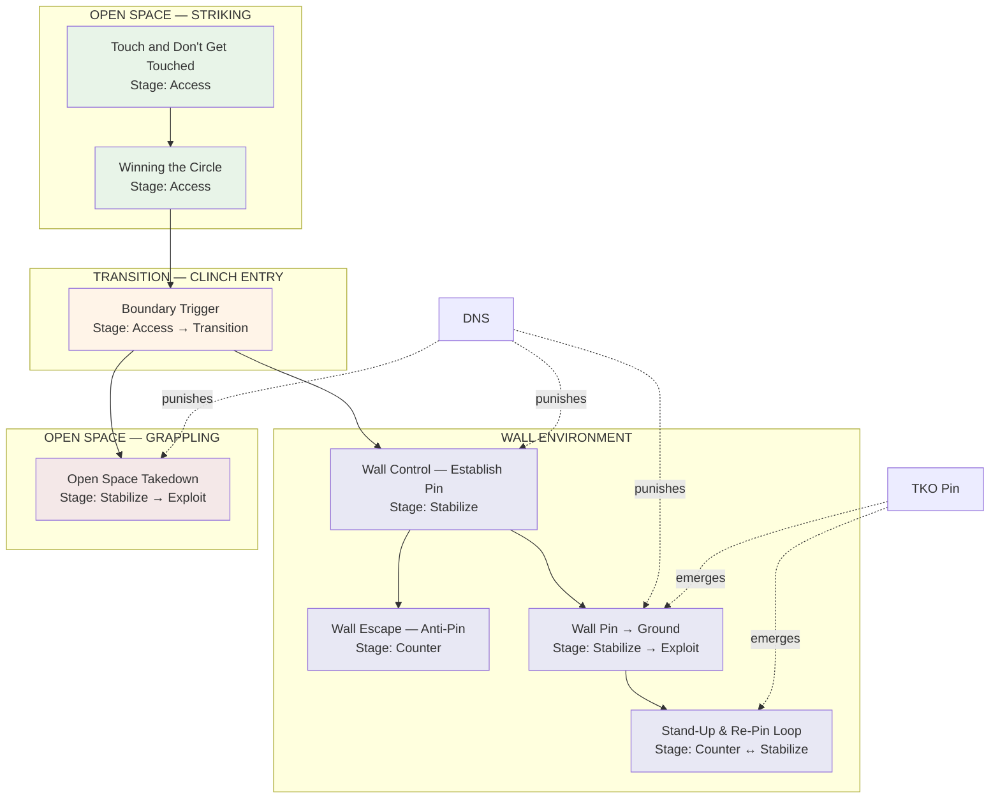

# System Map — Ecological MMA Games

This document provides multiple views of the game system for navigation and understanding.

---

## Visual Flowchart (Mermaid)



---

## Static ASCII Map (No Rendering Required)

```
╔═══════════════════════════════════════════════════════════════════════════════╗
║                    ECOLOGICAL MMA GAMES — SYSTEM MAP                          ║
╠═══════════════════════════════════════════════════════════════════════════════╣
║                                                                               ║
║  ┌─────────────────────────────────────────────────────────────────────────┐  ║
║  │                         OPEN SPACE (Striking)                           │  ║
║  │                                                                         │  ║
║  │    ┌──────────────────────┐      ┌──────────────────────┐              │  ║
║  │    │ Touch & Don't Get    │      │ Winning the Circle   │              │  ║
║  │    │ Touched              │ ───► │                      │              │  ║
║  │    │ [ACCESS]             │      │ [ACCESS]             │              │  ║
║  │    │ Foundation           │      │ Space Control        │              │  ║
║  │    └──────────────────────┘      └──────────┬───────────┘              │  ║
║  └─────────────────────────────────────────────┼───────────────────────────┘  ║
║                                                │                              ║
║                                                ▼                              ║
║  ┌─────────────────────────────────────────────────────────────────────────┐  ║
║  │                         TRANSITION (Clinch Entry)                       │  ║
║  │                                                                         │  ║
║  │                   ┌──────────────────────────┐                          │  ║
║  │                   │ Boundary Trigger         │                          │  ║
║  │                   │ [ACCESS → TRANSITION]    │                          │  ║
║  │                   │ Clinch Permission        │                          │  ║
║  │                   └─────────┬────────────────┘                          │  ║
║  └─────────────────────────────┼────────────────────────────────────────────┘  ║
║                                │                                              ║
║               ┌────────────────┴────────────────┐                             ║
║               │                                 │                             ║
║               ▼                                 ▼                             ║
║  ┌────────────────────────────────┐  ┌────────────────────────────────────┐  ║
║  │      WALL ENVIRONMENT          │  │    OPEN SPACE (Grappling)          │  ║
║  │                                │  │                                    │  ║
║  │  ┌────────────────────────┐   │  │  ┌────────────────────────┐       │  ║
║  │  │ Wall Control —         │   │  │  │ Open Space Takedown    │       │  ║
║  │  │ Establish Pin          │   │  │  │ [STABILIZE → EXPLOIT]  │       │  ║
║  │  │ [STABILIZE]            │   │  │  │                        │       │  ║
║  │  └───────┬────────────────┘   │  │  │ ⚠ DNS most dangerous   │       │  ║
║  │          │                    │  │  └────────────────────────┘       │  ║
║  │          ├─────────────────┐  │  │                                    │  ║
║  │          │                 │  │  └────────────────────────────────────┘  ║
║  │          ▼                 ▼  │                                          ║
║  │  ┌──────────────┐  ┌──────────────────┐                                 ║
║  │  │ Wall Escape  │  │ Wall Pin →       │                                 ║
║  │  │ — Anti-Pin   │  │ Ground Control   │                                 ║
║  │  │ [COUNTER]    │  │ [STAB → EXPLOIT] │                                 ║
║  │  │              │  │                  │                                 ║
║  │  │ Defensive    │  │ ★ TKO Pin        │                                 ║
║  │  │ Symmetry     │  │   emerges here   │                                 ║
║  │  └──────────────┘  └────────┬─────────┘                                 ║
║  │                             │                                           ║
║  │                             ▼                                           ║
║  │                    ┌──────────────────┐                                 ║
║  │                    │ Stand-Up &       │                                 ║
║  │                    │ Re-Pin Loop      │                                 ║
║  │                    │ [COUNTER ↔ STAB] │                                 ║
║  │                    │                  │                                 ║
║  │                    │ ★ TKO Pin        │                                 ║
║  │                    │   emerges here   │                                 ║
║  │                    └──────────────────┘                                 ║
║  └─────────────────────────────────────────────────────────────────────────┘  ║
║                                                                               ║
╠═══════════════════════════════════════════════════════════════════════════════╣
║  CROSS-CUTTING CONCEPTS                                                       ║
║                                                                               ║
║  ┌─────────────────┐  ┌─────────────────┐  ┌─────────────────┐              ║
║  │ Hand Controls   │  │ DNS             │  │ TKO Pin         │              ║
║  │                 │  │                 │  │                 │              ║
║  │ Applies to:     │  │ Punishes:       │  │ Emerges in:     │              ║
║  │ • Touch Game    │  │ • Wall Control  │  │ • Wall→Ground   │              ║
║  │ • Circle        │  │ • Wall→Ground   │  │ • Stand-Up Loop │              ║
║  │ • Boundary      │  │ • Open Takedown │  │                 │              ║
║  └─────────────────┘  └─────────────────┘  └─────────────────┘              ║
╚═══════════════════════════════════════════════════════════════════════════════╝
```

---

## Game Inventory Matrix

| Game | Environment | Stage | Prerequisite | Leads To |
|------|-------------|-------|--------------|----------|
| Touch and Don't Get Touched | Open Space | Access | — | Winning the Circle |
| Winning the Circle | Open Space | Access | Touch Game | Boundary Trigger |
| Boundary Trigger | Space → Boundary | Access → Transition | Winning the Circle | Wall Control, Open Takedown |
| Wall Control — Establish Pin | Wall | Stabilize | Boundary Trigger | Wall Escape, Wall→Ground |
| Wall Escape — Anti-Pin | Wall | Counter | Wall Control | — |
| Wall Pin → Ground Control | Wall → Ground | Stabilize → Exploit | Wall Control | Stand-Up Loop |
| Stand-Up & Re-Pin Loop | Wall / Ground | Counter ↔ Stabilize | Wall→Ground | (Future ground games) |
| Open Space Takedown | Open Space | Stabilize → Exploit | Boundary Trigger | (Future ground games) |

---

## Decision State Coverage

| Decision State | Games Addressing It |
|----------------|---------------------|
| **Access** | Touch Game, Winning the Circle, Boundary Trigger |
| **Stabilize** | Wall Control, Wall→Ground, Open Takedown |
| **Exploit** | Wall→Ground (L3), Stand-Up Loop (TKO), Open Takedown (L3) |
| **Counter** | Wall Escape, Stand-Up Loop |

---

## Environment Coverage

| Environment | Games |
|-------------|-------|
| **Open Space (Striking)** | Touch Game, Winning the Circle |
| **Transition** | Boundary Trigger |
| **Wall** | Wall Control, Wall Escape, Wall→Ground, Stand-Up Loop |
| **Open Space (Grappling)** | Open Space Takedown |
| **Ground** | (Emerging in Wall→Ground and Stand-Up Loop; dedicated games pending) |

---

## Concept Integration Map

| Concept | Where It Appears | Function |
|---------|------------------|----------|
| **Hand Controls** | Touch Game, Circle, Boundary | Bridges striking and clinch |
| **DNS** | Wall Control, Wall→Ground, Open Takedown | Punishes poor posture |
| **TKO Pin** | Wall→Ground, Stand-Up Loop | Exploitation endpoint |
| **Scramble** | Wall→Ground, Stand-Up Loop, Open Takedown | Transition state |

---

## Gaps in Current System

| Gap | Description | Priority |
|-----|-------------|----------|
| **Ground-only games** | No games start on ground | High |
| **Ground Escape** | Defensive counter to ground control | High |
| **TKO Pin game** | Dedicated game for TKO pin creation/maintenance | Medium |
| **Submission games** | Submission-focused exploitation layer | Medium |
| **Shot entry game** | Takedown from distance (not clinch) | Lower |

---

## SYSTEM EVOLUTION NOTICE

This map reflects the current state of the system.
It will be updated as new games are added and relationships clarify.
