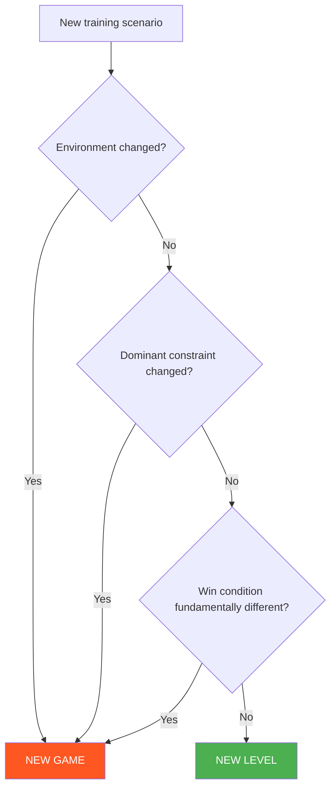

# Levels vs Games

This document defines the design rule for distinguishing games from levels.

---

## Definitions

### Game

A **game** is a distinct learning problem with:

- Stable environment
- Clear goal
- Defined invariants
- Clear win conditions

### Level

A **level** is increased completion **inside the same problem**:

- Same environment
- Same decision state
- Stricter or more complete success criteria

---

## Decision Framework

### Create New Level When:

- [x] Environment is unchanged
- [x] Decision state is unchanged
- [x] Difficulty is increased
- [x] Same core problem, higher standard

### Create New Game When:

- [ ] Environment changes (e.g., wall → ground)
- [ ] Dominant constraint changes
- [ ] Win condition becomes fundamentally different
- [ ] Roles change significantly

---

## Rule of Thumb

!!! tip "Quick Test"
    If you change **≥2 of these**, it's probably a new game:

    - Environment
    - Entry condition
    - Win condition
    - Roles
    - Primary decision state

---

## Example: Wall Stand-Up Progression

This is a **single game** with **three levels**, not three games:

| Level | Description | Why Same Game? |
|-------|-------------|----------------|
| L1 | Stand-up only | Core problem |
| L2 | Stand-up + disengage | Same problem, higher completion |
| L3 | Stand-up + reversal | Same problem, highest difficulty |

The environment (wall/ground), roles (defender/attacker), and core decision (escape vs maintain) stay constant.

---

## Example: Wall Control → Wall Escape

These are **two different games**, not levels:

| Aspect | Wall Control | Wall Escape |
|--------|--------------|-------------|
| Primary role | Attacker | Defender |
| Goal | Establish pin | Break pin |
| Stage | Stabilize | Counter |
| Win condition | Hold 5 seconds | Create space or reverse |

The roles, goals, and decision states are inverted — this is a new game, not a harder version.

---

## Why This Matters

### For Curriculum Design

- Games should be **distinct learning units**
- Levels should be **progressive mastery** of the same unit
- Mixing them creates confusion about what's being learned

### For Assessment

- Within a game, progression through levels indicates mastery
- Moving to a new game indicates breadth expansion
- Clear distinction enables tracking

### For Coach Communication

- "Run Wall Control Level 2" is unambiguous
- "Run some wall stuff" is not
- Clear naming enables precise session planning

---

## Edge Cases

### Transition Games

Games that span environments (e.g., Wall → Ground) are **single games** because:

- The transition itself is the problem
- The environment change is the learning focus

### Loop Games

Games with cyclical dynamics (e.g., Stand-Up Loop) are **single games** because:

- The loop is the learning unit
- Each cycle isn't a separate problem

---

!!! abstract "System Evolution Notice"
    These design rules may be refined as the system grows.
