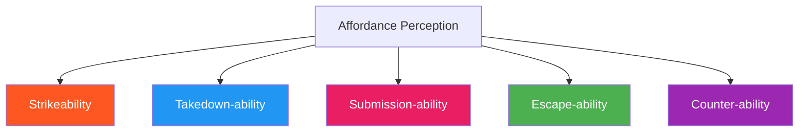

# Affordance Design

A practical framework for creating and reading affordances in MMA training games. Affordances are opportunities for action that the environment offers — this concept translates ecological theory into coaching practice.

---

## What Are Affordances?

> An affordance is an opportunity for action that exists in the relationship between an athlete and their environment.

Affordances are not properties of the athlete OR the environment alone — they exist in the relationship between the two (Gibson, 1979).

| Not an Affordance | An Affordance |
|-------------------|---------------|
| "The opponent has a weak chin" | "The chin is open AND I'm in range AND I have the angle" |
| "I know how to do an arm bar" | "The arm is extended AND I have hip control AND they can't posture" |
| "The wall is behind them" | "They're backing up AND I can cut the angle AND close distance" |

---

## The Five MMA Affordance Types



| Affordance | What the Athlete Perceives | Information Sources |
|-----------|---------------------------|---------------------|
| **Strikeability** | Open targets, range alignment, defensive gaps | Visual: guard position, distance, angle, weight distribution |
| **Takedown-ability** | Off-balance moments, single-leg exposure, over-commitment | Visual + haptic: weight shift, posture break, clinch grip |
| **Submission-ability** | Extended limbs, exposed neck, back access, positional dominance | Haptic + proprioceptive: grip strength, joint angle, weight pressure |
| **Escape-ability** | Hip space, frame opportunity, weight shift, posture break | Haptic + proprioceptive: pressure direction, hip freedom, frame potential |
| **Counter-ability** | Telegraphed attack, recovery position, over-commitment | Visual: preparation movements, balance shifts, pattern recognition |

---

## Designing Affordances Into Games

The coach's job is to create environments where the right affordances are **available and perceivable**.

### Step 1: Define the Target Affordance

What should athletes learn to perceive?

| If the game develops... | The target affordance is... |
|------------------------|---------------------------|
| Striking defense | Counter-ability (perceiving when attacker is committed) |
| Takedown offense | Takedown-ability (perceiving when opponent is off-balance) |
| Ground escape | Escape-ability (perceiving when top pressure shifts) |
| Wall control | Submission-ability for defender (perceiving neck/arm exposure) |

### Step 2: Ensure the Affordance Is Present

The game's constraints must create situations where the target affordance actually appears:

| If target affordance is... | Ensure the game includes... |
|---------------------------|---------------------------|
| Strikeability | Attacker who creates openings (not just a static target) |
| Takedown-ability | Opponent who moves and shifts weight (not a dummy) |
| Escape-ability | Top player who actively controls (creates pressure to escape from) |
| Counter-ability | Attacker who initiates with intent (not a passive feeder) |

!!! warning "Common Design Error"
    If the affordance never appears in the game, athletes can't learn to perceive it. A "takedown defense" game where the attacker never actually shoots is not developing takedown perception.

### Step 3: Don't Prescribe the Solution

The affordance should be present, but the *response* to it should emerge from the athlete:

| Prescribed (avoid) | Emergent (goal) |
|--------------------|-----------------|
| "When you see the jab, slip left" | Create game where slipping is rewarded; direction emerges |
| "Shoot when they drop their hands" | Create game where takedown-ability appears; timing emerges |
| "Frame on the bicep to escape" | Create game where escape-ability appears; framing emerges |

---

## Affordance Landscapes

Games create different **affordance landscapes** depending on their constraints:

```
NARROW                                                      RICH
(Few opportunities)                                  (Many opportunities)
|-------|-------|-------|-------|-------|-------|-------|
Parry    Slip    Touch   Counter  Pressure   Positional
                 Game    Striking  to TD      Battle
```

| Landscape Type | Characteristics | Best For |
|---------------|-----------------|----------|
| **Narrow** | Few affordances available; constrained options | Beginners, skill isolation, building one perception |
| **Moderate** | Several affordances; some choice required | Intermediate, integrating perceptions |
| **Rich** | Many affordances simultaneously; complex decisions | Advanced, full MMA expression, realistic pressure |

### Progression Through Landscapes

Athletes should progress from narrow to rich landscapes as their perception develops:

1. **Narrow landscape** — Learn to perceive one affordance type reliably
2. **Moderate landscape** — Perceive multiple affordances, choose between them
3. **Rich landscape** — Perceive the full affordance landscape under realistic conditions

This is why game [levels](../about/levels-vs-games.md) progressively remove constraints — each level widens the affordance landscape.

---

## Reading Affordances as a Coach

Coaches need to perceive affordances too — not to fight, but to assess learning:

### Signs Athletes Are Perceiving Affordances

| Signal | What It Means |
|--------|---------------|
| Acting at the right moment (not too early, not too late) | Timing perception is developing |
| Varying responses to similar situations | Multiple solutions emerging |
| Exploiting openings without coaching cues | Self-organized perception-action coupling |
| Adapting to new partners quickly | Affordance perception is transferring |

### Signs Athletes Are NOT Perceiving Affordances

| Signal | What It Means | Coach Action |
|--------|---------------|-------------|
| Identical response every time | Memorized pattern, not perception | Add variability (different partners, angles) |
| Acting too late consistently | Not reading information early enough | Slow down the game; simplify the landscape |
| Freezing or hesitating | Overwhelmed by affordance landscape | Narrow the constraints; fewer options |
| Only succeeding against one partner | Perception tied to specific cues | Rotate partners frequently |

---

## Affordances and Information Sources

Each affordance type relies on different information channels:

| Information Channel | What It Provides | Primary Affordance Types |
|--------------------|-----------------|-------------------------|
| **Visual** | Distance, angle, guard position, weight distribution | Strikeability, Counter-ability |
| **Haptic** | Grip pressure, push-pull forces, contact points | Takedown-ability, Submission-ability |
| **Proprioceptive** | Own body position, balance, available movement | Escape-ability, all types |

Games must preserve the relevant information channel. See [Perception-Action Coupling](../principles/cla/key-concepts.md) in the CLA Knowledge Base.

---

## Relationship to Other Concepts

| Concept | Connection |
|---------|-----------|
| [Constraint Manipulation](constraint-manipulation.md) | Constraints create the affordance landscape |
| [Decision States](decision-states.md) | Each state has characteristic affordances |
| [Confidence Rating](confidence-rating.md) | Confidence affects which affordances athletes perceive |
| [Three Zones](three-zones.md) | Zone selection is affordance-driven |
| [Defensive Solutions](defensive-solutions.md) | Each solution responds to different affordance perception |

---

!!! abstract "System Evolution Notice"
    This framework will be refined as new affordance patterns are identified through game development and coaching experience.
