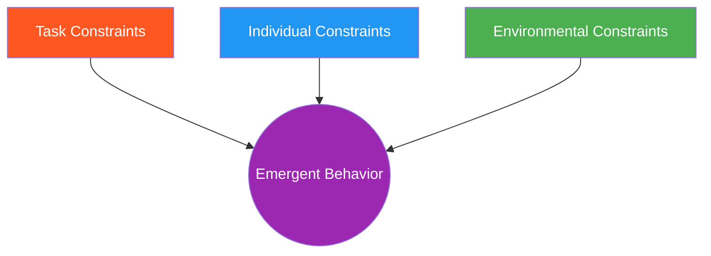

# Constraint Manipulation

A practical taxonomy of constraint types and their effects on athlete behavior. This is the primary tool for designing and modifying ecological games.

---

## The Three Constraint Categories

Every game environment is shaped by three interacting constraint categories (Newell, 1986):

| Category | What It Is | Who Controls It |
|----------|-----------|-----------------|
| **Task** | Rules, goals, equipment, scoring | Coach designs these |
| **Individual** | Athlete's body, skill, experience, fatigue | Athlete brings these |
| **Environmental** | Space, surface, wall, gravity, other athletes | Context provides these |

---

## Task Constraints (Coach-Controlled)

These are the primary lever for game design. Manipulate these to shape what athletes discover.

### Constraint Patterns and Their Effects

| Constraint Pattern | What You Manipulate | Effect on Behavior | Example |
|-------------------|--------------------|--------------------|---------|
| **Weapon restriction** | Limit available attacks | Forces creativity with one tool | Lead Hand Offense: only jab develops setup variety |
| **Target restriction** | Limit where to attack | Focuses accuracy and reading | Land the Target: predetermined strike develops deception |
| **Response restriction** | Limit defensive options | Develops specific defensive skills | Parry the Straight: only parry forces hand timing |
| **Role asymmetry** | Different goals for each partner | Creates natural problem-solving | Wall Control vs. Wall Escape: pin vs. escape |
| **Initiation rule** | Control who acts first | Develops reading or initiation | Counter-Striking: attacker must initiate first |
| **Scoring rule** | Define what counts as success | Shapes what athletes prioritize | Touch Game: clean touch vs. getting touched |
| **Time pressure** | Limit round duration | Changes risk-reward calculations | Short rounds increase urgency to act |
| **Reset condition** | Define when play stops | Focuses on specific phase | Ground Access: reset on pass or sweep |

### Combining Constraints

A single constraint rarely creates the desired learning environment. Games typically combine 3-5 task constraints:

| Game | Key Constraints Combined | Resulting Behavior |
|------|------------------------|-------------------|
| [Slip the Straight](../games/slip-the-straight.md) | Attacker throws straights only + Defender can only slip + Light contact | Head movement emerges without coaching cues |
| [Wall Grinding](../games/wall-grinding.md) | Must deal damage (not just hold) + Cannot transition to ground + Defender can escape or submit | Offensive creativity from constrained position |
| [Counter-Wrestling](../games/counter-wrestling.md) | Attacker initiates wrestling + Defender uses wrestling to counter + Strikes at Level 4 | Wrestling defense through wrestling, not avoidance |

---

## Individual Constraints (Athlete-Brought)

These cannot be directly manipulated but must be accounted for when designing games.

| Constraint | Effect on Game Design |
|-----------|----------------------|
| **Body size** | Pair appropriately; size mismatch changes available solutions |
| **Skill level** | Match level selection to athlete capability |
| **Fatigue state** | Fresh vs. tired athletes explore differently |
| **Injury/limitation** | May need constraint modification |
| **Experience** | Experienced athletes need richer affordance landscapes |
| **Psychological state** | Anxiety narrows perception; confidence broadens it |

!!! tip "Working With Individual Constraints"
    When a game isn't producing desired behavior, check individual constraints before changing task constraints. The game may be well-designed but mis-matched to the athlete.

---

## Environmental Constraints (Context-Provided)

| Constraint | Effect | Games That Use It |
|-----------|--------|-------------------|
| **Wall/cage** | Limits retreat, creates vertical grappling | All Wall games |
| **Ground/mats** | Changes gravity relationship, enables grappling | All Ground games |
| **Open space** | Allows full movement, rewards footwork | All Open Space games |
| **Boundary** | Creates spatial pressure without a wall | Pressure to Clinch, Winning the Circle |
| **Playing area size** | Smaller = more engagement; larger = more evasion | Adjustable for all games |

---

## The Constraint Manipulation Process

When designing a new game or modifying an existing one:

### 1. Identify the Problem

What decision or skill should the athlete develop?

### 2. Choose Constraints That Create the Problem

| If you want... | Add this constraint... |
|---------------|----------------------|
| Offensive creativity | Weapon restriction (fewer tools = more creative use) |
| Defensive reading | Initiation rule (force opponent to act first) |
| Pressure management | Spatial restriction (smaller area, boundary) |
| Transition awareness | Domain mixing (add cross-domain threats at higher levels) |
| Positional control | Scoring that rewards position time, not just finish |
| Urgency/decisiveness | Time pressure (short rounds, point differential) |

### 3. Remove Constraints That Block Learning

| If athletes are... | Remove or relax... |
|--------------------|-------------------|
| Stuck in one solution | Response restriction (allow more options) |
| Not engaging | Initiation rule (let either side start) |
| Overwhelmed | Reduce options available to the feeder/attacker |
| Bored/unchallenged | Weapon restriction (add more tools) |
| Gaming the rules | Scoring rules that reward unrepresentative behavior |

### 4. Test and Adjust

Observe the emergent behavior. If athletes aren't discovering desired solutions:

- The constraints may be too tight (no room to explore)
- The constraints may be too loose (no pressure to adapt)
- Individual constraints may be mismatched (wrong level, wrong pairing)

See: [Constraints-Led Approach](../principles/cla/index.md) for theoretical foundations.

---

## Common Mistakes

| Mistake | Problem | Fix |
|---------|---------|-----|
| Too many constraints | Athletes can't move naturally | Start with 3, add incrementally |
| Contradictory constraints | Rules fight each other | Test constraints in pairs first |
| Constraint doesn't match goal | Develops wrong skill | Revisit the problem statement |
| Forgetting individual constraints | Same game fails for different athletes | Adjust for athlete, not just game |
| Static constraints across levels | No progression | Use [Scaling Difficulty](scaling-difficulty.md) principles |

---

## Relationship to Levels

Game [levels](../about/levels-vs-games.md) are essentially planned constraint manipulation sequences. Each level typically changes 1-2 task constraints while maintaining the core problem:

| Level | Typical Constraint Change |
|-------|--------------------------|
| Level 1 | Maximum restriction — isolate the core skill |
| Level 2 | Add options — more defensive or offensive tools |
| Level 3 | Add threats — DNS, strikes, or grappling threats |
| Level 4 | Full MMA Expression — cross-domain constraints removed |

---

!!! abstract "System Evolution Notice"
    This taxonomy will expand as new constraint patterns are identified through game development and testing.
