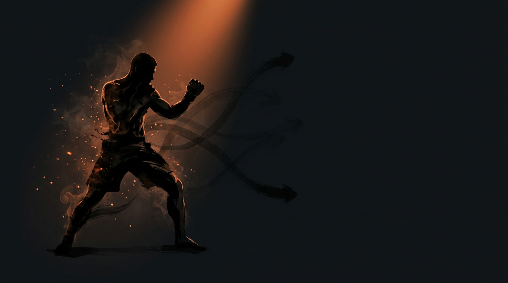

  
  
Universal Framework · All EnvironmentsDecision States

Universal FrameworkAll EnvironmentsFour Phases

<b>Every moment in a fight is one of four decision states.</b> Knowing which one you're in determines your immediate priority, and the cycle never stops turning.

  
You're always in one of four states,  know it, and you know your next move.

  
Access · Stabilize · Exploit · Counter, then the loop begins again. <b>The cycle never stops turning.</b>

  

    
1Access"Can I get to them?"

    
2Stabilize"Can I hold this?"

    
3Exploit"Can I finish from here?"

    
4Counter"Can I escape or reverse?"

  

  
Counter returns you to Access, the loop never breaks

  

🚪

Access

<i>"Can I get to them?"</i>, establish connection or position.The entry phase: closing distance, establishing clinch, completing a takedown, passing guard, achieving mount.

  

🔗

Stabilize

<i>"Can I hold this?"</i>, secure and control the position.The control phase: establishing grips/hooks, killing hips, controlling posture, preventing frames. Without it, access is temporary.

  

💥

Exploit

<i>"Can I finish from here?"</i>, deal damage or submit.The finish phase: striking from dominance, submission attempts, ground and pound, TKO accumulation. The payoff of Access and Stabilize.

  

🔄

Counter

<i>"Can I escape or reverse?"</i>, deny the opponent's exploitation.The defensive phase: defending strikes, escaping positions, reversing control, standing up. Success returns you to Access.

Access, The Entry Phase

<b>"Can I get to them?"</b> Getting where you need to be: closing striking distance, establishing clinch, completing a takedown, passing guard, achieving mount.

  
Key skills→Distance management · timing entries · reading reactions · feinting and setup

  
Games→<a href="../../games/touch-game/">Touch &amp; Don't Get Touched</a> · <a href="../../games/pressure-to-clinch/">Pressure to Clinch</a> · <a href="../../games/ground-access/">Ground Access</a>

Stabilize, The Control Phase

<b>"Can I hold this?"</b> Making your position stick. Without stabilization, access is temporary and exploitation is impossible: establish grips/hooks, kill hips, control posture, prevent frames.

  
Key skills→Pressure distribution · anticipating escapes · grip fighting · weight placement

  
Games→<a href="../../games/wall-control/">Wall Control</a> · <a href="../../games/ground-control/">Ground Control</a> · position maintenance in any game

Exploit, The Finish Phase

<b>"Can I finish from here?"</b> Where control becomes damage or finish, the purpose of Access and Stabilize: striking from dominant position, submission attempts, ground and pound, TKO accumulation.

  
Key skills→Recognizing finishing windows · committing to finish · holding position while attacking · chaining attacks

  
Games→<a href="../../games/sustained-offense/">Sustained Offense</a> · <a href="../../games/wall-grinding/">Wall Grinding</a> · ground finishing via <a href="../../games/ground-control/">Ground Control</a> + Submission

Counter, The Defensive Phase

<b>"Can I escape or reverse?"</b> What happens on the wrong side of the exchange, defending strikes, escaping positions, reversing control, standing up from bottom. Success returns you to Access (your own, or neutral).

  
Key skills→Survival · recognizing escape windows · defensive submissions · technical stand-up

  
Games→<a href="../../games/close-range-defense/">Close-Range Defense</a> · <a href="../../games/wall-escape/">Wall Escape</a> · <a href="../../games/ground-escape/">Ground Escape</a> · <a href="../../games/leg-reclaim/">Leg Reclaim</a> · all defensive games

How the States Flow

  

⚔️

Offensive flow

Access → Stabilize → Exploit → (finish or lose position) → Access.

  

🛡️

Defensive flow

Counter → (escape) → Access (your turn) or Counter (still defending).

  

↩️

Position loss

Exploit → (opponent escapes) → Access (chase) or Counter (they reversed).

Application to Games

Every game maps onto the four states across its environment:

  
Striking→Touch Game · Sustained Offense · KO/TKO · Close-Range Defense

  
Wrestling→Pressure to Clinch / Takedowns · Wall Control · Ground transitions · Takedown Defense

  
Wall→Pressure to Wall · Wall Control · Wall Grinding · Wall Escape

  
Ground→Ground Access · Ground Control · Ground Control + Submission · Ground Escape / Leg Reclaim

Read across each row as Access · Stabilize · Exploit · Counter.

Training Implications

<ul class="emma-checklist">
  <li><b>Know your state</b>, at any moment, know which state you're in; it sets your priority.</li>
  <li><b>Don't skip states</b>, exploiting without stabilizing leads to scrambles. Stabilize before you attack.</li>
  <li><b>Transitions are vulnerable</b>, moving between states creates openings, for you and the opponent.</li>
  <li><b>Counter resets the game</b>, a successful Counter returns to neutral or gives you Access. Not just survival, opportunity.</li>
</ul>

??? abstract "Summary &amp; system integration"
    

      
Access→Get there

      
Stabilize→Hold it

      
Exploit→Finish it

      
Counter→Escape it

    

    Every technique, position, and game fits somewhere in this cycle. When a game description mentions "Access phase" or "Counter state, " it refers to this framework, understanding where you are determines what you should do next.
