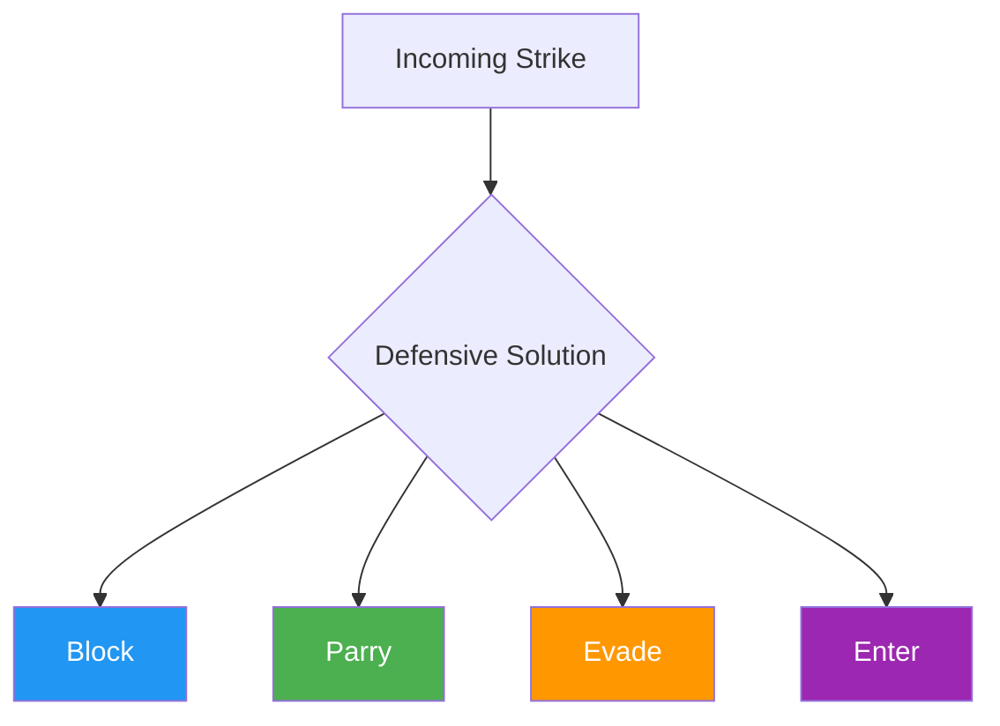

# Concept: Defensive Solutions in Striking

This document defines the **primary ways an athlete can defend against strikes** within the ecological MMA framework.

---

## Definition

> **Defense:** Any action that meaningfully reduces the opponent's ability to land effective strikes.

---

## The Four Core Defensive Solutions

---

### 1. Blocking

**Definition:** Using the arms or legs to create a physical barrier between the body and an incoming strike.

**Examples:**

- Forearm shields
- Leg checks
- Elbow blocks
- Tight guard positions

**Characteristics:**

| Property | Value |
|----------|-------|
| Force handling | Absorbs or redirects |
| Timing | Reactive |
| Movement | Often static |
| Cost | Increases fatigue over time |

!!! note "Trade-off"
    Blocking is reliable but costly if overused.

---

### 2. Parrying

**Definition:** Redirecting a strike off the center line before it lands cleanly.

**Examples:**

- Pushing straight punches off line
- Slapping or guiding strikes away from the body

**Characteristics:**

| Property | Value |
|----------|-------|
| Force handling | Redirects |
| Timing | Requires precision |
| Movement | Light, efficient |
| Cost | Low if timed well |

!!! note "Trade-off"
    Parrying is efficient but timing-dependent.

---

### 3. Evasion

**Definition:** Avoiding strikes entirely through movement.

**Examples:**

- Head movement
- Footwork
- Angle changes
- Distance management

**Characteristics:**

| Property | Value |
|----------|-------|
| Force handling | None (no contact) |
| Timing | Anticipatory |
| Movement | Dynamic |
| Cost | Lowest impact cost |

!!! note "Trade-off"
    Evasion is ideal when space is available.

---

### 4. Entering

**Definition:** Neutralizing strikes by **removing the opponent's ability to strike**.

**Examples:**

- Clinching
- Hand control
- Level changes
- Takedown entries

**Characteristics:**

| Property | Value |
|----------|-------|
| Force handling | Negates threat entirely |
| Timing | Proactive |
| Movement | High commitment |
| Cost | Trades distance for control |

!!! note "Trade-off"
    Entering trades striking range for grappling control.

---

## Combination Patterns

These four categories are **functionally distinct** but not mutually exclusive.

Most real defensive actions are **combinations**:

| Pattern | Description |
|---------|-------------|
| Evade → Enter | Slip punch, initiate clinch |
| Parry → Hand control | Redirect jab, trap hand |
| Block → Clinch | Absorb hook, close distance |
| Evade → Counter | Slip punch, counter strike |

This is expected and desired.

---

## What About Countering?

A potential fifth category is sometimes proposed: **Countering**.

However, in this system:

- Countering is an **offensive response**
- Not a defensive solution in itself
- A counter only exists **after** one of the four defenses has succeeded

Therefore, countering is not listed as a primary defensive category.

---

## Defensive Hierarchy

!!! warning "Context Determines Effectiveness"
    No defensive solution is universally superior.

Effectiveness depends on:

- Available space
- Fatigue level
- Skill level
- Environment (wall vs open space)
- Proximity to clinch

The system teaches athletes to **select**, not memorize, defensive solutions.

---

## Integration into Games

Games may constrain:

- Which defensive solutions are **allowed**
- Which are **emphasized**
- Which are **punished**

This is intentional and context-driven.

| Game | Defensive Focus |
|------|-----------------|
| Touch Game | Evasion, counter-touch |
| Winning the Circle | Evasion (footwork) |
| Boundary Trigger | Evasion → Enter |
| Wall Escape | Frames (blocking) → Enter (DNS) |

---

!!! abstract "System Evolution Notice"
    Defensive categories may be revised if new functional distinctions emerge.
