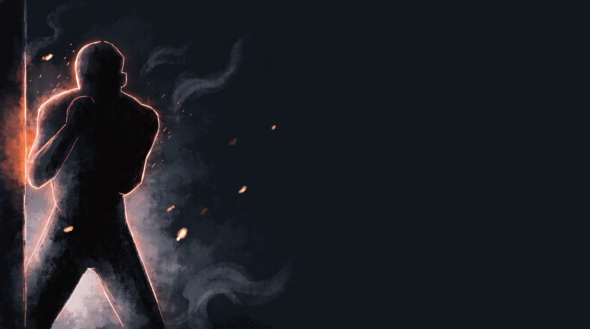

  
  
Spatial Control · All DomainsThe Environment Always Plays

Spatial ControlAll DomainsFoundationalStanding Principle

<b>The environment is never neutral.</b> A wall, a corner, the edge of the mat, even open space itself, is always closer to one fighter's advantage than the other's, whether or not a game's stated rules mention it. Play it on purpose, before the game tells you to.

  
The rules didn't ask for it,  use it anyway.

  
Whatever's actually around you, a wall, a corner, open space, is part of the exchange whether the game's stated rules reference it or not.

Where This Came From

A student, mid-round, instinctively used the wall to trap a training partner, in a stage of the game whose stated rules never mentioned a wall at all. The coach didn't correct it, he named it: "The second that we start playing, I don't care what the rules are. The first thing I'm going to do is put myself here, and then start playing the game... you should always be playing the environment to your advantage." Coach intent caught up to student behavior, not the other way around, and that gap is exactly the kind of signal worth keeping.

Two Ways to Miss This

  

📜

Playing only the stated rule

Treating a game's constraints as the entire problem. If the rules say "open space," a fighter who only tracks the rules stops managing the wall, the corner, the edge of the mat, even when it's right there and free for the taking.

  

🎯

Winning the exchange, losing the room

Landing clean, scoring the point, winning the specific rep, while steadily giving up position relative to the room. Related to <a href="../winning-the-circle/">Winning the Circle</a>'s "winning the fight ≠ winning the circle," but broader: even outside a stated circle, geography is still being won or lost.

How to Apply It

  

🧭

Reorient before you engage

Before playing the stated game, register where the room's few genuine variables are, a wall, a corner, a partner already backed toward an edge, and choose your first position relative to them, not just relative to the opponent.

  

🕳️

Notice when someone gives you the door

If a partner or opponent creates access, even by accident, to a piece of the environment that helps you, take it. "The door was open" is a real, actionable read, not a metaphor.

  

🎛️

A dial, not a rule to memorize

It doesn't need a stated constraint to apply. Unlike a game's explicit, bounded rules, this is a standing orientation: always ask what the room is offering, in every game, every round, every position.

This is <b>not a game</b> and never needs its own page of rules. It's the orientation that makes the wall-specific games (<a href="../../games/wall-control/">Wall Control</a>, <a href="../../games/pressure-to-wall/">Pressure to Wall</a>, <a href="../../games/wall-grinding/">Wall Grinding</a>) make sense in the first place, and it applies just as much in games that never mention a wall.

!!! abstract "Related Concepts"
    - [Winning the Circle](../winning-the-circle/), the specific, rule-bound version of this principle inside a marked perimeter
    - [Wall Control, Establish the Pin](../../games/wall-control/), where this principle cashes out once the wall is reached
    - [Counter the Straight](../../games/counter-the-straight/), where this principle was first named live, mid-class
