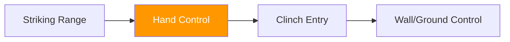

# Concept: Hand Controls

---

## Definition

**Hand control** refers to any intentional use of the hands or arms to interfere with an opponent's ability to strike, frame, or maneuver effectively.

!!! note "Key Distinction"
    Hand control is not a position. It is a **functional interaction**.

---

## Purpose of Hand Control

Hand control allows an athlete to:

- Deny strike initiation
- Disrupt rhythm and timing
- Gather tactile information
- Bridge striking and grappling
- Create entry opportunities without absorbing damage

It is a core MMA skill that exists at **all ranges**.

---

## Common Forms of Hand Control

| Form | Description |
|------|-------------|
| Parrying and trapping | Redirecting and momentarily holding |
| Two-on-one control | Controlling one arm with both hands (temporary) |
| Wrist or forearm interference | Blocking the tool before it's used |
| Clearing frames | Removing defensive structures |
| Redirecting guard position | Changing where opponent's hands point |
| Tactile monitoring | Feeling opponent's intent through contact |

These interactions may be brief or sustained depending on context.

---

## Hand Control vs Blocking

| Aspect | Blocking | Hand Control |
|--------|----------|--------------|
| **Focus** | The strike | The striking tool |
| **Timing** | Reactive | Proactive or simultaneous |
| **Result** | Absorbs or deflects force | Prevents strike from occurring |

Blocking reacts to strikes.
Hand control prevents strikes from occurring cleanly.

---

## Hand Control as Defensive Solution

Hand control functions as:

- A form of **defense** (denying strikes)
- A form of **entry** (bridging to clinch)
- A form of **pressure** (disrupting rhythm)
- A form of **denial** (preventing counter-attack)

It is especially important for:

- Advanced striking exchanges
- Clinch initiation
- Minimizing damage while closing distance

---

## Hand Control in the System

Hand control appears:

| Context | Role |
|---------|------|
| [Touch Game](../games/touch-game.md) Level 4 | Advanced expression of "don't get touched" |
| [Winning the Circle](../games/winning-circle.md) | Pressure tool for attacker |
| [Boundary Trigger](../games/boundary-trigger.md) | Bridge into clinch |
| All grappling games | Controlling defender's frames |

---

## Emergence Through Constraints

!!! tip "Design Philosophy"
    Hand control should emerge naturally through constraints, not be forced as a technique.

When games constrain athletes' options appropriately, hand control emerges as a **solution** — not because it was taught explicitly, but because it solves the problem the game presents.

---

## Integration with Other Concepts

Hand control is the **bridge skill** between striking and grappling domains.

---

!!! abstract "System Evolution Notice"
    This concept may be refined as additional interaction patterns are identified.
