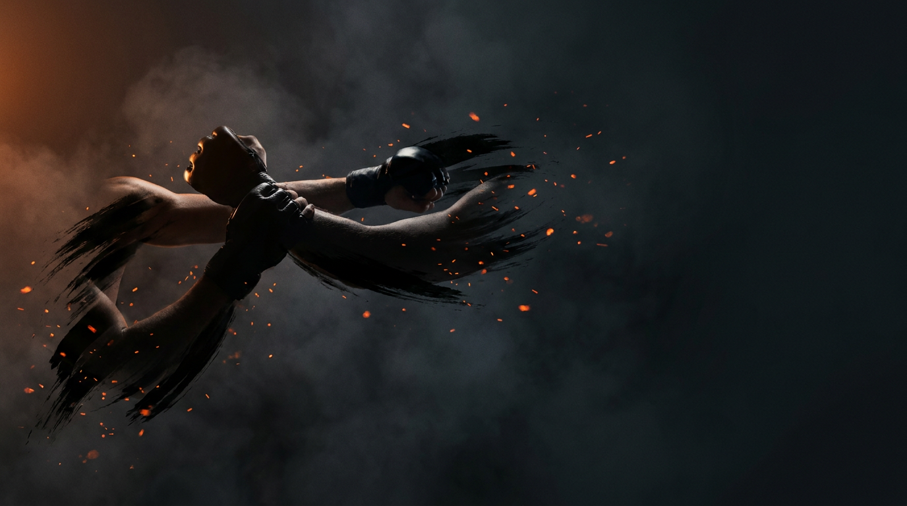

  
  
Core Concept · Bridge SkillHand Controls

Core ConceptBridge SkillAll Ranges

**Hand control is the bridge between striking and grappling — it stops the tool before the strike, not the strike after it leaves.**

<b>Hand control</b> is any intentional use of the hands or arms to interfere with an opponent's ability to strike, frame, or maneuver effectively. It is <b>not a position — it is a functional interaction.</b>

  
Stop the tool — not the strike after it leaves.

  
A functional interaction, not a position. <b>It's the bridge from striking into grappling.</b>

What It Buys You

  

🚫

Deny initiation

Stop the strike before it starts.

  

🎵

Disrupt rhythm

Break timing and tempo.

  

✋

Gather info

Read intent through tactile contact.

  

🌉

Bridge ranges

Connect striking to grappling.

  

🚪

Create entries

Open opportunities without absorbing damage.

Common Forms

  ↗️ Parrying &amp; trappingRedirecting a strike and momentarily holding the limb that threw it.
  ✌️ Two-on-one controlControlling one of the opponent's arms with both of your hands — temporary, not a held position.
  🤚 Wrist / forearm interferenceBlocking the striking tool before it is used.
  🧹 Clearing framesRemoving the opponent's defensive structures so you can advance.
  🔄 Redirecting guard positionChanging where the opponent's hands point, opening lines of attack.
  📡 Tactile monitoringFeeling the opponent's intent through sustained contact — these interactions may be brief or sustained depending on context.

Hand Control vs. Blocking

Blocking reacts to strikes. Hand control prevents strikes from occurring cleanly.

  
Focus→Block targets <b>the strike</b> · Hand control targets <b>the striking tool</b>

  
Timing→Block is <b>reactive</b> · Hand control is <b>proactive or simultaneous</b>

  
Result→Block <b>absorbs or deflects force</b> · Hand control <b>prevents the strike from occurring</b>

One Tool, Four Jobs

  

🛡️

Defense

Denying strikes.

  

🚪

Entry

Bridging to the clinch.

  

⏬

Pressure

Disrupting rhythm.

  

🚫

Denial

Preventing the counter-attack.

It matters most for **advanced striking exchanges**, **clinch initiation**, and **minimising damage while closing distance**.

Where It Lives in the System

  
<a href="../../games/touch-game/">Touch Game</a> · Lv 4→Advanced expression of "don't get touched"

  
<a href="../../games/pressure-to-clinch/">Pressure to Clinch</a>→Pressure tool and clinch entry

  
All grappling games→Controlling the defender's frames

It Emerges — It Isn't Taught

<b>Design philosophy:</b> hand control should <b>emerge naturally through constraints</b>, not be forced as a technique. When games constrain options appropriately, hand control appears as a <i>solution</i> — because it solves the problem the game presents.

??? abstract "Integration map & evolution notice"

    
The bridge skill between domains

    

      
Striking range→Hand control

      
Hand control→Clinch entry

      
Clinch entry→Wall / ground control

    

    
Hand control is the <b>bridge skill</b> between the striking and grappling domains.

    
This concept may be refined as additional interaction patterns are identified.

Related · <a href="../defensive-solutions/">Defensive Solutions</a> — hand control as Enter &amp; Parry · <a href="../confidence-rating/">Confidence Rating</a> — tactile reads build confidence · Games · <a href="../../games/pressure-to-clinch/">Pressure to Clinch</a> · <a href="../../games/clinch-denial/">Clinch Denial</a>

