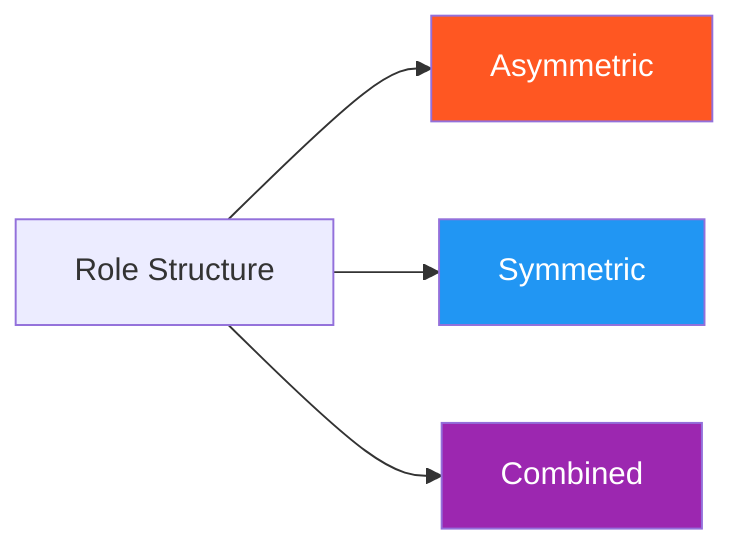
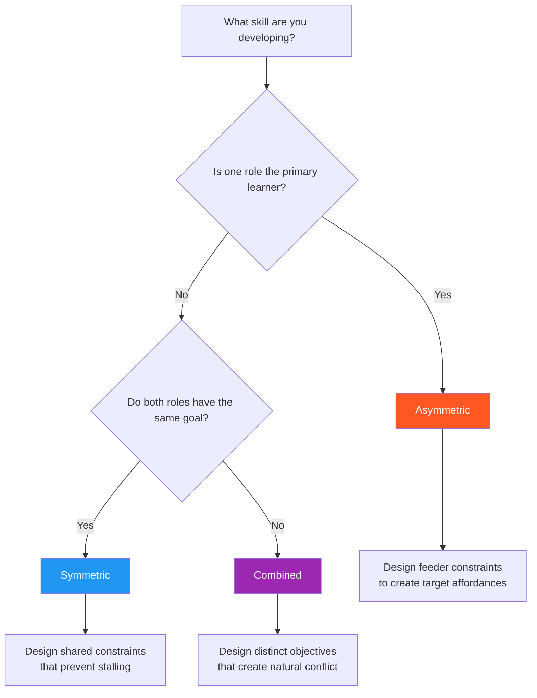

# Role Design

Principles for setting up roles in ecological MMA games. Every game assigns roles — how those roles are designed determines what athletes learn.

---

## The Three Role Structures

| Structure | Definition | When to Use |
|-----------|-----------|-------------|
| **Asymmetric** | Different goals for each partner (A attacks, B defends) | When developing a specific skill for one role |
| **Symmetric** | Same goals for both partners | When both should practice the same problem |
| **Combined** | Both have distinct but equally active objectives | When the interaction itself is the learning |

---

## Asymmetric Games

One athlete is the **primary learner**, the other is the **training tool**.

### Design Principles

| Principle | Rationale |
|-----------|-----------|
| The primary learner faces the core problem | The game exists to develop their skill |
| The feeder creates representative pressure | They must act realistically, not just comply |
| The feeder's constraints shape the learner's affordances | What the feeder does determines what the learner can perceive |
| Both roles should be engaging | A bored feeder creates unrepresentative pressure |

### Examples

| Game | Role A | Role B | Primary Learner |
|------|--------|--------|-----------------|
| [Parry the Straight](../games/parry-the-straight.md) | Throws straight punches | Parries | B (defender) |
| [Wall Control](../games/wall-control.md) | Maintains pin | Escapes | A (controller) |
| [Ground Access](../games/ground-access.md) | Passes guard | Retains guard | A (passer) |
| [Land the Target](../games/land-the-target.md) | Attacks predetermined target | Defends | A (attacker) |

### Feeder Constraints Matter

The feeder's constraints directly shape the learning environment:

| Feeder Constraint | Effect on Primary Learner |
|-------------------|--------------------------|
| Limited attacks (straights only) | Narrows perception — learns one thing well |
| Varied attacks (any strike) | Broadens perception — learns to read multiple cues |
| Must initiate first | Learner develops reactive/counter skills |
| Cannot initiate | Learner develops proactive/offensive skills |
| Intensity capped | Learner focuses on technique without overwhelm |
| Realistic intensity | Learner develops under pressure |

---

## Symmetric Games

Both athletes work on the same problem simultaneously.

### When Symmetric Works

| Scenario | Why Symmetric |
|----------|---------------|
| Range management | Both need to control distance |
| Scramble training | Both need to win transitions |
| Mixed skill levels with same goal | Both developing same perception |

### When Symmetric Fails

| Scenario | Problem | Better Alternative |
|----------|---------|-------------------|
| One athlete dominates completely | Dominated athlete stops learning | Asymmetric with constraints on stronger athlete |
| Neither engages | No pressure to act | Add initiation rules or scoring |
| Both play defensive | No learning occurs | Require one side to initiate |

---

## Combined Games

Both athletes have distinct, active objectives that create a dynamic interaction.

### Design Principles

| Principle | Rationale |
|-----------|-----------|
| Both roles have meaningful goals | Neither athlete is passive |
| Goals create natural tension | The conflict IS the learning |
| Roles may reverse during play | Scrambles and transitions teach adaptability |

### Examples

| Game | Role A Goal | Role B Goal | Tension |
|------|-------------|-------------|---------|
| [Touch Game](../games/touch-game.md) | Touch without getting touched | Touch without getting touched | Range control arms race |
| [Stand-Up Loop](../games/standup-loop.md) | Get up and stay up | Take down and re-pin | Escape vs. control cycle |
| [Positional Battle](../games/positional-battle.md) | Win positional exchanges | Win positional exchanges | Scramble dominance |

---

## Designing Roles for New Games

### Decision Framework

### Role Rotation

| Game Type | Rotation Guidance |
|-----------|-------------------|
| Asymmetric | Switch roles each round so both experience both sides |
| Symmetric | No rotation needed — both doing the same thing |
| Combined | Switch roles to develop both perspectives |

!!! tip "The Feeder Learns Too"
    Even in asymmetric games, the feeder develops perception. The attacker in Parry the Straight learns what makes punches land or get parried. Design feeder constraints that make their role engaging and educational, not mechanical.

---

## Common Role Design Mistakes

| Mistake | Problem | Fix |
|---------|---------|-----|
| Feeder is robotic | Unrepresentative pressure; learner develops false confidence | Give feeder meaningful goals and intensity targets |
| Both roles are too passive | No engagement, no learning | Add initiation rules or scoring pressure |
| Role imbalance in difficulty | One partner bored, other overwhelmed | Adjust constraints to balance challenge |
| No role rotation | Athletes only develop one perspective | Alternate every round or set |
| Feeder "wins" by refusing to engage | Game breaks down | Add feeder constraints that require action |

---

## Relationship to Other Concepts

| Concept | Connection |
|---------|-----------|
| [Constraint Manipulation](constraint-manipulation.md) | Role constraints are a subset of task constraints |
| [Affordance Design](affordance-design.md) | Feeder constraints create the affordance landscape |
| [Scaling Difficulty](scaling-difficulty.md) | Role intensity is a scaling lever |
| [Full MMA Expression](full-mma-expression.md) | Level 4 often adds cross-role threats |

---

!!! abstract "System Evolution Notice"
    Role design principles will be refined as new game structures are tested.
