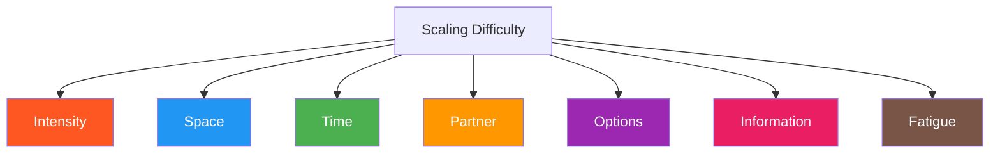

# Scaling Difficulty

How to adjust challenge within a game without changing the game itself. Distinct from levels (which are planned progressions), scaling is real-time adjustment for individual athletes.

---

## Levels vs. Scaling

| | Levels | Scaling |
|-|--------|---------|
| **What changes** | The game's constraint structure | Intensity within a constraint structure |
| **Who decides** | The curriculum/system | The coach in the moment |
| **When it happens** | Between sessions or phases | During a round or between rounds |
| **Example** | Add DNS at Level 3 | Change partner, area size, or round length |

Levels are structural. Scaling is parametric.

---

## The Seven Scaling Levers

### 1. Intensity

| Direction | Adjustment | Effect |
|-----------|-----------|--------|
| **Easier** | Reduce contact, slow tempo | More time to perceive and explore |
| **Harder** | Increase contact, faster tempo | Demands quicker perception-action |

### 2. Space

| Direction | Adjustment | Effect |
|-----------|-----------|--------|
| **Easier** | Larger playing area | More time, more escape routes |
| **Harder** | Smaller playing area | More engagement, less evasion |

### 3. Time

| Direction | Adjustment | Effect |
|-----------|-----------|--------|
| **Easier** | Longer rounds | Less urgency, more exploration |
| **Harder** | Shorter rounds | Forced decisiveness, higher stakes per exchange |

### 4. Partner

| Direction | Adjustment | Effect |
|-----------|-----------|--------|
| **Easier** | Less experienced or smaller partner | Slower inputs, more success |
| **Harder** | More experienced or larger partner | Faster inputs, more failures to learn from |

### 5. Options Available

| Direction | Adjustment | Effect |
|-----------|-----------|--------|
| **Easier** | Restrict feeder's options (e.g., straights only) | Narrower affordance landscape; easier to read |
| **Harder** | Expand feeder's options (e.g., any strike) | Richer landscape; more complex perception |

### 6. Information Load

| Direction | Adjustment | Effect |
|-----------|-----------|--------|
| **Easier** | Announce what's coming ("I'm going to jab") | Reduces perception demand |
| **Harder** | No telegraphing; deception allowed | Full perceptual challenge |

### 7. Fatigue State

| Direction | Adjustment | Effect |
|-----------|-----------|--------|
| **Easier** | Fresh, well-rested | Maximum perception and movement quality |
| **Harder** | Fatigued (after conditioning or multiple rounds) | Tests skill retention under stress |

---

## Scaling in Practice

### For Mixed-Ability Groups

When partners have different skill levels, scale differently for each:

| Situation | Scale for Less Experienced | Scale for More Experienced |
|-----------|---------------------------|---------------------------|
| Striking game | Reduce feeder intensity | Add weapon options |
| Grappling game | Larger space, more resets | Shorter rounds, start from worse position |
| Combined game | Fewer threats to track | Add cross-domain threats |

### The Green-Amber-Red Framework

Use the three zones to diagnose when scaling is needed:

| Zone | Athlete Behavior | Coach Action |
|------|-----------------|-------------|
| **Green** | Succeeding consistently, looking comfortable | Scale up — add challenge |
| **Amber** | Succeeding sometimes, visibly problem-solving | Stay here — this is the learning zone |
| **Red** | Failing consistently, frustrated or panicking | Scale down — reduce challenge |

!!! tip "Stay in Amber"
    Learning happens in the amber zone. If athletes are always in green, they're not growing. If they're always in red, they're not learning. Scale to keep them in amber.

---

## What NOT to Scale

Some things should remain constant regardless of difficulty:

| Keep Constant | Why |
|--------------|-----|
| The core problem | Changing the problem changes the game |
| Safety rules | Non-negotiable regardless of skill level |
| Role structure | Asymmetric stays asymmetric |
| Perception-action coupling | Never decompose into drill fragments |

---

## Scaling vs. Creating a New Level

| If you need to... | Do this |
|-------------------|---------|
| Adjust challenge for one athlete in the moment | Scale |
| Add a new constraint type (e.g., DNS, strikes) | Create a new level |
| Change the playing area size | Scale |
| Add cross-domain threats | Create a new level |
| Change partner intensity | Scale |
| Change the game's scoring or win condition | Create a new level |

See: [Levels vs Games](../about/levels-vs-games.md)

---

## Relationship to Other Concepts

| Concept | Connection |
|---------|-----------|
| [Constraint Manipulation](constraint-manipulation.md) | Scaling adjusts constraint intensity; levels change constraint structure |
| [Affordance Design](affordance-design.md) | Scaling adjusts the affordance landscape's richness |
| [Role Design](role-design.md) | Partner selection and feeder intensity are scaling levers |
| [Full MMA Expression](full-mma-expression.md) | Level 4 is the widest scaling of the affordance landscape |

---

!!! abstract "System Evolution Notice"
    Scaling principles will be expanded as new patterns emerge from coaching practice.
