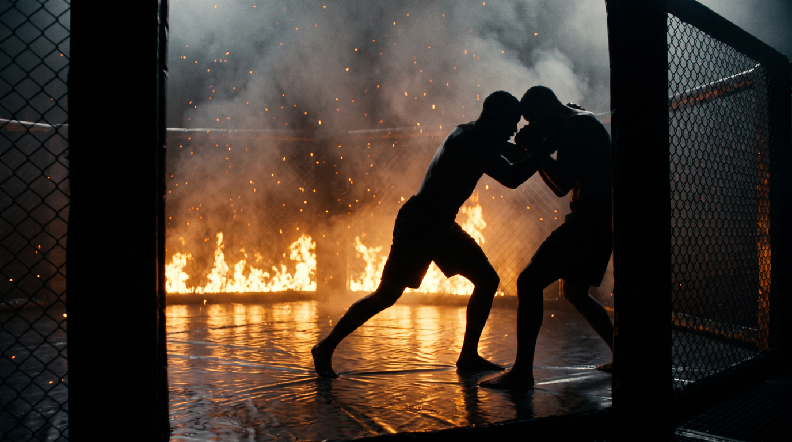

  
  
Core Concept · ControlThree Points of Pressure

Core ConceptControlClinch &amp; Wall

**Most people pin with their arms. Arms tire, and arms are two things a man can fight. Pressure applied at three separated points at once is a structure, and a structure is much harder to argue with.**

The three points are the <b>forehead</b> into the head or spine, the <b>shoulder and chest</b> across the top side, and the <b>hip</b> driving low. Together they take the top, middle and bottom of a body at the same time. He can usually solve one. He can rarely solve three.

  
Your head is a tool.  Most people carry it around like luggage.

  
The forehead is the point almost nobody uses and the one that changes the position most. <b>Get there and be mean with it.</b>

The Three Points

  

🧠

Forehead, into the head or spine

Drive it in and keep it there. When he turns his head to look for an exit, take your forehead the other way and keep the pressure. It follows him rather than being shed.

  

💪

Shoulder and chest, top side

Your centre mass into his top side. This is the point that stops him standing up straight and reclaiming his posture.

  

🦴

Hip, low

Hip to hip, driving. This is what stops the lower half from stepping out from under the top half, which is how most escapes actually begin.

Why Three, and Why Separated

  
One point→He turns away from it and it is gone

  
Two points close together→One movement can clear both, because they share a line

  
Three points, top, middle and bottom→Clearing one leaves the other two, and the movement that clears it feeds the next

  
Structure instead of grip→Frees a hand, because the position is being held by your frame rather than your arms

The freed hand is the real prize. Once the structure holds him, <b>you are no longer choosing between holding and hitting</b>, which is the trade that decides most clinch exchanges. See <a href="../../games/clinch-holder/">Clinch Holder</a>, where that trade is the whole game.

Where It Comes From

This is <b>Dagestani and Russian wrestling pressure</b>, and it is the clearest thing separating wrestlers who merely hold people from wrestlers who make holding unbearable. In MMA the <b>Diaz brothers</b> show the striking application: pin at the wall, transfer the forehead into the chest, and work from there. When the man stops trying to run and starts dealing with the punches, go back to the pin. The two states feed each other.

The Rhythm

  
He is trying to leave→Pressure. Three points, forehead following his head

  
He stops leaving and deals with the position→Strike. The structure is holding him, so the free hand is available

  
He reacts to the strikes and tries to leave again→Back to pressure. The cycle is the control

Check, Not Checkmate

Hip to hip on his side, one hand free, his weapons pointing away from you. <b>It is check, not checkmate.</b> He has nothing from there, but nothing has ended. Treating this position as a finish is how people get reversed out of it. Treat it as the place from which you choose what happens next: keep working, go to the back, start the takedown, or simply stay and make him carry you.

It Emerges: It Isn't Taught

<b>Design philosophy:</b> forehead pressure appears on its own once a game makes <b>holding and hitting compete for the same two hands</b>. Players who cannot do both look for a third thing to hold with, and the head is what is available. Constrain the game so the trade is real, and this concept arrives as the answer rather than as an instruction. In its first session it was coached live four separate times before it was ever formally taught, which is the pattern to look for.

Where It Lives in the System

  
<a href="../../games/clinch-holder/">Clinch Holder</a>→The home game. Holding while damaging is exactly the trade this solves

  
<a href="../../games/wall-control/">Wall Control</a> · <a href="../../games/wall-grinding/">Wall Grinding</a>→The wall supplies a fourth surface, making the structure far cheaper to hold

  
<a href="../../games/fifty-fifty-clinch/">50/50 Clinch</a>→How a neutral clinch stops being neutral

  
Ground control games→The same three-point logic, with gravity doing the work of the wall

??? note "Safety"

    

      🧠 Forehead into the head, shoulder or spine, never into the face or the throat
      ⬆️ Head <b>up</b> when you drive. Dropping the head so your crown leads is how necks get compressed, especially if your partner comes off the wall as you come in. If you are going to disappear, disappear into the wall, not into the floor
      🩹 Any neck pain stops the round. Compression symptoms can arrive late
      🤝 Sustained pressure is exhausting and easy to overdo on a smaller partner. Dial the load, not the structure
    

Related · <a href="../hand-controls/">Hand Controls</a>, what the freed hand does next · <a href="../tko-pin/">TKO Pin</a>, where sustained pressure is going · <a href="../environment-always-plays/">Environment Always Plays</a>, the wall as the fourth point · Games · <a href="../../games/clinch-holder/">Clinch Holder</a> · <a href="../../games/wall-control/">Wall Control</a>

