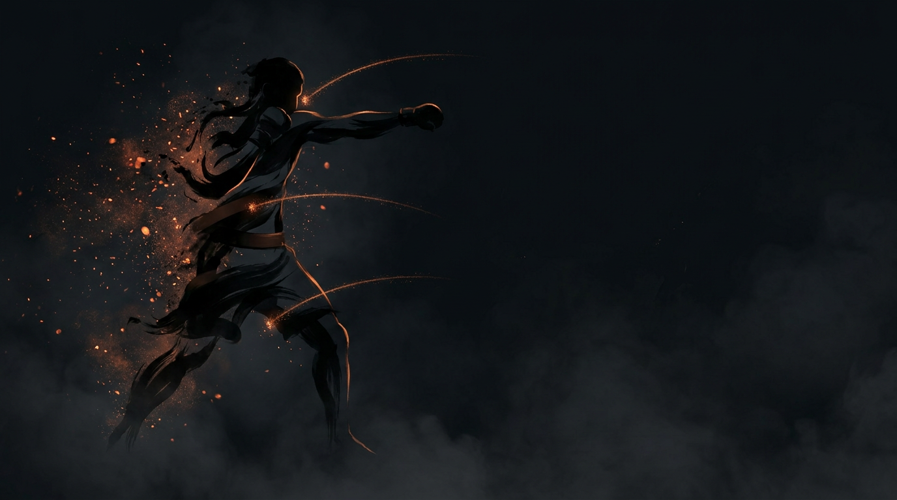

  
  
Striking Concept · Offense + DefenseThree Zones of Attack

Striking ConceptOffense + DefenseMisdirection

<b>There are only three zones you can attack.</b> Every strike targets one; every defense protects one or more. You cannot fully protect all three at once — and that is the whole game.

  
No guard covers all three — hit them where they're not.

  
Head, body, legs. Every stance is a trade; their guard shows you their holes.

The Three Zones

  

    
HighHead

    
HeadChin, temple, nose, ear.

  

  

    
MidBody

    
BodyLiver, solar plexus, ribs, floating ribs.

  

  

    
LowLegs

    
LegsThigh (inside/outside), calf, knee.

  

The Misdirection Principle

<b>"Hit them where they're not."</b> The opponent can only actively defend one area at a time. When they commit attention and guard to one zone, the other zones open. This isn't a gimmick — it's the fundamental reality of striking.

  
1<b>Threaten one zone</b>Make them believe an attack is coming to Zone A.A real, committed-looking threat — a feint or a partial strike that reads as the real thing.

  
2<b>They respond</b>Guard, attention, or body position shifts to protect Zone A.The defensive reaction is what creates the opening — you're shaping it on purpose.

  
3<b>Attack another zone</b>Zone B or C is now more exposed.They cannot cover what they just left to protect Zone A.

  
4<b>Land the target</b>Strike where their defense isn't.The last strike was often planned from the start — everything before it was setup.

When defense commits to one zone, the others open

  
Protect head (hands high)→Body and legs open

  
Protect body (guard low, elbows tight)→Head opens

  
Protect legs (checking, weight shifted)→Head and body open

Guard Positions — Every One Is a Trade

There is no guard that protects all three zones. Every stance is a choice about what to prioritize and what to leave vulnerable. <b>When you see an opponent's guard, you're seeing their priorities — and their holes.</b>

  ⬆️ High GuardHands at temples/forehead. Protects head from hooks and straights; exposes body and legs. Used when expecting head attacks or shelling up.
  ↔️ Mid GuardHands at chin level. Protects head with small movement, can drop to body — but nothing is fully covered without movement. The neutral, ready position.
  ⬇️ Low GuardHands at chest/belly. Protects body and solar plexus; head is completely open. Used against body punchers or to bait head shots.
  🤚 Extended GuardHands reaching out. Protects nothing directly — instead intercepts strikes before they arrive, controls range, disrupts the opponent. Risk: if they get past the hands, everything is exposed.
  🛞 Philly Shell / Shoulder RollLead shoulder and rear hand. Protects lead side of head and body; exposes rear side of head, body if the shoulder rolls late, and legs. A counter-punching style.

Building Combinations Across Zones

The best combinations don't just throw multiple strikes — early strikes <b>shape the defensive response</b> to open the target you actually want. The last strike is the plan; everything before it is setup.

When you attack a zone, the defender reacts — opening another

  
Attack head→Hands up, chin tucked → body, legs open

  
Attack body→Elbows drop, hunch forward → head opens

  
Attack legs→Check or shift weight → head and body open (hands busy with balance)

  

🥊

Jab → Cross → Left Hook to Body

Head shots raise the guard; the body opens for the hook.Jab and cross attack the head, the guard rises, the open body takes the hook.

  

🫁

Jab to Body → Cross to Head

The body jab drops the guard; the head opens for the cross.The body jab pulls elbows/guard down, the cross lands high on the exposed head.

  

🦵

1-2 → Low Kick

Hands occupied high; the legs are unguarded.Jab-cross occupies the hands high, the low kick lands while they focus on the hands.

  

🎭

Head Kick Feint → Low Kick

The high feint lifts the hands; the lead leg is available.The feint sends hands up and weight high to check; the low kick lands on the exposed lead leg.

Found vs. Created Openings

High-level striking is about <b>creating</b> openings, not just finding them. You make the hole, then you hit it.

  

🔍

Found openings

Exist from the opponent's habits or current position — observe, recognize, attack.Guard naturally sits low, hands drop after throwing, no leg-kick checks, looks away at certain moments. The attacker's job: spot the pattern, hit the available zone.

  

🛠️

Created openings

Don't exist until you manufacture them with misdirection.Feint to head → body opens; attack body repeatedly → they guard it → head opens; threaten the lead leg → weight shifts → rear leg planted. The attacker's job: force the response that creates the opening you want.

Defensive Implications

You cannot protect all three zones simultaneously. Sound defense runs a loop:

  
1<b>Read</b>What zone are they likely to attack?

  
2<b>Prioritize</b>Protect the most threatened zone.

  
3<b>Recover</b>Reset before they attack another.

  
4<b>Vary</b>Don't be predictable about which zone you prioritize.

  Always protecting the same zone — they'll find the hole
  Showing a consistent guard pattern
  Not knowing which zone you're currently exposing

Application to Confidence Rating

Zone reading is how you build offensive confidence — it scales with your <a href="../confidence-rating/">Confidence Rating</a>.

  
Low→Probe all three zones to see how they react

  
Building→Identify which zone they protect most, which they neglect

  
High→Attack the neglected zone with commitment

  
Very High→Create openings by manipulating their zone defense

??? note "Summary &amp; related concepts"
    <ul class="emma-checklist">
      <li><b>Three zones</b> — Head, Body, Legs are the only targets.</li>
      <li><b>Misdirection</b> — make them commit to one zone, attack another.</li>
      <li><b>Guard reality</b> — every position protects some zones, exposes others. No perfect defense.</li>
      <li><b>Combination logic</b> — early strikes shape the response to open the real target.</li>
      <li><b>Found vs. created</b> — high-level striking manufactures openings.</li>
    </ul>

    

      
<a href="../confidence-rating/">Confidence Rating</a>→Zone reading is how you build offensive confidence

      
<a href="../defensive-solutions/">Defensive Solutions</a>→Each solution (block, parry, slip) works differently across zones

    

    
This concept may be refined as striking game patterns develop.

