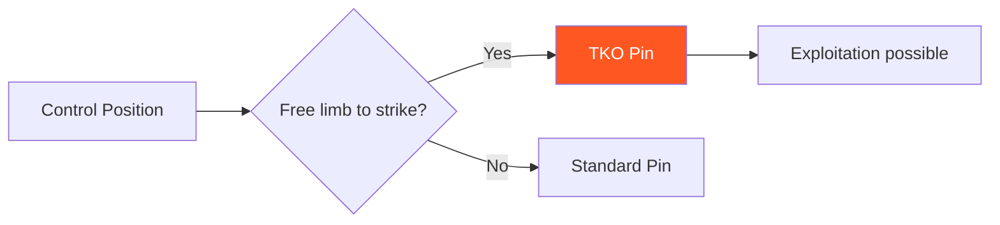

# Concept: TKO Pin

!!! warning "Critical Concept"
    A TKO Pin is a **control state**, not a position.

---

## Definition

A TKO Pin exists when:

- [x] The defender's hips and shoulders are meaningfully controlled
- [x] Posture and mobility are compromised
- [x] **At least one limb is free to strike effectively**
- [x] Defender options are high-cost (damage, exposure, reversal risk)

---

## Key Properties

### TKO Pin is Often Fleeting

Unlike a stable mount or back control, TKO pin is frequently a **momentary state** that must be:

- Created
- Captured
- Stabilized (if possible)
- Re-acquired when lost

### Trade-Off: Control vs Strike Access

!!! note "The Core Tension"
    To strike effectively, the attacker must release some control. This creates a trade-off:

    - **Maximum control** = Minimal strike access
    - **Maximum strike access** = Reduced control

    Skilled attackers learn to **oscillate** between these states.

### Exists on Wall or Ground

TKO pin can emerge in:

- Wall pin positions (Level 3)
- Ground control (from Wall → Ground transition)
- Stand-Up Loop (after successful re-pin)

---

## Quality Spectrum

| Quality | Description |
|---------|-------------|
| **Threat** | TKO pin is available but not stabilized. Fleeting. |
| **Stable** | TKO pin is held for multiple seconds. Strikes landing. |
| **Dominant** | Defender has no viable escape. Fight-ending territory. |

---

## Training Focus

The system trains TKO pin through a progression:

| Phase | Description |
|-------|-------------|
| **Create** | Earn the position through control and transitions |
| **Capture** | Recognize when TKO pin is available |
| **Stabilize** | Maintain the state while striking |
| **Re-acquire** | Recover TKO pin after defender movement |

---

## Where TKO Pin Appears

| Game | How It Appears |
|------|----------------|
| [Wall Control](../games/wall-control.md) | Level 3 — Threaten TKO pin access |
| [Wall → Ground](../games/wall-to-ground.md) | Level 3 — Establish TKO pin threat |
| [Stand-Up Loop](../games/standup-loop.md) | Attacker win condition |

---

## Related Concept: DNS

Defensive Neck Submissions (DNS) are the primary defensive counter to TKO pin attempts.

When an attacker reaches for TKO pin and their posture breaks:

- Guillotine threats become available
- Front headlock entries open up
- Attacker must choose between TKO pin pursuit and neck safety

DNS keeps attackers honest. It is allowed in all games where TKO pin is relevant.

---

!!! abstract "System Evolution Notice"
    TKO Pin definitions may evolve as control models refine.
