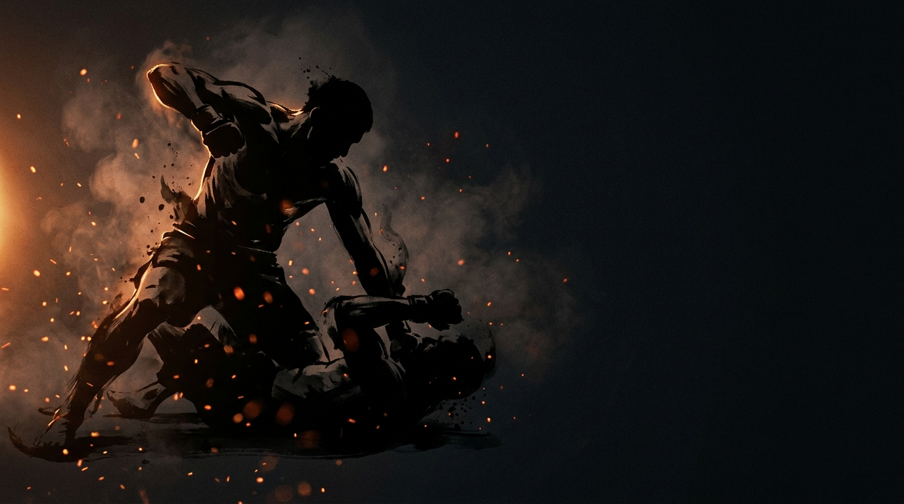

  
  
Control Concept · Wall + GroundTKO Pin

Control ConceptWall + GroundFleeting State

<b>A TKO Pin is a control <i>state</i>, not a position.</b> It exists the moment you control the opponent's frame while keeping a limb free to strike, and it can vanish just as fast.

  
Control the frame, free a limb,  strike before it slips away.

  
It's a fleeting state, not a held position. <b>Create it, capture it, stabilize it, re-acquire it.</b>

When a TKO Pin Exists

All four conditions must hold at once:

<ul class="emma-checklist">
  <li>The defender's hips and shoulders are meaningfully controlled.</li>
  <li>Posture and mobility are compromised.</li>
  <li><b>At least one limb is free to strike effectively.</b></li>
  <li>Defender options are high-cost, damage, exposure, reversal risk.</li>
</ul>

  
Control + a limb free to strike→<b>TKO Pin</b>, exploitation is possible

  
Control, no limb free→Standard Pin, control only

Key Properties

  

⏳

Often fleeting

Unlike a stable mount or back control, it's frequently a momentary state.It must be created, captured, stabilized if possible, and re-acquired when lost.

  

⚖️

Control vs. strike access

To strike, you must release some control, skilled attackers <b>oscillate</b> between the two.Maximum control = minimal strike access. Maximum strike access = reduced control. The oscillation is the skill.

  

📍

Wall or ground

Emerges in multiple environments.Wall pin positions (Level 3), ground control (from Wall → Ground transition), and the Stand-Up Loop after a successful re-pin.

Quality Spectrum

  
Threat→Available but not stabilized, fleeting

  
Stable→Held for multiple seconds, strikes landing

  
Dominant→No viable escape, fight-ending territory

Training Focus

The system trains the TKO pin as a four-phase loop:

  

    
1CreateOpen the pin

    
2CaptureSeize the control

    
3StabilizeHold it if you can

    
4Re-acquireRecover it when lost

  

  
A fleeting state: lose it, re-acquire, repeat

  
1<b>Create</b>Earn the position through control and transitions.

  
2<b>Capture</b>Recognize when the TKO pin is available.

  
3<b>Stabilize</b>Maintain the state while striking.

  
4<b>Re-acquire</b>Recover the pin after defender movement.

Where TKO Pin Appears

  
<a href="../../games/wall-control/">Wall Control</a>→Level 3, threaten TKO pin access

  
<a href="../../games/wall-to-ground/">Wall → Ground</a>→Level 3, establish TKO pin threat

  
<a href="../../games/standup-loop/">Stand-Up Loop</a>→Attacker win condition

Related Concept: DNS

<b>Defensive Neck Submissions (DNS)</b> are the primary defensive counter to TKO pin attempts, they keep attackers honest, and are allowed in all games where TKO pin is relevant.

When an attacker reaches for the TKO pin and their posture breaks:

  

🪢

Guillotine threats

Become available as posture breaks forward.

  

🤼

Front headlock entries

Open up against the broken posture.

  

🔀

Forced choice

Attacker must choose between TKO pin pursuit and neck safety.

??? abstract "System evolution notice"
    TKO Pin definitions may evolve as control models refine.
