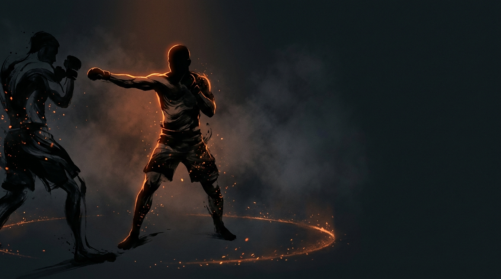

  
  
Spatial Control · All DomainsWinning the Circle

Spatial ControlAll DomainsFoundationalContinuous Battle

<b>Winning the Circle</b> is the outcome of a spatial exchange where one fighter holds the positional advantage. The <b>outside</b> fighter wins by cutting off escape and corralling the opponent to the boundary; the <b>inside</b> fighter wins by escaping to open space and regaining freedom.

  
Whoever owns the space,  owns the options.

  
Every moment, one fighter is winning the circle: shrinking space by pressure, or keeping it open by escape.

Key Positions

  ⚖️ 50/50 clinchEach fighter has one overhook and one underhook (mirror grips, one per side), starting chest to chest, symmetric and neutral. Whoever first wins inside control or the angle gains the advantage.
  🧱 Wall pinAt least two points of pinning control, the hips and upper body held immobile and flat to the wall. If the shoulders can still rotate, it's pressure, not a pin.

The Two Perspectives

  

🎯

Outside, Pressuring

Escape routes shrinking · their movement turns predictable · you hold centre while they near the boundary · you dictate range &amp; timing. <b>Success:</b> opponent reaches the boundary with limited options → clinch → wall pin.

  

🌀

Inside, Escaping

You keep access to open space · you move laterally without being cut off · you control when &amp; where engagements happen · they chase instead of cutting angles. <b>Success:</b> return to centre, reset distance, regain freedom.

The "Circle" Is Available Space

The circle doesn't need an actual circular boundary, it represents the **available space** around a fighter at any moment. Winning it means controlling that space: taking it away (attacker) or maintaining it (defender).

  
Cage→The space between you and the fence

  
Ring→The space between you and the ropes

  
Open mat→The imaginary space defined by your movement options

  
Training drill→The marked perimeter (cones, tape, etc.)

Why It Matters

Fighters who consistently win the circle control the fight's geography, tactical advantage in every domain.

  

🎯

Win it attacking

You dictate range &amp; timing · clinch and takedown entries open · their offense turns predictable · you accumulate control advantage.

  

🌀

Win it defending

You choose when to engage · you strike and move freely · you avoid being trapped · you deny their game plan.

Winning vs. Losing, A Continuous Battle

The circle can be won and lost many times in a single exchange. It is a continuous battle, not a single event.

  
Options increasingvsOptions decreasing

  
Space availablevsSpace shrinking

  
Movement proactivevsMovement reactive

  
You set the termsvsOpponent sets the terms

??? warning "Key insight, winning the fight ≠ winning the circle"

    
You can be "winning" a fight (landing strikes, scoring points) while <i>losing</i> the circle. If the opponent is steadily taking space, your options shrink even as you land shots. Eventually it catches up, you end up pinned to the cage or taken down.

How to Win It

  

🎯

Outside, Pressure

Cut angles, don't chase, move where they're going · use feints &amp; strikes as pressure without overcommitting · keep composure &amp; structure · recognise when clinch is available, then convert.

  

🌀

Inside, Escape

Move early, before space closes · circle laterally instead of backing up · strike to create space · recognise early when you're losing, awareness beats panic.

Developed Through Games

  
<a href="../../games/touch-game/">Touch &amp; Don't Get Touched</a>→Range and timing foundation

  
<a href="../../games/pressure-to-clinch/">Pressure to Clinch</a>→Full pressure-to-pin sequence

  
<a href="../../games/wall-control/">Wall Control</a>→What to do after winning the circle

Common Errors

??? note "Attacker errors"

    

      
Chasing, not cutting→Opponent escapes, you lose position

      
Over-pressuring (crashing)→Loss of composure, vulnerable to counters

      
Clinching too early→No setup, easy to defend or reverse

    

??? note "Defender errors"

    

      
Backing up straight→Runs directly into the boundary

      
Moving too late→Space already gone

      
Only using hands→Movement is the primary tool

    

The fighter who wins the circle doesn't just accumulate position, they accumulate <b>options</b>. And options win fights.

!!! abstract "Related Concepts"
    - [Wall Control, Establish the Pin](../games/wall-control.md), The completion of winning the circle for the attacker
    - [Pressure to Clinch](../games/pressure-to-clinch.md), The primary game for developing this skill
