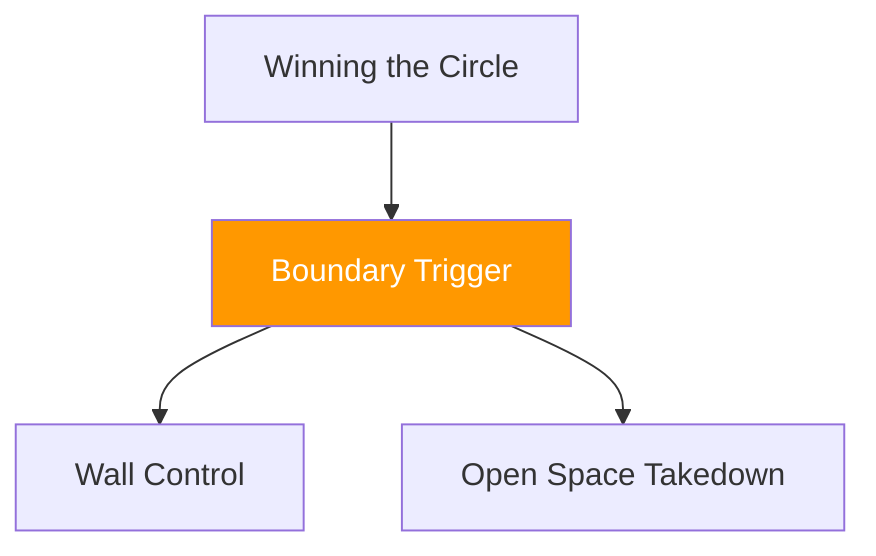

# Winning the Circle — Boundary Trigger

!!! info "Game Identity"
    - **Problem:** Recognizing clinch opportunity via space denial
    - **Environment:** Open Space → Boundary
    - **Stage:** Access → Transition

This game teaches athletes to **recognize when striking range has collapsed** and clinch engagement becomes available. The boundary acts as a permission trigger.

---

## Goal

This is an **asymmetric game** that transitions from striking to clinch.

| Role | Objective |
|------|-----------|
| **Attacker** | Force opponent into boundary-limited space and initiate clinch |
| **Defender** | Recognize boundary danger and escape before clinch is established |

The objective is **transition recognition**, not clinch technique.

---

## Entry Condition

- Begin from Winning the Circle format
- Boundary (wall, cage, or marked area) acts as clinch permission trigger
- Reset to neutral if defender escapes boundary cleanly
- Roles switch between rounds

---

## Invariants

1. Clinch allowed only at boundary — not in open space
2. No takedowns yet
3. Boundary replaces imaginary circle if training space has a wall

---

## Key Logic: The Boundary as Permission

!!! warning "Critical Concept"

    The boundary is not just a spatial constraint — it is a **behavioral trigger**.

When the defender's back approaches the boundary:

- Their retreat options disappear
- Lateral movement becomes their only escape
- The attacker gains **permission** to initiate clinch

This teaches attackers to **read spatial collapse** rather than chase arbitrarily.

### Clean Clinch vs Scramble Clinch

| Type | Definition | Outcome |
|------|------------|---------|
| **Clean clinch** | Hands connected, posture controlled, escape denied | Exchange ends — attacker wins |
| **Scramble clinch** | Contact made but defender still has exit options | Play continues |

---

## Win Conditions

| Role | Win Condition |
|------|---------------|
| Attacker | Hands-connected clinch with controlled posture |
| Defender | Escaping boundary and resetting to open space |

Typical round length: 60–90 seconds.

---

## Levels

=== "Level 1 — Clinch Only"
    - No strikes during approach
    - Focus purely on reading boundary and timing entry
    - Clinch technique is not evaluated — only recognition

=== "Level 2 — Add Strikes During Pressure"
    - Light strikes permitted
    - Strikes used to create backward movement toward boundary
    - Defender must manage both strike threat and spatial awareness

=== "Level 3 — Clinch + Immediate Continuation"
    - Upon clinch, play continues briefly (3–5 seconds)
    - Attacker must maintain clinch control
    - Defender may attempt immediate escape or reversal

---

## Advanced Expressions (Coach Context)

As athletes develop, the boundary trigger becomes internalized:

**For attackers:**

- Entry timing becomes instinctive
- Feints create backward movement without real strikes
- Clinch initiation flows directly from pressure

**For defenders:**

- Boundary awareness becomes constant, not reactive
- Lateral escapes become smaller and earlier
- Defensive clinch acceptance becomes a viable strategy

---

## System Position

This is the **critical transition game** between striking and grappling. It teaches the moment of domain change.

---

!!! abstract "System Evolution Notice"
    Boundary recognition rules may evolve with training environments.
