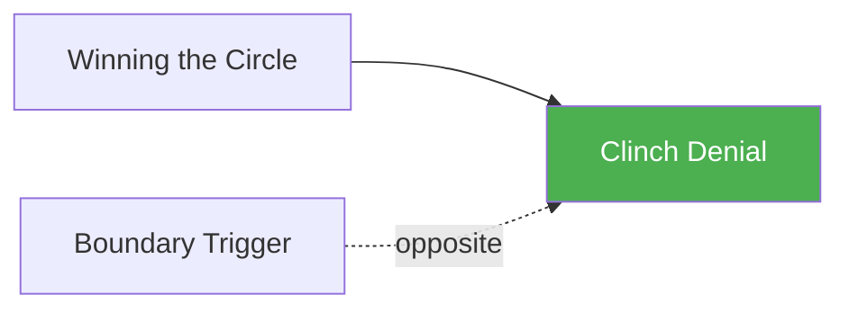

# Clinch Denial

!!! info "Game Identity"
    - **Problem:** Preventing opponent from establishing clinch connection
    - **Environment:** Open Space
    - **Stage:** Counter (Anti-Access)

This is a **defensive wrestling game** focused on preventing clinch establishment. The defender learns to use frames, hand fighting, and movement to deny connection.

---

## Goal

This is an **asymmetric game** with distinct roles.

| Role | Objective |
|------|-----------|
| **Attacker** | Establish meaningful clinch connection (hands locked, collar tie, body lock) |
| **Defender** | Deny clinch and maintain open space |

The objective is **connection denial**, not escape from clinch.

---

## Entry Condition

- Both players start standing at mid-range
- Attacker attempts to close distance and establish clinch
- Defender uses frames, hand fighting, and movement
- Reset when clinch is established OR defender creates significant space

---

## Invariants

1. Attacker **must attempt clinch** — no striking-only pressure
2. Defender **cannot strike** at Level 1 — denial tools only
3. Brief hand contact is not clinch — must be meaningful connection
4. Game ends on clinch establishment, not continuation

---

## Task Focus

### Attacker
- Close distance
- Swim hands to connection
- Use collar ties, underhooks, body lock attempts
- Chain attempts when denied

### Defender
- Post and frame to create distance
- Hand fight to deny grips
- Circle and angle to prevent direct entry
- Push off and disengage

!!! question "Key Internal Questions — Defender"
    - "Am I stopping their hands before they connect?"
    - "Can I create an angle before they close distance?"
    - "Am I framing effectively or just pushing?"

---

## Key Logic: Deny Before Connected

!!! note "The Core Skill"
    Clinch denial is easier than clinch escape. The progression:

    | Stage | Difficulty | Tools |
    |-------|------------|-------|
    | Before they reach | Easiest | Movement, distance |
    | As they reach | Medium | Frames, hand fighting |
    | After they connect | Hardest | Clinch escape (different game) |

    This game focuses on the first two stages.

---

## Win Conditions

| Role | Win Condition |
|------|---------------|
| **Attacker** | Establish meaningful clinch (both hands connected with control) |
| **Defender** | Deny clinch for set time OR create significant space |

**On defender win:** Roles switch.
**On attacker win:** Reset, same roles.

---

## Levels

=== "Level 1 — No Strikes"
    - Pure clinch entry vs. denial
    - No strikes from either player
    - Focus: Hand fighting and framing

=== "Level 2 — Attacker Uses Pressure"
    - Attacker can use forward pressure to close space
    - Defender must manage being backed up
    - Focus: Denial under pressure

=== "Level 3 — Add Movement"
    - Defender can use footwork and angles
    - Attacker must cut off and close
    - Focus: Movement-based denial

=== "Level 4 — Full MMA Expression"
    - Defender can strike to create space
    - Attacker must close through strike threat
    - Focus: Clinch denial under MMA pressure
    - See: [Full MMA Expression](../concepts/full-mma-expression.md)

---

## Safety

- **Contact limits:** Light contact on frames and hand fighting
- **Stop conditions:** Excessive force, frustration
- **Coach intervention:** Reset if neither player is progressing

---

## System Position

- **Prerequisite games:** Winning the Circle
- **Follow-on games:** Boundary Trigger (opposite perspective)
- **Related concepts:** Hand Controls

---

!!! abstract "System Evolution Notice"
    This game may be refined as clinch denial patterns emerge.
