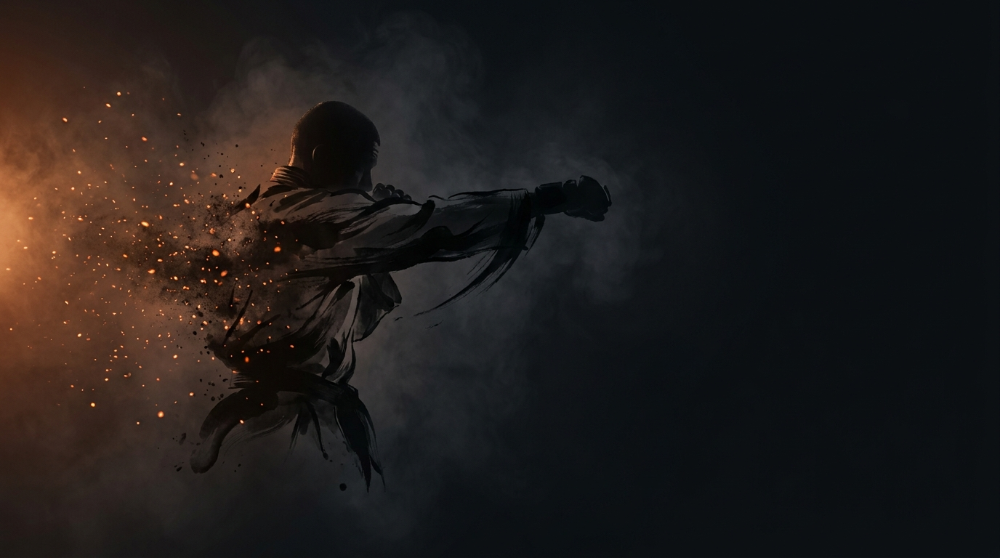

  
  
Transition · WrestlingClinch Denial

TransitionWrestlingDefensiveIntermediateOpen Space

Deny the clinch before it forms, frames, hand fighting, and movement keep open space.

  
Start<b>Two fighters at mid-range in open space, inside a marked perimeter.</b>

  
→

  
The Goal<b>Attacker locks a clinch; defender denies connection &amp; keeps space.</b>

  
→

  
Finish<b>Deny for the round → switch · Clinch locks → reset · Leave the perimeter → loss.</b>

  
Don't escape the clinch,  never let it form.

  
Frames, hand fighting, and movement keep open space. <b>Denying connection is far easier than escaping it once locked.</b>

Key Positions

  ⚖️ 50/50 clinchEach fighter has one overhook and one underhook (mirror grips, one per side), starting chest to chest, symmetric and neutral. Whoever first wins inside control or the angle gains the advantage.

What to Read

<b>Attune to</b> the <i>felt frames</i>, the <b>inertial array</b> at the contact: how the attacker's reach and posture load against your hands and forearms as they close, not their eyes or their feet. That haptic information specifies <i>which grip is coming</i> and <i>which way to frame</i> before connection sets.

The Starting Position

  
PlayersTwo, squared off at mid-range.

  
RangeMid-range, open space.

  
BoundaryA marked perimeter, both stay inside.

  
RolesOne attacker, one defender.

  
Start &amp; resetAttacker initiates; reset after a clinch locks or space is created.

The Matchup

  

    
🤼

    
Attacker

    
Trying to close distance and lock a meaningful clinch, collar tie, underhook, or body lock with control.

    Swim hands to connection; chain attempts when denied. Brief contact isn't a clinch, you need a meaningful, controlling grip. Scale pressure to the defender's success.
  

  
VS

  

    
🛡️

    
Defender

    
Trying to deny connection and keep open space, frames, hand fighting, and movement, not escape.

    Post and frame, hand-fight the grips, circle and angle off entries. No striking at Level 1, pure denial tools. Stop them before they connect, not after.
  

The Rules

  🤼 Attacker must attempt clinchThe attacker must seek a clinch entry, no striking-only pressure. This keeps the defender's reading problem focused on connection denial.
  🛡️ Denial tools only, no strikes (L1)At Level 1 the defender uses frames, hand fighting, and movement only, no strikes. This isolates the pure denial solution before striking is integrated.
  🔗 Meaningful connection onlyBrief hand contact is not a clinch. The attacker must establish a controlling grip, collar tie, underhook, or body lock, for it to count.
  🏁 Game ends on clinchPlay ends the moment a meaningful clinch is established, this game trains denial, not escape from a locked clinch (a different game).
  ⬛ Stay inside the perimeterPlay happens inside a marked perimeter, any shape (square, circle, taped lines). If both feet leave it, you lose instantly.

How to Win

  
Switch Deny for the round or create space → switch roles.When the defender denies the clinch for the set time or creates significant space, the players switch roles. The defender kept open space for the full round or broke clean, and earns the attacking role.

  
Reset Clinch locks → reset, same roles.When the attacker locks a meaningful clinch, reset to mid-range, same roles. Both hands connected with control, collar tie, underhook, or body lock. Then begin again from mid-range.

  
Loss Both feet leave the perimeter → loss.When both of a player's feet leave the perimeter, that player loses, whoever they are. Crossing the marked perimeter loses the game instantly, regardless of the exchange, training the cage-edge awareness a fighter needs.

The Levels

  
1<b>No strikes</b>Pure entry vs. denial.Pure clinch entry against pure denial, no strikes either side. Build hand fighting and framing with no other pressure.

  
2<b>Attacker pressures</b>Forward drive to close space.The attacker adds forward pressure to close space. The defender must deny while being backed up.

  
3<b>Add movement</b>Footwork and angles.The defender uses footwork and angles to deny; the attacker must cut off and close. Movement-based denial.

  
4<b>Full MMA</b>Strike to create space.The defender can strike to create space; the attacker must close through the strike threat. Clinch denial under <a href="../../concepts/full-mma-expression/">full MMA pressure</a>.

Recall Check

  
Test yourself before moving on. Answer out loud, then reveal what good looks like.

  

    
Q What are you reading to know which grip is coming and which way to frame?

    
The <b>felt frames</b>, the <b>inertial array</b> at the contact: how the attacker's reach and posture load against your hands and forearms as they close. Not their eyes or their feet. That haptic information arrives <b>before connection sets</b>.

  

  

    
Q Why does this game end the moment a clinch locks rather than letting you escape?

    
It trains <b>denial, not escape</b>. Denying connection is far easier than escaping a locked clinch, so the whole skill lives in stopping them <b>before they connect</b>.

  

  

    
Q What counts as a real clinch here, and what doesn't?

    
A <b>meaningful, controlling grip</b>: a collar tie, underhook, or body lock. <b>Brief hand contact is not a clinch.</b> The attacker has to establish control for it to count.

  

  

    
Q What is the difference between framing and just pushing?

    
A <b>frame redirects and creates an angle</b>; a shove only delays the entry. Feel which grip is coming and meet it, don't just brace against forward pressure.

  

Go Deeper

??? note "Task focus &amp; coaching cues"

    
Each role's job

    

      

🤼

Attacker

Close distance; swim hands to connection; use collar ties, underhooks, body lock attempts; chain when denied.

      

🛡️

Defender

Post and frame to create distance; hand-fight grips; circle and angle off entries; push off and disengage.

    

    
Coaching cues

    

      

⏱️

Stop them before they connect

"Are you stopping them before they connect or after?" Early denial, frames and hand fighting before the clinch sets. Late denial becomes escape, which is harder.

      

✋

Frame, don't just push

"Am I framing effectively or just pushing?" A frame redirects and creates an angle; a shove only delays. Feel which grip is coming and meet it.

    

??? abstract "Constraints-Led analysis"

    
Constraints → Affordances

    

      
Attacker must attempt clinch→Consistent clinch attempts to defend

      
Defender can't strike (L1)→Isolates hand fighting &amp; framing skill

      
Game ends on clinch (not escape)→Focuses on denial, not escape after connection

      
Progressive tools (frames → movement → strikes)→Scaffolded learning of denial options

      
Mid-range start→Time to read and react before contact

    

    
Develops <b>clinch-denial affordances</b>, perceiving entry attempts and selecting denial tools. Denial is easier than escape; this game exploits that principle (Renshaw et al., 2019).

    
What the defender reads

    

      

👁️

Visual

Entry angle, hand targeting, distance closure, head position → frame direction &amp; movement timing.

      

✋

Haptic

Grip attempts &amp; reach loading on the frames → which hand to fight.

      

🧭

Proprioceptive

Own frame position &amp; strength → denial effectiveness.

    

    
What we measure (order parameter)

    
Whether the defender <b>meets the entry in time</b>, frame and hand-fight arriving before the grip sets, so they stay free rather than getting clinched. Track clean denials vs. clinches locked, and whether the frame re-sets between attempts. That timing relationship is the order parameter; when it stabilizes, the skill has formed.

    
Representativeness

    
<b>Models:</b> a striker keeping a wrestler or clinch-fighter from establishing connection to keep the fight at distance.

    
Simplified: no strikes (L1)ends on clinchdenial not escape

    
Hand fighting and framing here transfer to any clinch-denial situation, opposite perspective to <a href="../wall-control/">Wall Control</a>.

    
Readiness to progress

    <ul class="emma-checklist">
      <li>Denies ~70%+ vs. varied attackers</li>
      <li>Uses frames, hand fighting &amp; push-offs</li>
      <li>Can describe: "I stopped their underhook by…"</li>
      <li>Composed under forward pressure</li>
    </ul>

    
Warning signs

    

      Gets clinched consistently
      Only uses one denial tool
      Backs up without framing
      Panics when grips are attempted
    

??? note "Safety &amp; related games"

    

      🤝 Light contact on frames &amp; hand fighting
      🛑 Stop on excessive force or frustration
      🔁 Reset if neither player is progressing
    

    
Where it sits

    

      
Prerequisite→<a href="../pressure-to-clinch/">Pressure to Clinch</a>

      
Follow-on→<a href="../wall-control/">Wall Control</a> (opposite perspective)

      
Related→<a href="../../concepts/hand-controls/">Hand Controls</a>

    

