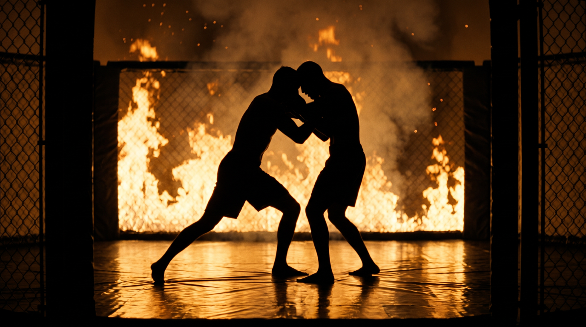

  
  
Transition · WrestlingClinch Holder

!!! warning "Provisional (WIP): derived from class recording 2026-08-21"
    Run live for roughly twenty minutes across several rounds, extended twice by student request.
    **Pending review on the platform.** Name and structure may change.
    Roles are named **Holder** and **Escaper**. See <a href="../closing-the-distance/">Closing the Distance</a> for why this family avoids offense and defense.

TransitionWrestlingCombinedIntermediateControl → Damage

The sibling of <a href="../fifty-fifty-clinch/">50/50 Clinch</a>: same start, opposite goals. One man has to keep you and hurt you at the same time. The other has to leave, or get under you.

  
Start<b>Both fighters already in a 50/50 clinch, one body length off the wall, inside a marked perimeter.</b>

  
→

  
The Goal<b>The Holder keeps the clinch and does damage from it. The Escaper separates clean or drops under the hips.</b>

  
→

  
Finish<b>Held and landing for the count → Holder · Clean separation or a connection on the legs → Escaper · Back taken → gold star.</b>

  
Holding him is not the win.  Holding him while you hurt him is the win.

  
A man who only hangs on is stalling, and stalling does not score here. <b>The price of the position is that you have to use it.</b>

What to Read

<b>Attune to</b> <i>where his weight is going</i> through the points you are connected at: weight coming into you means he is posting to create the frame he will leave through, weight leaving means the separation has already started. Read <i>the change in his hip height</i>, because a dropping hip is the level change arriving and it demands a different answer than a shove. Read <i>which of your three contact points has gone soft</i>, since escapes begin where pressure was released rather than where it was applied. For the Escaper, read <i>the moment his strike commits</i>, because the hand that is hitting you is a hand that is no longer holding you.

The Starting Position

  
PlayersTwo, one Holder, one Escaper.

  
RangeAlready clinched, in a 50/50, chest to chest, neither with a dominant tie.

  
BoundaryA marked perimeter. Start one body length off the wall so the wall has to be earned.

  
RolesHolder: keep the clinch and land. Escaper: separate or take the legs. Both may strike from inside.

  
Start &amp; reset"Go". Roles switch on any win. Rotate with the winner staying in.

The Matchup

  

    
🧲

    
Holder (Sticky)

    
Trying to keep him from leaving while landing real work from inside the clinch.

    Take the wall, it is your friend and not his. Drive the forehead, the shoulder and the hip together. Get to the side, hip to hip, one hand free, and work. Every strike should either stop him leaving or move him toward where you want him.
  

  
VS

  

    
🚪

    
Escaper (Leaving)

    
Trying to break clean back to range, or get under the hips and connect on the legs.

    Urgency. Every second you stay is damage you are taking for free. Your strikes are not there to knock him out, they are there to make him react so a gap opens. Do not trade your escape for a chance to hit him hard.
  

The Rules

  👊 The Holder must damage, not just holdHanging on scores nothing. The win requires the clinch to be kept <b>and</b> used. This is the anti-stall rule built into the win condition itself rather than added as a separate penalty, and it is the standard across this family.
  🦵 Knees are thrown with the thighBring the thigh into the side of the body or the leg. Never the point of the knee, and never to the head. Same for punches from inside: contact is shown and controlled, not landed with weight.
  🔄 Any clinch is legalPlum, collar ties, body lock, over-under, dirty boxing position, all of it. Switch grips freely. If the 50/50 is causing you problems, take it to a body lock or get behind him.
  🧱 The environment is in playThe wall is live from the first rung and it belongs to whoever gets there first. The Holder wants the Escaper's back on it. The Escaper wants to stay off it and use it to spin out.
  🦶 The Escaper's connection goes under the hipsThe level change has to arrive genuinely under the hips onto the legs. Grabbing at a leg from a bad, bent-over position is not a win, it is a worse position that happens to touch the target.
  ⛔ No finishing takedown by defaultThe connection on the legs ends the exchange. We are not completing the takedown, because completing it from a poor position teaches you to accept the poor position. Restore the finish only when the group holds the position well.
  ⬛ Stay inside the perimeterBoth feet out loses the exchange for whoever crosses it.

How to Win

  
Holder Keep the clinch for five seconds while landing at least three controlled strikes → win.Both halves are required and both are countable. Five seconds of him genuinely trying to leave, and three shown knees or punches inside that window. Holding him for five seconds without landing is not a win, it is a stall.

  
Holder Take the back and hold it three seconds → gold star.Chest to back, behind him, staying there. The best place to be in any fight, and the hardest to earn from a neutral clinch. Once you are there, his problems are entirely his own.

  
Escaper Break clean to striking range → win.Fully separated, facing him, back at a range where he would have to re-enter. A break where he keeps a tie and drags you straight back is not a break.

  
Escaper Get under the hips and connect on the legs → win.A real level change with hands on the legs from underneath. Sprawled on, or stuffed and picked back up into the clinch, means no count and he keeps working.

  
Loss Both feet leave the perimeter, or the Holder stalls out the round.A Holder who reaches the end of the round having held and landed nothing has lost it. Stalling is a losing strategy here by design.

The Levels

  
1<b>Hold and leave</b>No strikes, position only.Pure holding against pure escaping. No strikes either side. Find out what actually keeps a man where he is, and where the exits are, before anything else is added.

  
2<b>The legs go live</b>The Escaper earns the level change.The Escaper now has a second door: under the hips onto the legs. The Holder has to defend leaving and defend the shot at once, which is what makes the clinch an MMA problem rather than a wrestling one.

  
3<b>Damage on</b>The Holder must land to win.Controlled knees off the thigh and dirty boxing come on, for both players. The Holder's win now requires landing, so simply hanging on stops working. The Escaper's strikes are for creating reactions, not for winning.

  
4<b>Take the wall</b>Drag him onto it.Still starting a body length off, but now the wall is the explicit objective. Pinning against it makes holding far easier and escaping far harder, and it is where the three points of pressure earn their keep.

  
5<b>Finish it</b>The takedown is restored.The Escaper's connection may now be completed to a takedown, and the Holder may convert to a takedown of their own. Only once the group is holding good position, never as a shortcut to the win condition.

Recall Check

  
Test yourself before moving on. Answer out loud, then reveal what good looks like.

  

    
Q You held him for the whole round and he never got away. Did you win?

    
<b>No.</b> Holding is half the job. If nothing landed, you stalled, and stalling loses here. The position is only worth having if you spend it, which is exactly true in a real fight where a referee will stand you up.

  

  

    
Q You are the Escaper and you have a clean shot at his chin. Take it?

    
<b>Probably not.</b> Your goal is the door, not the knockout. Strikes from the bottom of this position are there to buy a reaction that opens a gap. The moment you trade your escape plan for a chance to hurt him, you are playing his game inside his grip.

  

  

    
Q Where does the wall belong?

    
<b>To whoever gets there first, and it is the Holder's friend far more than the Escaper's.</b> A man with his back on the wall has lost most of his exits. If you are holding, put him there. If you are escaping, keep your back off it and use it to spin around him.

  

  

    
Q Why does the game stop before the takedown is finished?

    
Because reaching a winning condition from a bad position is not winning. If the shot is scored the moment hands touch legs, students learn to dive at legs from bent-over, vulnerable positions. The win condition is a stand-in for "I am in a place from which I could take him down", and it only means that if the position is good.

  

Go Deeper

??? note "Task focus &amp; coaching cues"

    
Each role's job

    

      

🧲

Holder

Get to the wall, get to the side, hip to hip with a hand free. Three points of pressure. Strike to stop him leaving, and to move him where you want him.

      

🚪

Escaper

Urgency first. Wiggle the arms, find the frame, use his committed strike as your window. Off the wall, redirect his motion. Under the hips if the door will not open.

    

    
Coaching cues

    

      

🧠

Use the forehead

The single most under-used tool in the position. Drive it into the head or the spine and keep it there, switching sides as he turns. See <a href="../../concepts/three-points-of-pressure/">Three Points of Pressure</a> for the full picture.

      

⚡

Urgency, not patience

The mirror image of the entry game. There, the man closing has all the time in the world. Here, the man held has none, because every second is damage. Escapers who settle in and work the problem calmly are misreading the position.

      

🎣

Strikes buy reactions

True for both roles, for different reasons. The Holder strikes to stop movement and to steer. The Escaper strikes to make an arm bend so it can be spun out of. Neither is hunting a finish from here.

      

🥋

Do not out-judo a bigger man

A recurring failure is the smaller player trying to throw someone heavier rather than taking the position. Switch grips, take the body lock, or get behind him. Position first, technique second.

      

♟️

Check, not checkmate

Hip to hip on the side, one hand free, his weapons pointing the wrong way. It is not a finish, and treating it as one gets you reversed. It is the place from which everything else becomes available.

    

??? abstract "Constraints-Led analysis"

    
Constraints → Affordances

    

      
Holder must land to win, not merely hold→Makes stalling a losing strategy structurally, without a separate penalty rule

      
Escaper has two doors, out or under→Forces the Holder to defend separation and the level change simultaneously, which is the actual MMA clinch problem

      
Start one body length off the wall→The wall becomes something to win rather than a fixed feature, so both players have to fight for the environment

      
Both may strike from inside→Hands are shared between holding and hitting, so every strike is a small release and every grip is a forgone strike

      
Takedown withheld by default→Stops students chasing the scoring event from positions that would get them hurt, keeping the win a proxy for real position

    

    
The defining feature is <b>anti-stall by win condition</b>. Elsewhere in the library a stalling tax is bolted on as an extra rule at a later level. Here it is inseparable from winning: the Holder cannot succeed by hanging on, because hanging on is not what the win says. This is the pattern to prefer whenever a control game risks becoming a hugging contest.

    
The second feature is the <b>shared-resource tension</b>. Both players have exactly two hands and three jobs between them. The Holder must choose, moment to moment, how much to hold and how much to hit; the Escaper must choose between framing and striking. That trade is the whole game, and it is what a clinch actually feels like.

    
What athletes read

    

      

👁️

Visual

Change in hip height → shot or shove. Which way the head is turning → which side the escape is coming out of.

      

✋

Haptic

Weight arriving or leaving through each contact point → hold, release, or reposition. A contact point going soft → the exit he is building.

      

🧭

Proprioceptive

Own head position under load, and where the wall sits relative to both sets of hips.

    

    
What we measure (order parameter)

    
Whether <b>holding and hitting stop competing</b>. Early on students alternate visibly: they grip, then release to strike, then re-grip. The game has done its work when strikes come out of the structure without the structure loosening, and when the Escaper's exits start arriving off a committed strike rather than off brute strength. Count strikes landed per five seconds of control, and track how often a Holder loses the position in the act of throwing.

    
Representativeness

    
<b>Models:</b> where most amateur fights actually live, the 50/50 clinch, and the thing that makes it an MMA position rather than a Muay Thai one: the constant threat of the level change underneath. Thai clinch work builds real skill, but it is played without that threat, so the solutions it produces do not transfer here unchanged.

    
hold and land, or it does not counttwo doors outthe wall is live

    
Sibling of <a href="../fifty-fifty-clinch/">50/50 Clinch</a>: identical start, opposite goals, which makes them different games rather than levels of one. Picks up where <a href="../closing-the-distance/">Closing the Distance</a> ends. Feeds <a href="../wall-control/">Wall Control</a> and <a href="../wall-grinding/">Wall Grinding</a>.

    
First-run observations (2026-08-21)

    <ul class="emma-checklist">
      <li>The most requested game of the session, extended twice by the students themselves</li>
      <li>Forehead pressure had to be coached four times during rounds before it was taught formally, and it stuck immediately once named</li>
      <li>Escapers consistently lacked urgency and treated the position as a puzzle rather than a fire</li>
      <li>Smaller players repeatedly tried to throw heavier partners instead of improving position first</li>
      <li>One neck compression against the wall, caused by a dropped head as the partner left the wall. The head-up rule is not a formality</li>
      <li>The finishing takedown was deliberately withheld on the day because of size disparity in the room</li>
    </ul>

    
Readiness to progress

    <ul class="emma-checklist">
      <li>Strikes without loosening the structure that is holding him</li>
      <li>Gets to the side and hip to hip rather than staying square and wrestling</li>
      <li>Uses the forehead as pressure by default, not as an afterthought</li>
      <li>As Escaper, moves with urgency and exits off a committed strike</li>
      <li>Keeps the head up while driving, particularly near the wall</li>
    </ul>

    
Warning signs

    

      Holds on and lands nothing, then claims the round
      Escaper settles in and works calmly while taking damage
      Head drops while driving forward, especially coming off the wall
      Tries to throw a much heavier partner instead of taking the position
      Releases the whole clinch in order to throw one shot
      Dives at the legs from a bent-over, vulnerable posture
    

??? note "Safety &amp; related games"

    

      🧠 Head up when you drive. Dropping the head as your partner leaves the wall is how necks get compressed. If you are going to disappear, disappear into the wall, not into the floor
      🦵 Knees with the thigh into the body or leg only, never the point, never the head
      🤛 Strikes inside the clinch are shown and controlled, this position makes real damage very easy to do
      ⚖️ Size mismatches are common here, hold rung 5 until both players are comfortable
      🌪️ No throws or sweeps at speed, the wall and the floor arrive faster than people expect
    

    
Where it sits

    

      
Prerequisite→<a href="../fifty-fifty-clinch/">50/50 Clinch</a> · <a href="../closing-the-distance/">Closing the Distance</a>

      
Follow-on→<a href="../wall-control/">Wall Control</a> · <a href="../wall-grinding/">Wall Grinding</a> · <a href="../body-lock-to-ground/">Body Lock to Ground</a>

      
Related→<a href="../wall-escape/">Wall Escape</a> · <a href="../../concepts/three-points-of-pressure/">Three Points of Pressure</a> · <a href="../../concepts/hand-controls/">Hand Controls</a>

    

