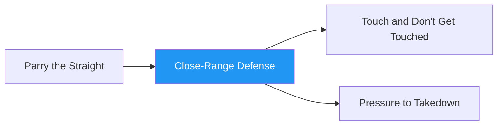

# Close-Range Defense

!!! info "Game Identity"
    - **Problem:** Defending strikes at close range using multiple defensive solutions
    - **Environment:** Open Space (Close Quarters)
    - **Stage:** Access / Counter

This is a **scaling defensive game** that progressively opens up defensive options. The defender learns to mix between blocking, parrying, and dodging based on what the situation demands.

---

## Goal

This is an **asymmetric game** with distinct roles.

| Role | Objective |
|------|-----------|
| **Attacker** | Compromise defender's openings and land strikes |
| **Defender** | Defend strikes using defensive principles (tight blocking, parrying, static dodging) |

The objective is **defensive adaptability** — learning when to use which solution.

---

## Entry Condition

- Both players start at close quarters (inside striking range)
- Attacker in "winning position" (slight pressure advantage)
- Defender in "losing position" (must defend, cannot exit freely)
- Reset after successful defensive sequence or clean strike lands

---

## Invariants

1. Defender **cannot exit** — must stay and defend (no backing up continuously)
2. Attacker must throw combinations and **allow for reset** (no continuous overwhelming pressure)
3. Attacker must strike in reasonable distance (can't crowd the defender)

---

## Task Focus

### Attacker
- Compromise defender's openings and land strikes
- Start with only head strikes or only straight punches
- Scale difficulty to partner — increase challenge with successful defense

### Defender
- Mix between different kinds of defense as task focus opens up
- Start with only tight blocking
- Progress to blocking with parrying, then add dodging

!!! warning "Defensive Trade-offs"
    - **Hands closer to face** = easier to defend strikes, harder to counter
    - **Hands further out** = more compromised, but can disrupt attacker or counter
    - **When dodging**, more offline head = more compromised for significant strikes

---

## Key Logic: Scaling Defensive Solutions

The defender's available tools open up progressively:

| Level | Blocking | Parrying | Dodging | Counter |
|-------|:--------:|:--------:|:-------:|:-------:|
| 1 | Yes | — | — | — |
| 2 | Yes | Yes | — | — |
| 3 | Yes | Yes | Yes | — |
| 4 | Yes | Yes | Yes | Yes |

This teaches the defender to **layer** defensive solutions.

### Attacker Scaling

The attacker scales difficulty based on defender success:
- If defender handles current level → increase variety, speed, or combination length
- If defender struggles → simplify until they find success

---

## Win Conditions

**No winning condition** — this is a diagnostic game.

Success is evaluated by:
- **Defender:** Percentage of strikes defended, quality of defensive selection
- **Attacker:** Ability to find openings, appropriate scaling

---

## Levels

=== "Level 1 — Tight Blocking Only"
    - Defender can only use tight blocking (shell up)
    - Attacker throws head strikes only, straight punches only
    - Focus: Absorb and reset

=== "Level 2 — Add Parrying"
    - Defender can now block OR parry
    - Attacker adds body strikes
    - Focus: Choose appropriate defense for each strike

=== "Level 3 — Add Dodging"
    - Defender can block, parry, or dodge (static head movement)
    - Attacker adds hooks and varied combinations
    - Focus: Full defensive toolkit integration

=== "Level 4 — Add Counter Opportunity"
    - After successful defense, defender can throw one counter strike
    - Attacker must respect the counter threat
    - Focus: Defense as setup for offense

=== "Level 5 — Turn the Corner"
    - Defender can work to reposition (turn the corner on attacker)
    - Creates angle for counter-attack or escape
    - Focus: Defensive footwork integration

=== "Level 6 — Full MMA Expression"
    - Attacker can throw strikes AND shoot or establish clinch
    - Attacker wins by: landing clean strike OR establishing meaningful clinch/connection
    - Defender must defend strikes AND deny grappling entry
    - Focus: Full defensive toolkit under realistic MMA pressure
    - Shelling up without posture awareness creates takedown opportunities
    - See: [Full MMA Expression](../concepts/full-mma-expression.md)

---

## Constraints Analysis

*How this game applies the [Constraints-Led Approach](../principles/cla/index.md)*

| Constraint Type | Constraint | Affordance Created |
|-----------------|------------|-------------------|
| **Task** | Defender cannot exit (must stay in range) | Forces defensive engagement, no escape option |
| **Task** | Progressive tool availability (block → parry → dodge → counter) | Scaffolded learning of defensive integration |
| **Task** | Attacker must allow reset between combinations | Processing time for learning |
| **Task** | Close quarters starting position | No distance buffer—must defend immediately |
| **Individual** | Prerequisite: Skill isolation games | Foundation of individual defensive tools |
| **Environmental** | Open space, close range | Defensive selection matters (all solutions viable) |

!!! info "Theoretical Foundation"
    This game implements **Constrain to Afford** (Renshaw et al., 2019). By progressively unlocking defensive solutions, the defender naturally discovers which tools work for which attacks. The constraint of staying in range prevents the common escape response and forces true defensive skill development. **Degeneracy** develops as the defender learns multiple solutions for similar problems.

---

## Information Structure

*What athletes must perceive to succeed (perception-action coupling)*

### Defender Perceives

| Information Source | What to Read | Action It Supports |
|--------------------|--------------|-------------------|
| **Visual** | Punch type and trajectory | Select block, parry, or dodge |
| **Visual** | Combination rhythm | Anticipate follow-up strikes |
| **Visual** | Attacker's weight shift | Timing of defensive action |
| **Visual** | Openings after attacker commits | Counter timing |
| **Proprioceptive** | Guard position and coverage | Gaps in defense |
| **Haptic** | Strike impact location | Adjustment of guard position |

### Attacker Perceives

| Information Source | What to Read | Action It Supports |
|--------------------|--------------|-------------------|
| **Visual** | Defender's guard position | Where openings exist |
| **Visual** | Defender's defensive pattern | What they favor (block vs. parry) |
| **Visual** | Defender's posture and balance | When to press, when to reset |

!!! tip "Coaching Cue"
    Ask defenders: "Which defense did you use? Why that one?" This develops conscious awareness of selection, which becomes unconscious with practice.

---

## Representativeness

*How this game models real MMA situations*

### Real MMA Situation

Being pressured in close quarters and needing to defend multiple strikes while looking for opportunities to counter or escape.

### How This Game Represents It

| Element | Real MMA | This Game | Fidelity |
|---------|----------|-----------|----------|
| **Attack variety** | Full arsenal including grappling | Strikes scaled by level | Simplified |
| **Defensive options** | All available | Progressively unlocked | Scaffolded |
| **Exit option** | Can move away | Cannot exit at lower levels | Simplified |
| **Pressure intensity** | Continuous possible | Reset between combos | Reduced |
| **Consequence** | Damage, knockdown | Diagnostic (no scoring) | Reduced |

### Simplifications & Justification

| Simplification | Why Acceptable |
|----------------|----------------|
| Progressive tool unlocking | Allows focus on learning each defensive solution |
| Mandatory reset between combos | Processing time for deliberate practice |
| Staying in range required | Develops true defensive skill, not escape reliance |

!!! note "Transfer Expectation"
    Athletes who develop defensive selection here transfer directly to live striking exchanges. The perception-action coupling—seeing a strike type and selecting appropriate defense—is identical to competition.

---

## Variability Guidelines

*Creating "repetition without repetition" (Bernstein, 1967)*

### Within-Level Variability

| Vary This | How | Maintains |
|-----------|-----|-----------|
| **Attacker** | Different partners with different styles | Exposure to varied attack patterns |
| **Combination length** | 2-punch, 3-punch, 4-punch sequences | Defensive endurance and selection |
| **Attack type emphasis** | Body-focused sessions, head-focused sessions | Complete defensive vocabulary |
| **Tempo** | Fast combinations, slow combinations | Timing adaptability |
| **Intensity** | Light touch, moderate contact | Pressure calibration |

### What NOT to Vary

| Keep Constant | Why |
|---------------|-----|
| No exit allowed | Core constraint defining the game |
| Progressive tool unlocking | Scaffolded learning structure |
| Reset between combinations | Maintains processing opportunity |

### Progressing Through Levels

| Signal to Progress | Meaning |
|--------------------|---------|
| Appropriate defense selection 70%+ | Decision-making developing |
| Smooth transitions between defensive tools | Integration occurring |
| Defensive posture maintained between combos | Recovery skill established |

---

## Readiness Indicators

*When is the athlete ready to advance?*

### Ready for Next Level When

- [ ] Current tool set used appropriately (right defense for right strike)
- [ ] Smooth transitions between defensive solutions
- [ ] Composure maintained under attack pressure
- [ ] Can articulate why they chose specific defenses
- [ ] Recovery to good position after each combo

### Ready to Exit Game When

- [ ] Level 4+ competence (uses counters effectively)
- [ ] Defensive selection is automatic, not deliberate
- [ ] Can defend varied attackers with different styles
- [ ] Ready to integrate with footwork (Evasive Movement) or striking (Touch Game)

### Warning Signs (Not Ready to Progress)

| Sign | Meaning | Response |
|------|---------|----------|
| Only uses one defensive tool | Selection not developing | Constrain: "This round, no blocking—parry or dodge only" |
| Panics under combinations | Overwhelmed at current level | Reduce combo length, slow tempo |
| Takes clean shots frequently | Defense not effective | Return to previous level |
| Backs up despite constraint | Escape response dominating | Reinforce constraint, add boundary |

---

## Advanced Expressions (Coach Context)

As athletes develop:

**For defenders:**
- Defensive selection becomes automatic
- Movement between blocking, parrying, and dodging becomes fluid
- Counter opportunities are recognized instantly

**For attackers:**
- Learn to read defensive habits and exploit them
- Develop combination intelligence

---

## Safety

- **Contact limits:** Light to moderate — strikes should be felt but not damaging
- **Stop conditions:** Overwhelming pressure, loss of composure
- **Coach intervention:** Reset if attacker is not allowing defensive opportunities

---

## System Position

- **Prerequisite games:** Parry the Straight (and other skill isolation games)
- **Follow-on games:** Touch and Don't Get Touched, Pressure to Takedown
- **Related concepts:** Defensive Solutions in Striking, Hand Controls

---

!!! abstract "System Evolution Notice"
    This game may be refined as defensive integration patterns emerge.
