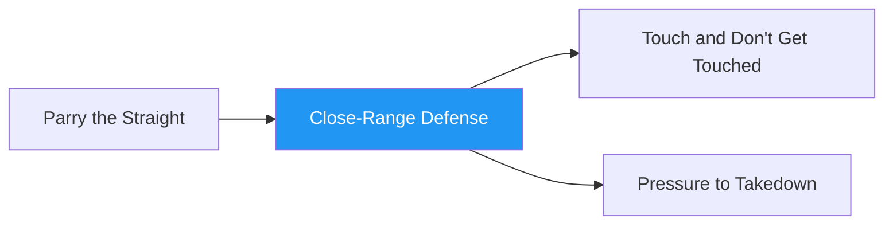

# Close-Range Defense

!!! info "Game Identity"
    - **Problem:** Defending strikes at close range using multiple defensive solutions
    - **Environment:** Open Space (Close Quarters)
    - **Stage:** Access / Counter

This is a **scaling defensive game** that progressively opens up defensive options. The defender learns to mix between blocking, parrying, and dodging based on what the situation demands.

---

## Goal

This is an **asymmetric game** with distinct roles.

| Role | Objective |
|------|-----------|
| **Attacker** | Compromise defender's openings and land strikes |
| **Defender** | Defend strikes using defensive principles (tight blocking, parrying, static dodging) |

The objective is **defensive adaptability** — learning when to use which solution.

---

## Entry Condition

- Both players start at close quarters (inside striking range)
- Attacker in "winning position" (slight pressure advantage)
- Defender in "losing position" (must defend, cannot exit freely)
- Reset after successful defensive sequence or clean strike lands

---

## Invariants

1. Defender **cannot exit** — must stay and defend (no backing up continuously)
2. Attacker must throw combinations and **allow for reset** (no continuous overwhelming pressure)
3. Attacker must strike in reasonable distance (can't crowd the defender)

---

## Task Focus

### Attacker
- Compromise defender's openings and land strikes
- Start with only head strikes or only straight punches
- Scale difficulty to partner — increase challenge with successful defense

### Defender
- Mix between different kinds of defense as task focus opens up
- Start with only tight blocking
- Progress to blocking with parrying, then add dodging

!!! warning "Defensive Trade-offs"
    - **Hands closer to face** = easier to defend strikes, harder to counter
    - **Hands further out** = more compromised, but can disrupt attacker or counter
    - **When dodging**, more offline head = more compromised for significant strikes

---

## Key Logic: Scaling Defensive Solutions

The defender's available tools open up progressively:

| Level | Blocking | Parrying | Dodging | Counter |
|-------|:--------:|:--------:|:-------:|:-------:|
| 1 | Yes | — | — | — |
| 2 | Yes | Yes | — | — |
| 3 | Yes | Yes | Yes | — |
| 4 | Yes | Yes | Yes | Yes |

This teaches the defender to **layer** defensive solutions.

### Attacker Scaling

The attacker scales difficulty based on defender success:
- If defender handles current level → increase variety, speed, or combination length
- If defender struggles → simplify until they find success

---

## Win Conditions

**No winning condition** — this is a diagnostic game.

Success is evaluated by:
- **Defender:** Percentage of strikes defended, quality of defensive selection
- **Attacker:** Ability to find openings, appropriate scaling

---

## Levels

=== "Level 1 — Tight Blocking Only"
    - Defender can only use tight blocking (shell up)
    - Attacker throws head strikes only, straight punches only
    - Focus: Absorb and reset

=== "Level 2 — Add Parrying"
    - Defender can now block OR parry
    - Attacker adds body strikes
    - Focus: Choose appropriate defense for each strike

=== "Level 3 — Add Dodging"
    - Defender can block, parry, or dodge (static head movement)
    - Attacker adds hooks and varied combinations
    - Focus: Full defensive toolkit integration

=== "Level 4 — Add Counter Opportunity"
    - After successful defense, defender can throw one counter strike
    - Attacker must respect the counter threat
    - Focus: Defense as setup for offense

=== "Level 5 — Turn the Corner"
    - Defender can work to reposition (turn the corner on attacker)
    - Creates angle for counter-attack or escape
    - Focus: Defensive footwork integration

---

## Advanced Expressions (Coach Context)

As athletes develop:

**For defenders:**
- Defensive selection becomes automatic
- Movement between blocking, parrying, and dodging becomes fluid
- Counter opportunities are recognized instantly

**For attackers:**
- Learn to read defensive habits and exploit them
- Develop combination intelligence

---

## Safety

- **Contact limits:** Light to moderate — strikes should be felt but not damaging
- **Stop conditions:** Overwhelming pressure, loss of composure
- **Coach intervention:** Reset if attacker is not allowing defensive opportunities

---

## System Position

- **Prerequisite games:** Parry the Straight (and other skill isolation games)
- **Follow-on games:** Touch and Don't Get Touched, Pressure to Takedown
- **Related concepts:** Defensive Solutions in Striking, Hand Controls

---

!!! abstract "System Evolution Notice"
    This game may be refined as defensive integration patterns emerge.
