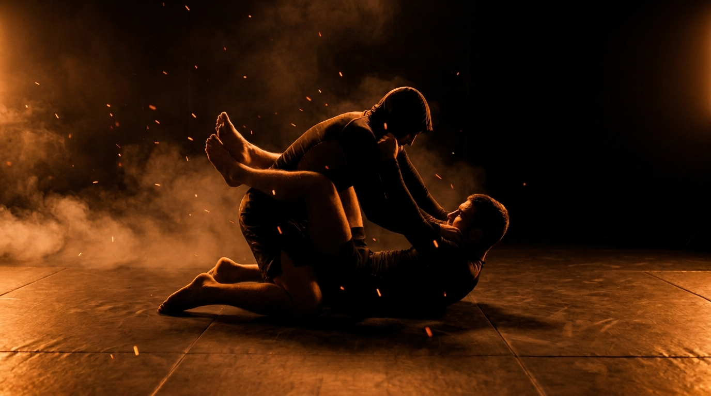

  
  
Ground · GrapplingClosed Guard Bottom

!!! warning "Provisional (WIP): built from the ground-wave spec, pending coach review"

    Sourced from the Slime Mold Grappling Club catalog (Greg Souders / Standard Jiu-Jitsu), re-expressed with our threshold rules. Passed the build rubric on paper (prerequisite chain corrected per the pressure-test); awaits validation against a live grappling class. Details may change.

GroundGrapplingCombinedIntermediateBreak &amp; Attack

Break their posture, then take the back, the sweep, or the top.

  
Start<b>Bottom in closed guard controlling posture; top working to posture up, inside a marked perimeter.</b>

  
→

  
The Goal<b>Bottom keeps the posture broken and converts it; top rebuilds and opens the guard.</b>

  
→

  
Finish<b>Sweep, climb to the back (chest-to-back, 3s), or a controlled finish threat → bottom · Posture rebuilt and guard opened → top · Out of bounds → loss.</b>

  
A closed guard that only holds on  is just a slow way to lose.

  
Broken posture is currency, spend it. <b>Every second their head is down, something is available.</b>

What to Read

<b>Attune to</b> the <i>top's weight through your legs and grips</i>, where their hands are based and when their head crosses their hands. A head pulled past the hands has no base under it: that's the climb. Hands on your chest are posts to trap; hands on the mat are doors to the back. The guard tells you which attack is open, listen with the legs.

The Starting Position

  
PlayersTwo, one bottom (closed guard), one top (posturing).

  
PositionBottom's ankles locked behind the top, grips on; top kneeling, posture contested.

  
BoundaryA marked perimeter, both stay inside.

  
RolesBottom breaks posture and converts; top rebuilds posture and opens the guard.

  
Start &amp; resetBegin locked with grips contested; reset on a conversion, an open, or the round cap.

The Matchup

  

    
🤸

    
Bottom (Closed Guard)

    
Trying to keep the top's posture broken and convert it into a sweep, a back-climb, or a controlled finish threat.

    Arms and legs pull together, the lock is an engine, not a belt. Trap a hand when it posts on your chest, climb the hips when the head comes down. Pick the attack the posture break offers, don't force a favorite.
  

  
VS

  

    
🥋

    
Top (Posturing)

    
Trying to rebuild posture, win the grips, and open the guard.

    Head up, spine stacked, hands fighting grips, never both hands on the mat. Posture is rebuilt in pieces: win the head first, then the grips, then the hips. Opening the guard from a broken posture isn't possible, stop trying.
  

The Rules

  🔒 Posture is the resourceThe round revolves around the top's posture: broken, the bottom attacks; rebuilt, the top opens. Both sides should always know who owns it right now.
  🧗 The back is climbed, not jumpedThe back-take counts when the bottom's hips climb outside the top's arms and reach chest-to-back, held 3 seconds. The climb route (hips to shoulder line) is the skill being trained.
  🛑 Finish threats are positionsA finish threat wins when the controlling position is locked (arm trapped and extended, or a closed loop on the neck), then everyone stops. We prove the position, never the crank. Tap early, finish nothing fast.
  ⏱️ Round cap, no stallingRun a set round cap (start at 60 seconds). If neither side wins by the cap, reset and switch roles. A locked guard that attacks nothing is a stall, the cap punishes it. A clock, never "as long as possible".
  🚫 No striking until the top levelLevels 1 to 4 are grappling only, so the bottom can read posture and base without defending strikes. Strikes enter at the full-expression level.
  🎚️ GnP dial-up, by permissionOnce strikes are on, the coach explicitly grants a meaner dial on ground-and-pound: mid-grapple, strength is already compromised, so firmer strikes stay safe. A postured top now strikes down, breaking posture becomes strike defense too. Ground games train smashing on the ground, not grappling for its own sake.
  ⬛ Stay inside the perimeterPlay happens inside a marked perimeter, any shape. If a player rolls fully out of it, that player loses the round, training mat-edge awareness.

How to Win

  
Win Bottom sweeps to top → bottom wins.A reversal that lands on top. The broken posture converted into position the most direct way.

  
Win Bottom climbs to the back, chest-to-back held 3s → bottom wins.Hips outside the arms, chest to the top's back, held. The highest-value conversion and the one the climb levels build toward.

  
Win Bottom locks a controlled finish threat → bottom wins, stop there.An arm trapped and extended or a closed loop on the neck, position proven, nothing cranked. Play stops on the lock.

  
Switch Top rebuilds posture and opens the guard → top wins.Head up, grips won, ankles unlocked. From here the position is the closed-guard-pass game, that's the next page.

  
Loss Roll fully out of the perimeter → that player loses.Crossing the marked perimeter loses the round instantly, regardless of position, training the mat-edge awareness a fighter needs.

The Levels

  
1<b>Own the posture</b>Keep them broken, nothing else.The round is only the posture war: bottom keeps the top's head down with arms and legs together, top rebuilds. Whoever owns the posture at the bell owns the round. The engine of every closed-guard attack, isolated.

  
2<b>Trap the posts</b>Capture the basing hand.When the top bases a hand on your chest or the mat, trap it (wrist plus elbow, or 2-on-1) before it pulls back. A trapped post means the next posture break has nothing to catch it.

  
3<b>Hips to the shoulder</b>Climb outside the arms.From the broken posture and a trapped arm, the bottom climbs the hips outside the top's arms toward the shoulder line. The doorway position to the back, learned as its own destination first.

  
4<b>Convert</b>Back, sweep, or finish threat.The full task, grappling only: break, trap, climb, and convert to whichever win the top's reaction offers. Forcing one favorite attack into every posture break is the tell this level exists to remove.

  
5<b>Full expression</b>Continuous, strikes on.Light strikes on. The top strikes from posture, so breaking posture now disarms as well as attacks. Closed guard the way MMA prices it.

Recall Check

  
Test yourself before moving on. Answer out loud, then reveal what good looks like.

  

    
Q Why is a holding-only closed guard a slow loss?

    
Because the top gets unlimited posture-rebuild attempts against a passive lock, and in MMA, a postured top strikes. <b>Broken posture is currency: spend it on an attack or lose it.</b>

  

  

    
Q What do the top's hands tell you?

    
<b>Hands based on your chest are posts to trap; hands on the mat are doors to the back.</b> And a head pulled past the hands has no base under it, that's the climb.

  

  

    
Q What makes the back-take count?

    
<b>Hips climbed outside the arms, chest-to-back, held 3 seconds.</b> The climb route is the skill; jumping past it into a scramble proves nothing.

  

  

    
Q In what order does the top rebuild posture?

    
<b>Head first, then grips, then hips.</b> Trying to open the guard from a broken posture feeds every attack the bottom has.

  

Go Deeper

??? note "Task focus &amp; coaching cues"

    
Each role's job

    

      

🤸

Bottom (Closed Guard)

Break posture with arms and legs together, trap the posts, climb the hips outside the arms, convert to whichever win the reaction offers.

      

🥋

Top (Posturing)

Rebuild head-grips-hips in order, never base both hands on the mat, open the guard only from a won posture.

    

    
Coaching cues

    

      

💱

What did you buy?

Ask the bottom: "You broke the posture three times, what did it buy you?" Posture breaks that purchase nothing are the stall in disguise.

      

🧗

Which door opened?

Ask after each conversion: "What did the top do that made that the right attack?" Trains attack selection from the reaction, not the repertoire.

    

??? abstract "Constraints-Led analysis"

    
Constraints → Affordances

    

      
Posture-war opening level→Makes the round's central resource explicit before attacks exist

      
Trap-the-post level→Same post-punishing grammar as the other guard games, compounding transfer

      
Climb proven by chest-to-back 3s→Rewards the route, not the scramble

      
Three win doors for the bottom→Attack selection becomes the trained skill

      
Round cap→Punishes the hold-and-wait guard directly

    

    
Implements <b>Task Simplification</b> (Renshaw et al., 2019): the break → trap → climb → convert ladder sequences closed-guard offense as perceptual stages, and the three-door win structure keeps the attack choice coupled to the top's live reaction instead of a rehearsed sequence.

    
What the bottom reads

    

      

✋

Haptic

Top's weight through the legs and grips → posture owned or rebuilding, hips light or heavy.

      

🧭

Proprioceptive

Own hip height relative to the top's arms → whether the climb doorway is open.

      

👁️

Visual

Head past the hands, hands on chest or mat → which of the three doors just opened.

    

    
What we measure (order parameter)

    
Whether the bottom <b>converts posture breaks before the top rebuilds</b>. Track conversions (sweep / back / threat) per posture break, and which door each conversion used. When the attack consistently matches the reaction, three different doors across a session, the selection skill has formed.

    
Representativeness

    
<b>Models:</b> the closed guard as MMA actually prices it, a position you must attack from immediately, because a postured top turns it into a striking platform.

    
Simplified: door ladderno strikes L1-4round cap

    
Builds on <a href="../seated-guard-retention/">Seated Guard Retention</a>'s post-punishing; mirrors <a href="../closed-guard-pass/">Closed Guard Pass</a>.

    
Readiness to progress

    <ul class="emma-checklist">
      <li>Keeps posture broken with arms and legs together</li>
      <li>Traps posts before they recover</li>
      <li>Climbs the hips outside the arms on the route</li>
      <li>Picks the door the reaction offers, all three across a session</li>
    </ul>

    
Warning signs

    

      Holds the lock and waits
      Forces the same attack into every break
      Climbs inside the arms, gives the head back
      Top bases both hands on the mat
    

??? note "Safety &amp; related games"

    

      🤝 Controlled grappling
      🛑 Finish threats stop on the lock, nothing cranked, tap early
      🔁 Reset if the position stalls completely
    

    
Where it sits

    

      
Prerequisite→<a href="../leg-reclaim/">Leg Reclaim</a> · <a href="../seated-guard-retention/">Seated Guard Retention</a>

      
Follow-on→Guard Submission Hunt (planned)

      
Mirror→<a href="../closed-guard-pass/">Closed Guard Pass</a>

      
Related→<a href="../../concepts/guard-recovery/">Guard Recovery</a> · <a href="../../concepts/decision-states/">Decision States</a>

    

