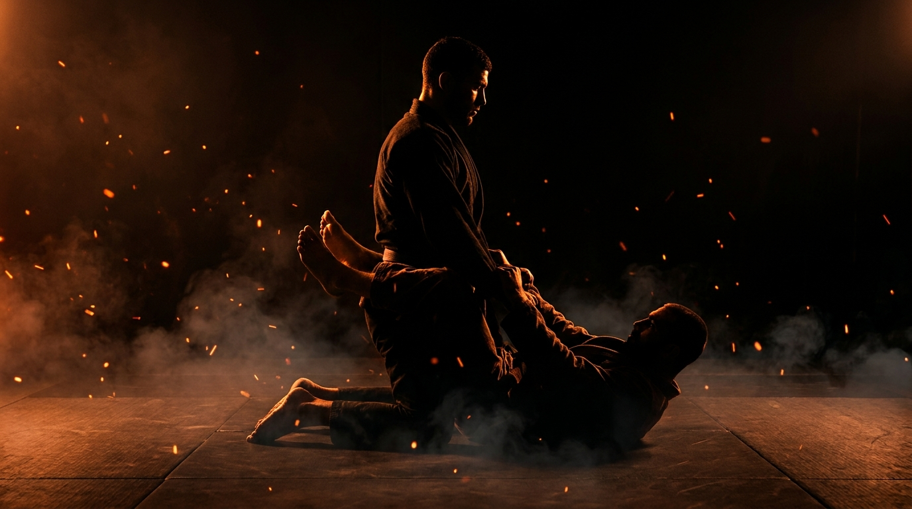

  
  
Ground · GrapplingClosed Guard Pass

!!! warning "Provisional (WIP): built from the ground-wave spec, pending coach review"

    Sourced from the Slime Mold Grappling Club catalog (Greg Souders / Standard Jiu-Jitsu), re-expressed with our threshold rules. Passed the build rubric on paper; awaits validation against a live grappling class. Details may change.

GroundGrapplingOffensiveIntermediatePassing

Win your posture, open the legs, pass to chest-to-chest.

  
Start<b>Top kneeling inside a closed guard, posture contested, inside a marked perimeter.</b>

  
→

  
The Goal<b>Top breaks the grips, opens the feet, and passes; bottom breaks posture and attacks.</b>

  
→

  
Finish<b>Chest-to-chest past the legs, held 3s → top · Sweep, climb to the back, or break posture to a finish threat → bottom · Out of bounds → loss.</b>

  
The guard doesn't open from the legs,  it opens from your posture.

  
Win the head and the grips first. <b>A postured spine makes the locked feet cost more than they hold.</b>

What to Read

<b>Attune to</b> the <i>pull on your posture</i>, where the bottom's grips and legs are dragging your head and hips. Every pull commits the bottom's hips to one side and tells you <i>which side to pressure</i> and <i>when the ankles unlock</i>. Posture regained is space created; pass into that space, not against the lock.

The Starting Position

  
PlayersTwo, one top (passer), one bottom (closed guard).

  
PositionTop kneeling inside the bottom's closed guard, posture contested by grips.

  
BoundaryA marked perimeter, both stay inside.

  
RolesTop breaks grips, opens the guard, and passes; bottom controls posture and attacks.

  
Start &amp; resetBegin from locked guard; reset on a pass, a sweep, a back-take, or the round cap.

The Matchup

  

    
🥋

    
Top (Passer)

    
Trying to win posture, open the locked feet, and pass to a chest-to-chest pin past the legs.

    Strip the grips before you stand. Keep the spine stacked over the hips, a pulled-down head is a sweep waiting to happen. Open the feet with posture and a stand, not by digging at the ankles from a broken position.
  

  
VS

  

    
🤸

    
Bottom (Guard)

    
Trying to break the top's posture and convert it: sweep, climb to the back, or threaten a finish.

    Grips plus legs work together, pull the head down as the hips climb. When the top stands, follow the hips, don't hug the ankles. A broken posture is your window: attack it before it rebuilds.
  

The Rules

  🧍 Posture before passingThe top's first job is winning the grips and the spine. Trying to force a pass from a broken posture feeds sweeps, that's the lesson, not a rule violation.
  🎯 Pass proven by the holdA pass counts when the top reaches chest-to-chest past the legs and holds it for 3 seconds. Flying past into a scramble proves nothing yet.
  ⏱️ Round cap, no stallingRun a set round cap (start at 60 seconds). If neither side wins by the cap, reset and switch roles. A clock, never "as long as possible".
  🚫 No striking until the top levelLevels 1 to 4 are grappling only, so both sides can read posture and grips without defending strikes. Strikes enter at the full-expression level.
  🎚️ GnP dial-up, by permissionOnce strikes are on, the coach explicitly grants a meaner dial on ground-and-pound: mid-grapple, strength is already compromised, so firmer strikes stay safe. Use striking as a disincentivization tool, the cost that punishes a lazy posture. Ground games train smashing on the ground, not grappling for its own sake.
  ⬛ Stay inside the perimeterPlay happens inside a marked perimeter, any shape. If a player rolls fully out of it, that player loses the round, training mat-edge awareness.

How to Win

  
Win Top passes to chest-to-chest past the legs, held 3s → top wins.Both legs cleared and a chest-to-chest connection held for 3 seconds, the observable proof the guard is beaten, not just briefly evaded.

  
Switch Bottom sweeps to top, climbs to the back (chest-to-back, 3s), or breaks posture into a finish threat → bottom wins.Any of the three converts the broken posture into something real: a reversal, the back, or a controlled finish position. The threat must be held, not just touched.

  
Reset Round cap expires with the guard intact → reset, switch roles.Neither the pass nor the attack landed before the clock. Switch roles so both sides get the passing problem.

  
Loss Roll fully out of the perimeter → that player loses.Crossing the marked perimeter loses the round instantly, regardless of position, training the mat-edge awareness a fighter needs.

The Levels

  
1<b>Win the grips</b>Strip and deny, posture only.No passing yet. Top works only to break the bottom's grips and keep a stacked spine; bottom works to keep posture broken. Whoever owns the posture at the bell owns the round. Isolates the grip-and-spine battle every pass starts from.

  
2<b>Open the feet</b>Make the ankles unlock.Top adds the next goal: force the locked feet open, by posture, knee position, or standing pressure. The round ends when the feet open or the cap expires. The bottom learns what an opening guard feels like before it costs them.

  
3<b>Stand to open</b>The standing break.Top must open the guard by standing. Standing changes every read: the bottom hunts the hips and ankles on the way up, the top learns to stand inside the guard without giving the sweep.

  
4<b>Open to pass</b>Past the knee line to chest.The full task, grappling only: break, open, and pass to chest-to-chest held 3 seconds. Bottom fights every stage and wins by sweep or back-climb.

  
5<b>Full expression</b>Continuous, strikes on.Light strikes on for both sides. Posture now protects your jaw as well as your base, and the bottom's broken-posture attacks carry real urgency. Pass under fire.

Recall Check

  
Test yourself before moving on. Answer out loud, then reveal what good looks like.

  

    
Q What has to be won before the feet will open?

    
<b>The grips and the posture.</b> A stacked spine over the hips makes the locked feet cost more than they hold. Digging at the ankles from a broken posture feeds the sweep.

  

  

    
Q Why does the pass require a 3-second chest-to-chest hold?

    
Because flying past the legs into a scramble proves nothing. The <b>held connection</b> is the observable proof the guard is actually beaten.

  

  

    
Q What does every pull on your posture tell you?

    
It tells you <b>where the bottom's hips committed</b>. A pull is information: pressure the side it came from, and pass into the space posture creates.

  

  

    
Q When the top stands, what should the bottom chase?

    
<b>The hips, not the ankles.</b> Hugging the ankles surrenders the connection that powers sweeps and back-climbs. Follow the hips up and attack the base.

  

Go Deeper

??? note "Task focus &amp; coaching cues"

    
Each role's job

    

      

🥋

Top (Passer)

Strip grips, stack the spine, open the feet with posture or a stand, pass past the knee line to chest-to-chest and hold it.

      

🤸

Bottom (Guard)

Break posture with grips and legs together, follow the hips when the top stands, convert every broken posture into a sweep, a back-climb, or a finish threat.

    

    
Coaching cues

    

      

🧍

Where is your head?

Ask the top: "Was your head over your hips when you tried to open?" Directs attention to posture as the opener, not hand strength.

      

⏳

What did the break buy?

Ask the bottom: "You broke the posture, what did you do with it?" A broken posture that isn't attacked rebuilds for free.

    

??? abstract "Constraints-Led analysis"

    
Constraints → Affordances

    

      
Posture-only and open-only levels→Isolates the grip battle and the opening before the pass exists

      
Pass proven by a 3s chest-to-chest hold→Rewards control over scramble-luck, observable for the coach

      
Bottom wins by sweep, back, or finish threat→Keeps the bottom dangerous, the top's posture honest

      
Round cap→Urgency for the top, no guard-sitting for the bottom

      
Live, resisting guard→Keeps the posture-reading perception intact

    

    
Implements <b>Task Simplification</b> (Renshaw et al., 2019): each level holds one slice of the passing problem (grips → opening → standing → passing) against a fully resisting opponent, so the perception-action loop never gets replaced by a drilled sequence.

    
What the top reads

    

      

✋

Haptic

Pull on the collar ties and sleeves, the drag on the spine → which side the bottom's hips committed to.

      

🧭

Proprioceptive

Own head-over-hips alignment → whether the posture is actually won or about to fold.

      

👁️

Visual

The bottom's hip angle and knee line → which pass lane is opening as the feet unlock.

    

    
What we measure (order parameter)

    
Whether the top <b>rebuilds posture faster than the bottom can convert a break</b>. Track passes held vs. sweeps and back-climbs conceded, and whether the guard opens from posture or from ankle-digging. When passes start arriving through the stand-and-open route under a live guard, the skill has formed.

    
Representativeness

    
<b>Models:</b> being locked inside a competent closed guard, the canonical top-side problem in grappling exchanges and in MMA once strikes stall.

    
Simplified: staged openingno strikes L1-4round cap

    
Deepens the passing side of <a href="../ground-access/">Ground Access</a>; mirrors <a href="../closed-guard-bottom/">Closed Guard Bottom</a>.

    
Readiness to progress

    <ul class="emma-checklist">
      <li>Strips grips before attempting to open</li>
      <li>Opens the guard from a stacked posture, standing when needed</li>
      <li>Passes to chest-to-chest and holds, not through, the position</li>
      <li>Survives broken posture without conceding the sweep</li>
    </ul>

    
Warning signs

    

      Digs at the ankles with a bent spine
      Stands without controlling the grips first
      Sprints past the legs without securing the chest
      Stalls inside the guard waiting for the cap
    

??? note "Safety &amp; related games"

    

      🤝 Controlled grappling
      🛑 Finish threats are positions, not cranks, stop on the catch
      🔁 Reset if the position stalls completely
    

    
Where it sits

    

      
Prerequisite→<a href="../ground-access/">Ground Access</a>

      
Follow-on→<a href="../open-guard-pass/">Open Guard Pass</a> · <a href="../half-guard-pass/">Half-Guard Pass</a>

      
Mirror→<a href="../closed-guard-bottom/">Closed Guard Bottom</a>

      
Related→<a href="../../concepts/decision-states/">Decision States</a>

    

