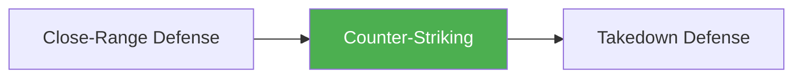

# Counter-Striking

!!! info "Game Identity"
    - **Problem:** Using offensive strikes as a defensive response
    - **Environment:** Transition Zone (Striking → Striking)
    - **Stage:** Counter (Defensive Offense)

This is a **defensive game with offensive tools** — the counter-striker uses strikes to interrupt, punish, and deter the opponent's offense. It sits in the Transition Zone because it's the defensive answer that keeps the fight in the striking domain.

---

## Goal

This is an **asymmetric game** with distinct roles.

| Role | Objective |
|------|-----------|
| **Counter-Striker** | Interrupt or punish opponent's offense with well-timed strikes |
| **Initiator** | Land clean offense despite counter threat |

The objective is **offensive defense** — using strikes to stop strikes.

---

## Entry Condition

- Both players start at striking range
- Initiator leads with offense
- Counter-striker times counters to punish
- Reset when clean exchange occurs OR initiator lands cleanly

---

## Invariants

1. Counter-striker **waits for initiation** — doesn't lead
2. Initiator **must initiate** — can't just stand there
3. Counters must be **reactive** — not preemptive offense
4. Both players stay in striking domain (no wrestling)

---

## Task Focus

### Counter-Striker (Defender)
- Read initiation cues (tells, timing patterns)
- Time counters to intercept or punish
- Select appropriate counter (check hook, pull counter, etc.)
- Make initiator pay for committing

### Initiator (Attacker)
- Vary timing to avoid predictability
- Use feints to draw counters
- Set traps for counter-striker
- Find clean entries despite threat

!!! question "Key Internal Questions — Counter-Striker"
    - "What is their favorite initiation?"
    - "Can I counter during or after their strike?"
    - "Am I being reactive or anticipating?"

---

## Key Logic: Counter Timing

!!! note "The Core Skill"
    Counters have different timing windows:

    | Counter Type | Timing | Example |
    |--------------|--------|---------|
    | **Intercept** | Before their strike lands | Jab over their jab |
    | **Simultaneous** | As their strike extends | Check hook vs. cross |
    | **Punish** | After their strike misses | Counter after pull |

    The skill is recognizing which timing is available and executing the appropriate counter.

---

## Win Conditions

| Role | Win Condition |
|------|---------------|
| **Counter-Striker** | Land clean counter(s) that interrupt offense |
| **Initiator** | Land clean offense without getting countered |

**On counter-striker win:** Roles switch.
**On initiator win:** Reset, same roles.

---

## Levels

=== "Level 1 — Single Counter"
    - Counter-striker can only throw one counter
    - Initiator throws single strikes
    - Focus: Basic counter timing

=== "Level 2 — Counter Combinations"
    - Counter-striker can follow up counters
    - Initiator uses 2-3 strike combinations
    - Focus: Chaining off counters

=== "Level 3 — Feints and Traps"
    - Initiator can feint to draw counters
    - Counter-striker must read real vs. fake
    - Focus: Counter-intelligence

=== "Level 4 — Full MMA Expression"
    - Initiator can shoot or clinch if countered
    - Counter-striker must manage wrestling threat
    - Focus: Counter-striking under MMA pressure
    - See: [Full MMA Expression](../concepts/full-mma-expression.md)

---

## Safety

- **Contact limits:** Light to moderate
- **Stop conditions:** Excessive force, head hunting
- **Coach intervention:** Reset if becoming reactive brawl

---

## System Position

- **Prerequisite games:** Close-Range Defense, Land the Target
- **Follow-on games:** Can lead to Takedown Defense if opponent shoots
- **Related concepts:** Confidence Rating, Defensive Solutions

---

!!! abstract "System Evolution Notice"
    This game may be refined as counter-striking patterns emerge.
