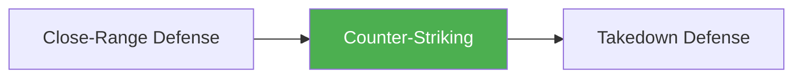

# Counter-Striking

!!! info "Game Identity"
    - **Problem:** Using offensive strikes as a defensive response
    - **Environment:** Transition Zone (Striking → Striking)
    - **Stage:** Counter (Defensive Offense)

This is a **defensive game with offensive tools** — the counter-striker uses strikes to interrupt, punish, and deter the opponent's offense. It sits in the Transition Zone because it's the defensive answer that keeps the fight in the striking domain.

---

## Goal

This is an **asymmetric game** with distinct roles.

| Role | Objective |
|------|-----------|
| **Counter-Striker** | Interrupt or punish opponent's offense with well-timed strikes |
| **Initiator** | Land clean offense despite counter threat |

The objective is **offensive defense** — using strikes to stop strikes.

---

## Entry Condition

- Both players start at striking range
- Initiator leads with offense
- Counter-striker times counters to punish
- Reset when clean exchange occurs OR initiator lands cleanly

---

## Invariants

1. Counter-striker **waits for initiation** — doesn't lead
2. Initiator **must initiate** — can't just stand there
3. Counters must be **reactive** — not preemptive offense
4. Both players stay in striking domain (no wrestling)

---

## Task Focus

### Counter-Striker (Defender)
- Read initiation cues (tells, timing patterns)
- Time counters to intercept or punish
- Select appropriate counter (check hook, pull counter, etc.)
- Make initiator pay for committing

### Initiator (Attacker)
- Vary timing to avoid predictability
- Use feints to draw counters
- Set traps for counter-striker
- Find clean entries despite threat

!!! question "Key Internal Questions — Counter-Striker"
    - "What is their favorite initiation?"
    - "Can I counter during or after their strike?"
    - "Am I being reactive or anticipating?"

---

## Key Logic: Counter Timing

!!! note "The Core Skill"
    Counters have different timing windows:

    | Counter Type | Timing | Example |
    |--------------|--------|---------|
    | **Intercept** | Before their strike lands | Jab over their jab |
    | **Simultaneous** | As their strike extends | Check hook vs. cross |
    | **Punish** | After their strike misses | Counter after pull |

    The skill is recognizing which timing is available and executing the appropriate counter.

---

## Win Conditions

| Role | Win Condition |
|------|---------------|
| **Counter-Striker** | Land clean counter(s) that interrupt offense |
| **Initiator** | Land clean offense without getting countered |

**On counter-striker win:** Roles switch.
**On initiator win:** Reset, same roles.

---

## Levels

=== "Level 1 — Single Counter"
    - Counter-striker can only throw one counter
    - Initiator throws single strikes
    - Focus: Basic counter timing

=== "Level 2 — Counter Combinations"
    - Counter-striker can follow up counters
    - Initiator uses 2-3 strike combinations
    - Focus: Chaining off counters

=== "Level 3 — Feints and Traps"
    - Initiator can feint to draw counters
    - Counter-striker must read real vs. fake
    - Focus: Counter-intelligence

=== "Level 4 — Full MMA Expression"
    - Initiator can shoot or clinch if countered
    - Counter-striker must manage wrestling threat
    - Focus: Counter-striking under MMA pressure
    - See: [Full MMA Expression](../concepts/full-mma-expression.md)

---

## Constraints Analysis

*How this game applies the [Constraints-Led Approach](../principles/cla/index.md)*

| Constraint Type | Constraint | Affordance Created |
|-----------------|------------|-------------------|
| **Task** | Counter-striker must wait (can't lead) | Forces reactive timing development |
| **Task** | Initiator must initiate | Creates reliable attacks to counter |
| **Task** | Both stay in striking domain | Isolates counter-striking without wrestling complexity |
| **Task** | Feints allowed at Level 3 | Develops discrimination (real vs. fake) |
| **Individual** | Prerequisites: Close-Range Defense, Land the Target | Has both defensive reading and offensive execution |
| **Environmental** | Striking range | Counter timing is viable (not too close, not too far) |

!!! info "Theoretical Foundation"
    This game develops **counter-timing affordance perception** (Hristovski et al., 2006). The constraint forcing the counter-striker to wait eliminates preemptive offense and isolates the reactive skill. Multiple counter-timing windows (intercept, simultaneous, punish) emerge through exploration, not instruction—embodying the CLA principle of self-organization under constraints.

---

## Information Structure

*What athletes must perceive to succeed (perception-action coupling)*

### Counter-Striker Perceives

| Information Source | What to Read | Action It Supports |
|--------------------|--------------|-------------------|
| **Visual** | Initiator's weight shift and shoulder rotation | Attack initiation detection |
| **Visual** | Attack trajectory and timing | Select counter type and timing |
| **Visual** | Initiator's recovery position | Punish window recognition |
| **Visual** | Pattern of attacks (tells, habits) | Anticipation calibration |
| **Proprioceptive** | Own balance and positioning | Counter execution readiness |
| **Haptic** | Contact (if any) on defense | Confirmation of timing |

### Initiator Perceives

| Information Source | What to Read | Action It Supports |
|--------------------|--------------|-------------------|
| **Visual** | Counter-striker's readiness and stance | When they're primed to counter |
| **Visual** | Counter-striker's reaction to feints | What draws them out |
| **Visual** | Counter-striker's positioning | Safe vs. dangerous entry angles |

!!! tip "Coaching Cue"
    Ask counter-strikers: "Did you wait to see it, or guess?" This develops the distinction between reactive countering (skilled) and anticipatory gambling (risky). The goal is reading and responding, not predicting.

---

## Representativeness

*How this game models real MMA situations*

### Real MMA Situation

A counter-fighter waiting for opponent to lead, then timing strikes to punish the initiation—a fundamental striking strategy in MMA.

### How This Game Represents It

| Element | Real MMA | This Game | Fidelity |
|---------|----------|-----------|----------|
| **Counter timing** | Intercept, simultaneous, punish | Same three windows | High |
| **Initiator variety** | Any attack including grappling | Strikes only (L1-3) | Simplified |
| **Counter variety** | Full arsenal | Progressive by level | Scaffolded |
| **Wrestling threat** | Always present | Added at Level 4 | Progressive |
| **Consequence** | Damage, knockdown | Role switch | Reduced |

### Simplifications & Justification

| Simplification | Why Acceptable |
|----------------|----------------|
| Striking only (L1-3) | Isolates counter-timing skill; wrestling added at Level 4 |
| Single counter at Level 1 | Develops timing before combination chaining |
| Clear role separation | Ensures reactive counter development, not mutual offense |

!!! note "Transfer Expectation"
    Counter-timing developed here transfers directly to any striking context. The perception of initiation cues and selection of counter timing is identical in sparring and competition. Fighters who develop countering become harder to attack.

---

## Variability Guidelines

*Creating "repetition without repetition" (Bernstein, 1967)*

### Within-Level Variability

| Vary This | How | Maintains |
|-----------|-----|-----------|
| **Initiator style** | Jab-heavy, power-heavy, combination-heavy | Multiple counter solutions |
| **Initiator timing** | Fast initiators, patient initiators | Timing adaptability |
| **Counter type emphasis** | Intercept-focused rounds, punish-focused rounds | Full counter vocabulary |
| **Stance matchups** | Orthodox vs. southpaw | Angle variety |
| **Attack variety** | Single strikes, combinations | Different counter problems |

### What NOT to Vary

| Keep Constant | Why |
|---------------|-----|
| Counter-striker must wait | Core constraint developing reactive skill |
| Initiator must initiate | Provides attacks to counter |
| Clear role separation | Maintains counter-focus |

### Progressing Through Levels

| Signal to Progress | Meaning |
|--------------------|---------|
| Consistent counter timing | Basic skill established |
| Uses multiple counter types | Degeneracy developing |
| Reads real vs. fake (Level 3) | Ready for feint complexity |

---

## Readiness Indicators

*When is the athlete ready to advance?*

### Ready for Next Level When

- [ ] Lands clean counters consistently (50%+ of initiations)
- [ ] Uses multiple counter timings (intercept, punish, etc.)
- [ ] Doesn't get drawn by feints (at appropriate level)
- [ ] Can articulate: "I saw them load so I countered"
- [ ] Maintains composure while waiting

### Ready to Exit Game When

- [ ] Level 3+ competence (handles feints appropriately)
- [ ] Counter timing is instinctive
- [ ] Can integrate counter-striking with other defensive tools
- [ ] Counter-punching appears naturally in sparring

### Warning Signs (Not Ready to Progress)

| Sign | Meaning | Response |
|------|---------|----------|
| Leads instead of waiting | Not playing the counter role | Reinforce constraint, restart with slower tempo |
| Gets countered by initiator | Committing at wrong time | Slow down, emphasize reading |
| Only one counter type works | Limited solution set | Deliberately practice neglected counters |
| Gets drawn by all feints | Discrimination not developed | Slow down, more deliberate at Level 2 |

---

## Safety

- **Contact limits:** Light to moderate
- **Stop conditions:** Excessive force, head hunting
- **Coach intervention:** Reset if becoming reactive brawl

---

## System Position

- **Prerequisite games:** Close-Range Defense, Land the Target
- **Follow-on games:** Can lead to Takedown Defense if opponent shoots
- **Related concepts:** Confidence Rating, Defensive Solutions

---

!!! abstract "System Evolution Notice"
    This game may be refined as counter-striking patterns emerge.
