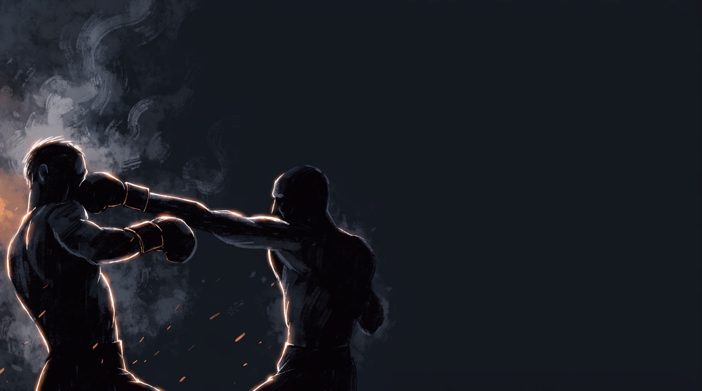

  
  
Skill Isolation · StrikingCounter the Straight

!!! warning "Provisional (WIP): derived from class recording 2026-07-10"
    Invented live in class and **pending review on the platform**.
    Name and structure may change. Remove the WIP status once confirmed.

Skill IsolationStrikingDefensiveIntermediateBridge

Slipping alone survives an exchange, it doesn't end one. This game removes the safety net of "miss and reset": a clean evasion only counts once it's followed by a real answer, forcing a single rep to chain two skills that [Slip the Straight](../slip-the-straight/) and [Counter-Striking](../counter-striking/) normally train apart.

  
Start<b>Two fighters at close range inside a marked perimeter; attacker restricted to one named hand.</b>

  
→

  
The Goal<b>Attacker lands with their one live hand; defender evades clean, then answers with a counter of their own.</b>

  
→

  
Finish<b>Evade + land a counter → switch · Land clean, uncountered → reset · Leave the perimeter → loss.</b>

  
Missing isn't enough,  make them pay for throwing it.

  
One hand for the attacker, one job for the defender: evade clean, then answer. <b>The counter only counts if the miss came first.</b>

What to Read

<b>Attune to</b> the <i>rate of expansion</i> (τ) of the incoming strike, read via shoulder–hip motion at <b>center mass</b>, the same information that times the slip in <a href="../slip-the-straight/">Slip the Straight</a>. What's new here is timing the second decision off the same read: the instant the evasion lands clean, that same shoulder-hip picture tells you whether the attacker is still extended (punish window open) or already recovering (window closing).

The Starting Position

  
PlayersTwo, squared off in a neutral fighting stance.

  
RangeInside punching distance.

  
BoundaryA marked perimeter, both stay inside.

  
RolesOne attacker restricted to a single named hand (lead or rear, coach's call), one defender, switch on a landed counter.

  
Start &amp; resetThe attacker initiates; reset to center after each exchange.

The Matchup

  

    
🥊

    
Attacker

    
Trying to land a clean straight with the one hand they're allowed, lead or rear, chosen by the coach.

    Only one named hand is live for the whole rep, switch which hand only when the coach calls it. Feints matter more here, since there's only one real tool to sell.
  

  
VS

  

    
⚡

    
Defender

    
Trying to evade clean, any method, then land a counter before the window closes.

    Evasion method is open, slip, lean, spin, whatever works, this isn't Slip the Straight's pure-slip constraint. But evading alone doesn't win, the rep isn't over until a counter lands.
  

The Rules

  ✋ Attacker: one hand onlyLead or rear, coach's call, but only one hand is live for the whole rep. Straights only, head only, no body shots.
  ⚡ Defender: evade AND counter, not evade OR counterA clean evasion alone doesn't win the rep. The defender has to follow it with a landed counter. This is the core difference from Slip the Straight, where a clean slip alone switches roles.
  🌀 Any evasion methodUnlike Slip the Straight's pure-slip constraint, leaning back, spinning off, or any other evasion is legal here, as long as it's genuinely clean and a counter follows it.
  ⬛ Stay inside the perimeterPlay happens inside a marked perimeter, any shape (square, circle, taped lines). If both feet leave it, you lose instantly.
  🦵 Optional dial: legs live for the defenderCoach's call, not the base rule. Once this dial is on, the defender may also win by shooting to connect on the legs at any point, on top of the evade-and-counter path. Treat it the same way Slip the Straight's Level 6 treats the "Full MMA" shot/clinch threat: a later dial-up, not a separate game.

How to Win

  
Switch Clean evasion + landed counter → switch roles.The defender has to do both in the same rep: miss cleanly, then answer. Evasion without a counter doesn't switch anything.

  
Reset Attacker lands clean, uncountered → reset, same roles.The one live hand got through. Begin again from a neutral stance.

  
Loss Leave the perimeter → loss.Crossing the marked perimeter loses the game instantly, regardless of the exchange.

The Levels

  
1<b>Lead hand only</b>Attacker fixed to the jab.Attacker throws only the lead hand. Defender builds the evade-then-counter timing against the most predictable single tool.

  
2<b>Rear hand only</b>Attacker fixed to the cross.Same rule, attacker restricted to the rear hand instead. Different timing and distance than the jab version.

  
3<b>Coach's choice, mid-rep</b>Attacker can switch stance and hand.Attacker may switch stance and therefore which hand is "lead," still one hand live at a time, but the defender can no longer assume which side it's coming from.

  
4<b>Legs live (optional dial)</b>Defender may also win by shooting.On top of evade-and-counter, the defender can win at any point by shooting to connect on the legs. Coach's call whether this dial is on.

Recall Check

  
Test yourself before moving on. Answer out loud, then reveal what good looks like.

  

    
Q Does a clean evasion win the rep by itself?

    
<b>No.</b> That's Slip the Straight's rule, not this one. Here the evasion only opens the door, a landed counter has to follow before the rep is won.

  

  

    
Q Why is the evasion method suddenly open, when Slip the Straight only allows a pure slip?

    
Once the counter becomes mandatory, the method of getting off the line matters less than reliably getting off it, so the rule loosens on purpose once the harder skill (the counter) is added.

  

  

    
Q Why cap the attacker to one hand instead of letting both hands go, like in Counter-Striking?

    
One hand keeps the read simple while the defender is learning to chain two skills in one rep. Both hands live is the next step, not this one, that's <a href="../counter-striking/">Counter-Striking</a>.

  

Go Deeper

??? note "Task focus &amp; coaching cues"

    
Each role's job

    

      

🥊

Attacker

Commit fully with the one live hand; vary timing; use feints since there's only one real weapon to sell.

      

⚡

Defender

Evade clean by any method, then land the counter before the window closes; don't treat the evasion as the finish line.

    

    
Coaching cues

    

      

🎯

The miss is step one, not the win

A student who's spent time on Slip the Straight will instinctively relax the moment the punch passes by. Here that's the halfway point, the counter still has to land.

      

🔓

Loosen the evasion, raise the bar elsewhere

Live-class sequencing worth keeping: forbid retreat first (Slip the Straight) to force real head movement without a safety net, then once evasion is trained, loosen the movement rule and require a counter instead. Constraints trade off, they don't all tighten at once.

    

??? abstract "Constraints-Led analysis"

    
Constraints → Affordances

    

      
Attacker fixed to one hand→Simplifies the read so the defender can focus on chaining two skills, not reading two tools

      
Evade AND counter required→Forces the evasion to be used as a setup, not treated as the finish

      
Evasion method open→Keeps the harder new skill (the counter) the sole constraint being trained at this stage

      
Optional legs-live dial→Adds a standing takedown-entry threat without touching the core evade-and-counter problem

    

    
Sits as a <b>bridge task</b> between <a href="../slip-the-straight/">Slip the Straight</a> (isolates the evasion) and <a href="../counter-striking/">Counter-Striking</a> (isolates reactive counter-timing against a fully live attacker). Implements <b>Task Simplification</b> (Renshaw et al., 2019) in reverse of the usual order: instead of adding one new motor skill to a stable one, it chains two already-isolated skills into a single rep before either gets full freedom.

    
What the defender reads

    

      

👁️

Visual: commitment

Shoulder rotation &amp; which hand loads, the same read as Slip the Straight, times the evasion.

      

🎯

Visual: recovery

Whether the attacker's arm is still extended or already retracting after the miss → whether the punish window is still open.

      

🧭

Proprioceptive

Own balance during and after the evasion → whether a counter is actually available or the evasion cost too much structure.

    

    
What we measure (order parameter)

    
Whether the defender's <b>evasion and counter land as one continuous action</b>, not two separate decisions with a pause between them. Track clean evade-and-land reps vs. clean evades with no counter (a partial win under Slip the Straight's rule, a non-win here) vs. shots eaten. When the pause between evading and countering disappears, the skill has formed.

    
Representativeness

    
<b>Models:</b> the real fight problem of making a single tool miss actually cost the attacker something, not just surviving it, before the defender has to do the same thing against a fully-loaded opponent.

    
Simplified: one hand for attackerstraights onlyevasion method open

    
Chains <a href="../slip-the-straight/">Slip the Straight</a>'s evasion into <a href="../counter-striking/">Counter-Striking</a>'s reactive-timing problem, transfers into full two-hand Counter-Striking once both skills are solid together.

    
First-run observations (2026-07-10)

    <ul class="emma-checklist">
      <li>Students needed the "miss isn't the finish line" framing repeated live, early reps treated a clean evasion as enough and stalled there</li>
      <li>Ran as a natural extension after Slip the Straight and a mixed-hands optional-counter variant in the same session, sequencing worked, evasion was already solid before the counter requirement was added</li>
    </ul>

    
Readiness to progress

    <ul class="emma-checklist">
      <li>Evasion and counter read as one continuous action, not two decisions</li>
      <li>Lands the counter on ~50%+ of clean evasions</li>
      <li>Doesn't relax after the miss before the counter starts</li>
      <li>Handles both the lead-only and rear-only versions</li>
    </ul>

    
Warning signs

    

      Treats a clean evasion as the win and stops moving
      Counters before actually evading clean, trading instead of solving the sequence
      Only ever counters with the same shot regardless of angle
    

??? note "Safety &amp; related games"

    

      🤝 Light-to-moderate contact
      🛑 Stop on freezing, lost composure, or excessive force
      🔁 Reset if the defender starts winning on evasion alone, that's the previous game, not this one
    

    
Where it sits

    

      
Prerequisite→<a href="../slip-the-straight/">Slip the Straight</a>

      
Follow-on→<a href="../counter-striking/">Counter-Striking</a>

      
Related→<a href="../../concepts/defensive-solutions/">Defensive Solutions</a> · <a href="../../concepts/environment-always-plays/">The Environment Always Plays</a>

    

