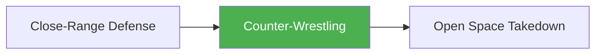

# Counter-Wrestling

!!! info "Game Identity"
    - **Problem:** Using wrestling as a defensive response to striking pressure
    - **Environment:** Transition Zone (Striking → Wrestling)
    - **Stage:** Counter (Defensive Wrestling)

This is a **defensive game that changes domains** — instead of defending strikes with strikes or evasion, the defender uses wrestling (clinch, level change, takedown) to neutralize striking offense. It's the transition from striking defense to wrestling offense.

---

## Goal

This is an **asymmetric game** with distinct roles.

| Role | Objective |
|------|-----------|
| **Counter-Wrestler** | Use wrestling to neutralize striking offense |
| **Striker** | Maintain striking distance and offense despite wrestling threat |

The objective is **domain change as defense** — escaping striking through wrestling.

---

## Entry Condition

- Both players start at striking range
- Striker leads with striking offense
- Counter-wrestler times wrestling entries to neutralize
- Reset when wrestling is established OR striker maintains striking

---

## Invariants

1. Counter-wrestler **waits for initiation** — doesn't lead
2. Striker **must strike** — can't just defend wrestling
3. Wrestling entry must be **reactive** — not preemptive
4. Counter-wrestler aims for clinch or takedown, not strikes

---

## Task Focus

### Counter-Wrestler (Defender)
- Read striking initiation
- Time clinch entries or level changes
- Use opponent's commitment against them
- Establish wrestling position from striking defense

### Striker (Attacker)
- Maintain distance to prevent wrestling
- Punish level change attempts
- Disengage from clinch attempts
- Keep fight in striking domain

!!! question "Key Internal Questions — Counter-Wrestler"
    - "When do they commit forward?"
    - "Is a clinch or level change better here?"
    - "Can I time my entry to their punch?"

---

## Key Logic: Wrestling as Escape

!!! note "The Core Skill"
    Counter-wrestling uses wrestling entries as defensive responses:

    | Striker Does | Counter-Wrestler Response |
    |--------------|---------------------------|
    | Commits to power shot | Shoot under during extension |
    | Pressures forward | Clinch and neutralize |
    | Throws combination | Time entry between strikes |
    | Gets close | Snap down or arm drag |

    The skill is recognizing when striking defense is disadvantageous and wrestling is the better answer.

---

## Win Conditions

| Role | Win Condition |
|------|---------------|
| **Counter-Wrestler** | Establish clinch or complete takedown |
| **Striker** | Land clean offense and maintain striking domain |

**On counter-wrestler win:** Transition to wrestling games (Open Space Takedown, etc.).
**On striker win:** Reset, same roles.

---

## Levels

=== "Level 1 — Clinch Only"
    - Counter-wrestler can only clinch
    - No level changes or takedowns
    - Focus: Timing clinch entries

=== "Level 2 — Add Level Changes"
    - Counter-wrestler can shoot or clinch
    - Striker must defend both
    - Focus: Reading which entry is coming

=== "Level 3 — Chain Wrestling"
    - Counter-wrestler can chain: clinch → takedown, shot → clinch
    - More dynamic exchanges
    - Focus: Wrestling chains as defense

=== "Level 4 — Full MMA Expression"
    - Striker can sprawl and continue striking
    - Counter-wrestler must complete wrestling
    - Focus: Domain change under resistance
    - See: [Full MMA Expression](../concepts/full-mma-expression.md)

---

## Constraints Analysis

*How this game applies the [Constraints-Led Approach](../principles/cla/index.md)*

| Constraint Type | Constraint | Affordance Created |
|-----------------|------------|-------------------|
| **Task** | Counter-wrestler must wait (can't lead) | Forces reactive wrestling entry |
| **Task** | Striker must strike (can't just defend) | Creates reliable attacks to counter-wrestle |
| **Task** | Counter-wrestler aims for clinch/takedown (not strikes) | Domain change is explicit goal |
| **Task** | Progressive entries (clinch → level change → chain) | Scaffolded learning of wrestling options |
| **Individual** | Prerequisites: Close-Range Defense, Pressure to Clinch | Has striking defense and clinch understanding |
| **Environmental** | Striking range transitioning to clinch | Entry timing is critical |

!!! info "Theoretical Foundation"
    This game develops **domain-switching as defense**—recognizing when wrestling is a better answer than striking defense. The constraint forcing reactive entry (not preemptive shooting) develops genuine perception of when to change domains. This is a key **degeneracy** in MMA—having multiple solutions to the same problem (Renshaw et al., 2019).

---

## Information Structure

*What athletes must perceive to succeed (perception-action coupling)*

### Counter-Wrestler Perceives

| Information Source | What to Read | Action It Supports |
|--------------------|--------------|-------------------|
| **Visual** | Striker's forward commitment | Clinch timing |
| **Visual** | Striker's balance during strike | Level change timing |
| **Visual** | Striker's combination rhythm | Entry window between strikes |
| **Visual** | Striker's head position | Snap down opportunity |
| **Haptic** | Contact during clinch entry | Grip confirmation |
| **Proprioceptive** | Own level and balance | Entry execution |

### Striker Perceives

| Information Source | What to Read | Action It Supports |
|--------------------|--------------|-------------------|
| **Visual** | Counter-wrestler's level change setup | Sprawl/stop preparation |
| **Visual** | Distance and positioning | Safe striking distance |
| **Visual** | Counter-wrestler's hand positioning | Clinch denial |

!!! tip "Coaching Cue"
    Ask counter-wrestlers: "When did you decide to shoot/clinch?" The answer should be about what they saw, not predetermined timing. If they say "after they threw the cross," that's perception-based. If they say "on my third exchange," that's preplanning.

---

## Representativeness

*How this game models real MMA situations*

### Real MMA Situation

Using wrestling to escape striking pressure—a common MMA scenario when a fighter is being out-struck and needs to change domains.

### How This Game Represents It

| Element | Real MMA | This Game | Fidelity |
|---------|----------|-----------|----------|
| **Domain change trigger** | Getting out-struck, needing reset | Reactive to striking | Analogous |
| **Entry options** | Clinch, level change, snap down | Progressive by level | Scaffolded |
| **Striker resistance** | Sprawl, frame, disengage | Added at Level 4 | Progressive |
| **Consequence** | Domain changes | Roles switch | Analogous |

### Simplifications & Justification

| Simplification | Why Acceptable |
|----------------|----------------|
| Striker must strike (can't defend) | Ensures consistent attacks to counter |
| Counter-wrestler can't lead | Develops reactive, not preemptive entries |
| Clear role separation | Maintains domain-change focus |

!!! note "Transfer Expectation"
    The timing perception—knowing when to shoot under a cross, when to clinch on forward pressure—transfers directly to live MMA. Fighters who develop this become harder to hurt because they have an escape route.

---

## Variability Guidelines

*Creating "repetition without repetition" (Bernstein, 1967)*

### Within-Level Variability

| Vary This | How | Maintains |
|-----------|-----|-----------|
| **Striker style** | Pressure strikers, counter strikers | Multiple entry solutions |
| **Striker commitment** | Heavy hitters, light hitters | Entry timing calibration |
| **Entry type emphasis** | Clinch-focused rounds, level-change-focused rounds | Full wrestling vocabulary |
| **Striker size/reach** | Longer strikers, compact strikers | Distance adaptability |

### What NOT to Vary

| Keep Constant | Why |
|---------------|-----|
| Counter-wrestler must wait | Core constraint developing reactive skill |
| Striker must strike | Provides consistent attacks to counter |
| Wrestling entry is goal | Maintains domain-change focus |

### Progressing Through Levels

| Signal to Progress | Meaning |
|--------------------|---------|
| Clinch entries well-timed | Basic timing developed |
| Uses level changes effectively | Ready for more wrestling options |
| Chains wrestling attempts | Complex solutions emerging |

---

## Readiness Indicators

*When is the athlete ready to advance?*

### Ready for Next Level When

- [ ] Entry timing matches striker's commitment consistently
- [ ] Uses multiple entry types (clinch, level change)
- [ ] Doesn't get hit cleanly during entry
- [ ] Can articulate: "I shot when they threw because..."
- [ ] Entries feel timed, not desperate

### Ready to Exit Game When

- [ ] Level 3+ competence (chains wrestling)
- [ ] Domain change timing is instinctive
- [ ] Wrestling entries appear in live sparring when appropriate
- [ ] Ready for full Open Space Takedown game

### Warning Signs (Not Ready to Progress)

| Sign | Meaning | Response |
|------|---------|----------|
| Shoots randomly (not reactive) | Not reading striker | Reinforce constraint, slow down |
| Gets hit during entries | Timing off | Work on timing at lower intensity |
| Only uses one entry | Limited solution set | Constrain that entry, force others |
| Entries feel panicked | Not confident | More reps at current level |

---

## Safety

- **Contact limits:** Light striking, controlled wrestling
- **Stop conditions:** Slamming, uncontrolled takedowns
- **Coach intervention:** Reset if becoming pure wrestling match

---

## System Position

- **Prerequisite games:** Close-Range Defense, Pressure to Clinch
- **Follow-on games:** Open Space Takedown
- **Related concepts:** Hand Controls, Level Change

---

!!! abstract "System Evolution Notice"
    This game may be refined as counter-wrestling patterns emerge.
