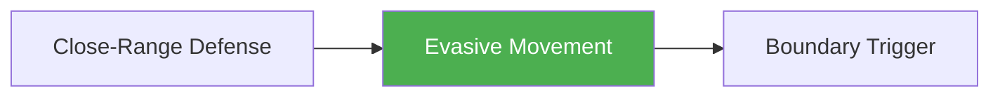

# Evasive Movement

!!! info "Game Identity"
    - **Problem:** Avoiding engagement through movement and distance management
    - **Environment:** Open Space
    - **Stage:** Counter (Defensive Striking)

This is a **defensive striking game** focused on avoiding conflict through movement — "getting on your bike." Unlike Close-Range Defense which handles incoming strikes, this game is about preventing engagement entirely through superior footwork and ring generalship.

---

## Goal

This is an **asymmetric game** with distinct roles.

| Role | Objective |
|------|-----------|
| **Evader** | Avoid engagement and maintain distance |
| **Pursuer** | Close distance and establish engagement |

The objective is **space creation and maintenance**, not defense within range.

---

## Entry Condition

- Both players start at medium range
- Pursuer attempts to close distance and engage
- Evader uses footwork, angles, and movement to avoid
- Reset when pursuer establishes range OR evader maintains distance for set time

---

## Invariants

1. Evader **must keep moving** — static defense doesn't count
2. Pursuer **actively closes** — not just walking forward
3. Evader cannot strike (at Level 1) — pure evasion
4. Ring/cage boundary forces decision points

---

## Task Focus

### Evader (Defender)
- Lateral movement and angles
- Distance management
- Ring awareness — don't get cornered
- Timing pivots and direction changes
- Energy conservation while moving

### Pursuer (Attacker)
- Cut off angles
- Pressure without overcommitting
- Herd toward boundary
- Recognize when evader is trapped
- Maintain composure through frustration

!!! question "Key Internal Questions — Evader"
    - "Where is the boundary behind me?"
    - "Can I angle off or do I need to circle?"
    - "Am I moving with purpose or just running?"

---

## Key Logic: Movement as Defense

!!! note "The Core Skill"
    Evasive Movement is a distinct defensive strategy from in-range defense:

    | Strategy | When to Use | Risk |
    |----------|-------------|------|
    | Close-Range Defense | Already in range, must deal with strikes | Taking damage |
    | Evasive Movement | Can maintain distance, avoid engagement | Getting cornered, gassing |

    The skill is knowing when to evade vs. when to engage — and executing movement efficiently.

---

## Win Conditions

| Role | Win Condition |
|------|---------------|
| **Evader** | Maintain distance/avoid engagement for set duration |
| **Pursuer** | Establish striking range OR corner evader against boundary |

**On evader win:** Roles switch.
**On pursuer win:** Reset, same roles.

---

## Levels

=== "Level 1 — Pure Movement"
    - Evader can only move — no strikes
    - Pursuer walks/jogs forward with pressure
    - Focus: Footwork fundamentals

=== "Level 2 — Add Feints"
    - Pursuer can feint to test reactions
    - Evader must read real vs. fake
    - Focus: Movement under pressure

=== "Level 3 — Evader Can Counter"
    - Evader can throw single counters while moving
    - Punishes pursuer overcommitment
    - Focus: Movement + counter integration

=== "Level 4 — Full MMA Expression"
    - Pursuer can shoot or clinch
    - Evader must manage all threats while moving
    - Focus: Evasion under MMA pressure
    - See: [Full MMA Expression](../concepts/full-mma-expression.md)

---

## Safety

- **Contact limits:** Light contact on any counters
- **Stop conditions:** Collisions with boundary, loss of composure
- **Coach intervention:** Reset if evader is truly stuck

---

## System Position

- **Prerequisite games:** Close-Range Defense
- **Follow-on games:** Boundary Trigger (when evasion reaches boundary)
- **Related concepts:** Three Zones, Ring Generalship

---

!!! abstract "System Evolution Notice"
    This game may be refined as evasive movement patterns emerge.
