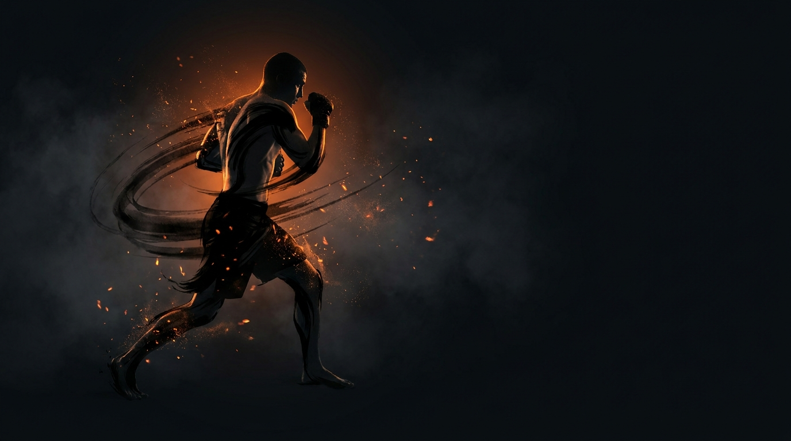

  
  
Open Space · StrikingEvasive Movement

Open SpaceStrikingDefensiveIntermediateFootwork

Prevent engagement entirely through footwork and ring generalship — "getting on your bike."

  
Start<b>Two fighters at medium range inside a marked perimeter.</b>

  
→

  
The Goal<b>Evader keeps distance; pursuer closes it and corners them.</b>

  
→

  
Finish<b>Keep distance for the duration → switch · Establish range or corner the evader → reset.</b>

  
The best defense — is the fight that never starts.

  
Avoid engagement through footwork and ring generalship, not by absorbing strikes. <b>Win the space, don't get cornered.</b>

What to Read

<b>Attune to</b> the <i>rate the open space is closing</i> (global optic flow) and the <i>pursuer's preferred distance</i> — far affords your escape, near affords their engagement. Read their angle of approach and weight commitment, plus the gap to the perimeter behind you, <b>not</b> their eyes. That information specifies <i>where your space is</i> and <i>when to pivot vs. circle</i>.

The Starting Position

  
PlayersTwo — one evader, one pursuer.

  
RangeMedium range, outside engagement.

  
BoundaryA marked perimeter — prevents endless retreat.

  
RolesOne evader, one pursuer.

  
Start &amp; resetPursuer closes; reset when range is established or time elapses.

The Matchup

  

    
🦅

    
Evader

    
Trying to avoid engagement and maintain distance for the set duration — pure movement, no striking at Level 1.

    Keep moving — static defense doesn't count. Use lateral movement, angles, and pivots. Conserve energy, and above all don't get cornered against the perimeter.
  

  
VS

  

    
🥊

    
Pursuer

    
Trying to close distance, cut off angles, and herd the evader toward the perimeter.

    Actively close — not just walk forward. Cut angles, pressure without overcommitting, and herd toward the boundary. Recognize when the evader is trapped, and keep composure through the frustration.
  

The Rules

  🦅 Evader must keep movingStatic defense doesn't count — the evader's whole job is movement. Standing and blocking is not a solution here.
  🥊 Pursuer actively closesThe pursuer must genuinely close and cut angles — not just walk forward passively. This creates real pressure to move efficiently.
  🚫 No striking at Level 1At Level 1 the evader cannot strike — pure evasion. Single counters are introduced only at Level 3.
  ⬛ A marked perimeter forces decisionsPlay happens inside a marked perimeter — any shape (ring, cage, taped lines). The boundary prevents infinite retreat and creates decision points.
  ⏱️ Win by duration or by corneringThe evader wins by keeping distance for a set time; the pursuer wins by establishing range or cornering. Clear objectives for both roles.

How to Win

  
Switch Keep distance for the duration → switch roles.The evader avoided engagement and kept the space open the whole round — ring generalship demonstrated — and earns the pursuing role.

  
Reset Pursuer establishes range or corners → reset, same roles.The space closed: the pursuer cut the angle and trapped the evader against the perimeter, or closed to engagement. Begin again at medium range.

  
Diagnostic Watch movement quality — angles and pivots, not gassing.Beyond the win, the coach reads movement quality: economy, use of angles, and composure under pursuit — not frantic circling or gassing.

The Levels

  
1<b>Pure movement</b>Evader can only move.Evader moves only — no strikes. Pursuer walks/jogs forward with pressure. Footwork fundamentals.

  
2<b>Add feints</b>Read real vs. fake.The pursuer can feint to test reactions; the evader must read real vs. fake. Movement under pressure.

  
3<b>Evader can counter</b>Single counters while moving.The evader can throw single counters while moving, punishing pursuer overcommitment. Movement + counter integration.

  
4<b>Full MMA expression</b>Shot / clinch threat.The pursuer can shoot or clinch; the evader must manage all threats while moving. Evasion under MMA pressure.

Go Deeper

??? note "Task focus &amp; coaching cues"

    
Each role's job

    

      

🦅

Evader

Lateral movement and angles; distance management; ring awareness; time pivots; conserve energy.

      

🥊

Pursuer

Cut off angles; pressure without overcommitting; herd toward the boundary; recognize the trap.

    

    
Coaching cues

    

      

🗺️

Where is your space?

Ask evaders: "Where is your space? Where is the wall?" This develops spatial awareness — the foundation of ring generalship.

      

✂️

Where do you want them?

Ask pursuers: "Where do you want them to go?" This develops cutting strategy over chasing.

    

??? abstract "Constraints-Led analysis"

    
Constraints → Affordances

    

      
Evader can only move (L1)→Forces development of movement solutions

      
Pursuer actively closes→Creates real pressure to move efficiently

      
Marked perimeter exists→Decision points and consequences for poor positioning

      
Win by duration or cornering→Clear objectives for both roles

      
Bounded space→Evasion must be purposeful, not endless running

    

    
Develops <b>ring generalship</b> — the perception of spatial affordances — through the <b>dyadic system</b> interaction (Renshaw et al., 2019).

    
What the players read

    

      

👁️

Visual

Pursuer's angle and weight commitment; distance to the perimeter → escape direction, pivot vs. circle.

      

🧭

Proprioceptive

Own balance and foot position → pivot and direction-change execution.

      

🫁

Fatigue

Own fatigue level → energy-conservation decisions.

    

    
What we measure (order parameter)

    
Whether the <b>open space is opening or closing over time</b> — is the evader keeping distance and using angles, or is the gap collapsing toward the perimeter? Track distance kept, cornering events, and movement economy. When the evader consistently keeps the space open without gassing, the skill has formed.

    
Representativeness

    
<b>Models:</b> avoiding a pressure fighter while maintaining positioning and energy efficiency.

    
Simplified: no strikes at L1pure pursuit earlyclear duration win

    
Movement patterns transfer to any distance-management situation — leads into <a href="../pressure-to-clinch/">Pressure to Clinch</a> when evasion reaches the boundary.

    
Readiness to progress

    <ul class="emma-checklist">
      <li>Maintains distance for the duration consistently</li>
      <li>Movement is economical — not gassing prematurely</li>
      <li>Uses pivots and angles, not just circling</li>
      <li>Stays calm under pursuit pressure</li>
      <li>Can verbalize: "I saw them cutting, so I changed direction"</li>
    </ul>

    
Warning signs

    

      Gets cornered frequently
      Gasses quickly
      Only circles one direction
      Panics near the boundary
    

??? note "Safety &amp; related games"

    

      🤝 Light contact on any counters
      🛑 Stop on boundary collisions or lost composure
      🔁 Coach resets if the evader is truly stuck
    

    
Where it sits

    

      
Prerequisite→<a href="../close-range-defense/">Close-Range Defense</a>

      
Follow-on→<a href="../pressure-to-clinch/">Pressure to Clinch</a>

      
Related→<a href="../../concepts/three-zones/">Three Zones</a> · <a href="../../concepts/winning-the-circle/">Winning the Circle</a>

    

