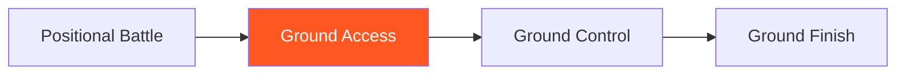

# Ground Access

!!! info "Game Identity"
    - **Problem:** Advancing position from top against active guard
    - **Environment:** Ground
    - **Stage:** Access (Offensive Grappling)

This is an **offensive ground game** focused on passing guard and advancing position. The top player learns to access dominant positions against active bottom resistance.

---

## Goal

This is an **asymmetric game** with distinct roles.

| Role | Objective |
|------|-----------|
| **Top (Attacker)** | Pass guard and establish dominant position |
| **Bottom (Defender)** | Retain guard OR sweep to top |

The objective is **position advancement**, not submission.

---

## Entry Condition

- Start with top player in bottom player's guard (closed, open, or half)
- Top player works to pass
- Bottom player retains or sweeps
- Reset when top establishes side control/mount OR bottom sweeps to top

---

## Invariants

1. Top player must **advance position** — just holding doesn't count
2. Bottom player **actively defends** — not passive
3. Submissions are not the goal at this stage
4. Position must be established, not just achieved momentarily

---

## Task Focus

### Top (Attacker)
- Break guard grips and controls
- Create passing opportunities
- Complete pass to dominant position
- Stabilize after passing

### Bottom (Defender)
- Maintain guard structure
- Create frames and distance
- Threaten sweeps to discourage passing
- Recover guard if partially passed

!!! question "Key Internal Questions — Top"
    - "What's preventing my pass right now?"
    - "Can I create an angle to pass?"
    - "Am I controlling their hips?"

---

## Key Logic: Access Before Damage

!!! note "The Core Skill"
    Ground Access follows the decision state progression:

    | Stage | Goal |
    |-------|------|
    | Access | Get past guard to dominant position |
    | Stabilize | Hold position (Ground Control) |
    | Exploit | Deal damage (Ground Finish) |

    This game focuses purely on the ACCESS stage — getting to the position.

---

## Win Conditions

| Role | Win Condition |
|------|---------------|
| **Top** | Establish dominant position (side control, mount, back) |
| **Bottom** | Sweep to top OR retain guard for extended period |

**On top win:** Roles switch.
**On bottom win:** Reset, same roles.

---

## Levels

=== "Level 1 — Closed Guard"
    - Start in closed guard
    - Top works to open and pass
    - Focus: Breaking closed guard

=== "Level 2 — Open Guard"
    - Start in open guard of bottom's choice
    - More dynamic passing required
    - Focus: Passing open guard variations

=== "Level 3 — Half Guard"
    - Start in half guard
    - Top works to clear and advance
    - Focus: Half guard passing

=== "Level 4 — Full MMA Expression"
    - Top can use ground strikes to open guard
    - Bottom can strike from guard
    - Focus: Guard passing under MMA pressure
    - See: [Full MMA Expression](../concepts/full-mma-expression.md)

---

## Safety

- **Contact limits:** Controlled grappling, no slamming
- **Stop conditions:** Joint locks, neck cranks
- **Coach intervention:** Reset if positions stall

---

## Constraints Analysis

*How this game applies the [Constraints-Led Approach](../principles/cla/index.md)*

| Constraint Type | Constraint | Affordance Created |
|-----------------|------------|-------------------|
| **Task** | Top must advance position (not just hold) | Develops active passing, not stalling |
| **Task** | Position must be established (not momentary) | Ensures complete passes |
| **Task** | Progressive guard types (closed → open → half) | Scaffolded complexity |
| **Task** | Bottom actively defends | Develops passing against resistance |
| **Individual** | Prerequisite: Positional Battle | Understands ground positions |
| **Environmental** | Guard as obstacle | Creates passing problem-space |

!!! info "Theoretical Foundation"
    This game develops **passing affordance perception**—recognizing when and where the guard can be passed. The constraint requiring position advancement (not just holding) prevents stalling and develops active problem-solving. **Degeneracy** emerges as athletes discover multiple passing solutions for the same guard type (Renshaw et al., 2019).

---

## Information Structure

*What athletes must perceive to succeed (perception-action coupling)*

### Top (Attacker) Perceives

| Information Source | What to Read | Action It Supports |
|--------------------|--------------|-------------------|
| **Haptic** | Guard grip strength | When to break grips |
| **Haptic** | Hip control level | Passing availability |
| **Visual** | Guard structure | Pass direction choice |
| **Visual** | Bottom's hand position | Grip prevention |
| **Proprioceptive** | Own base and posture | Pass execution stability |

### Bottom (Defender) Perceives

| Information Source | What to Read | Action It Supports |
|--------------------|--------------|-------------------|
| **Haptic** | Top's weight distribution | Sweep timing |
| **Haptic** | Passing pressure direction | Guard adjustment |
| **Visual** | Top's posture | Submission vs. retention choice |
| **Proprioceptive** | Own hip position | Guard recovery |

!!! tip "Coaching Cue"
    Ask top players: "What was preventing your pass?" This develops recognition of guard obstacles. Ask: "Did you control their hips before passing?" Hip control perception is key to successful passing.

---

## Representativeness

*How this game models real MMA situations*

### Real MMA Situation

Passing guard to achieve dominant ground position—the fundamental skill of ground offense in MMA.

### How This Game Represents It

| Element | Real MMA | This Game | Fidelity |
|---------|----------|-----------|----------|
| **Guard passing** | Required for ground offense | Same | High |
| **Active bottom defense** | Guard retention/sweeps | Same | High |
| **Position establishment** | Stable control needed | Same | High |
| **Multiple guard types** | Athletes use various guards | Progressive by level | Scaffolded |
| **Strikes** | Available | Progressive by level | Scaffolded |

### Simplifications & Justification

| Simplification | Why Acceptable |
|----------------|----------------|
| Start in guard (not from standing) | Isolates passing from takedown |
| No submissions focus | Develops positional skill first |
| Progressive guard complexity | Masters one guard before adding more |

!!! note "Transfer Expectation"
    Guard passing developed here transfers directly to MMA. The perception of passing opportunities and hip control is identical in competition.

---

## Variability Guidelines

*Creating "repetition without repetition" (Bernstein, 1967)*

### Within-Level Variability

| Vary This | How | Maintains |
|-----------|-----|-----------|
| **Guard type** | Closed, butterfly, spider, De La Riva | Multiple passing solutions |
| **Bottom resistance** | Passive retention, active sweeps | Adaptability |
| **Bottom size** | Larger, smaller, equal | Passing adjustment |
| **Pass style emphasis** | Pressure passes, speed passes | Full passing vocabulary |
| **Intensity** | Drilling pace, live pace | Pressure calibration |

### What NOT to Vary

| Keep Constant | Why |
|---------------|-----|
| Position must be established | Prevents incomplete passes |
| Active bottom defense | Develops realistic skill |
| No submission focus | Maintains passing emphasis |

### Progressing Through Levels

| Signal to Progress | Meaning |
|--------------------|---------|
| Passes closed guard consistently | Basic skill developing |
| Multiple pass options available | Degeneracy developing |
| Passes against active resistance | Ready for more complexity |

---

## Readiness Indicators

*When is the athlete ready to advance?*

### Ready for Next Level When

- [ ] Passes current guard type consistently
- [ ] Recognizes passing opportunities
- [ ] Maintains control through pass completion
- [ ] Handles bottom resistance effectively
- [ ] Can articulate: "I passed when their hips were..."

### Ready to Exit Game When

- [ ] Level 2+ competence (passes open guards)
- [ ] Multiple passing solutions for each guard
- [ ] Stabilizes immediately after passing
- [ ] Guard passing appears in sparring

### Warning Signs (Not Ready to Progress)

| Sign | Meaning | Response |
|------|---------|----------|
| Gets swept during pass attempts | Balance/base lacking | Focus on posture and base |
| Can't break grips | Grip fighting underdeveloped | Work on grip breaks |
| Passes but can't stabilize | Incomplete technique | Focus on pass completion |
| Only one pass works | Limited degeneracy | Vary guard types to force options |

---

## System Position

- **Prerequisite games:** Positional Battle
- **Follow-on games:** Ground Control
- **Related concepts:** Decision States

---

!!! abstract "System Evolution Notice"
    This game may be refined as ground access patterns emerge.
