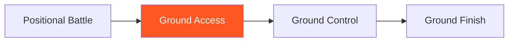

# Ground Access

!!! info "Game Identity"
    - **Problem:** Advancing position from top against active guard
    - **Environment:** Ground
    - **Stage:** Access (Offensive Grappling)

This is an **offensive ground game** focused on passing guard and advancing position. The top player learns to access dominant positions against active bottom resistance.

---

## Goal

This is an **asymmetric game** with distinct roles.

| Role | Objective |
|------|-----------|
| **Top (Attacker)** | Pass guard and establish dominant position |
| **Bottom (Defender)** | Retain guard OR sweep to top |

The objective is **position advancement**, not submission.

---

## Entry Condition

- Start with top player in bottom player's guard (closed, open, or half)
- Top player works to pass
- Bottom player retains or sweeps
- Reset when top establishes side control/mount OR bottom sweeps to top

---

## Invariants

1. Top player must **advance position** — just holding doesn't count
2. Bottom player **actively defends** — not passive
3. Submissions are not the goal at this stage
4. Position must be established, not just achieved momentarily

---

## Task Focus

### Top (Attacker)
- Break guard grips and controls
- Create passing opportunities
- Complete pass to dominant position
- Stabilize after passing

### Bottom (Defender)
- Maintain guard structure
- Create frames and distance
- Threaten sweeps to discourage passing
- Recover guard if partially passed

!!! question "Key Internal Questions — Top"
    - "What's preventing my pass right now?"
    - "Can I create an angle to pass?"
    - "Am I controlling their hips?"

---

## Key Logic: Access Before Damage

!!! note "The Core Skill"
    Ground Access follows the decision state progression:

    | Stage | Goal |
    |-------|------|
    | Access | Get past guard to dominant position |
    | Stabilize | Hold position (Ground Control) |
    | Exploit | Deal damage (Ground Finish) |

    This game focuses purely on the ACCESS stage — getting to the position.

---

## Win Conditions

| Role | Win Condition |
|------|---------------|
| **Top** | Establish dominant position (side control, mount, back) |
| **Bottom** | Sweep to top OR retain guard for extended period |

**On top win:** Roles switch.
**On bottom win:** Reset, same roles.

---

## Levels

=== "Level 1 — Closed Guard"
    - Start in closed guard
    - Top works to open and pass
    - Focus: Breaking closed guard

=== "Level 2 — Open Guard"
    - Start in open guard of bottom's choice
    - More dynamic passing required
    - Focus: Passing open guard variations

=== "Level 3 — Half Guard"
    - Start in half guard
    - Top works to clear and advance
    - Focus: Half guard passing

=== "Level 4 — Full MMA Expression"
    - Top can use ground strikes to open guard
    - Bottom can strike from guard
    - Focus: Guard passing under MMA pressure
    - See: [Full MMA Expression](../concepts/full-mma-expression.md)

---

## Safety

- **Contact limits:** Controlled grappling, no slamming
- **Stop conditions:** Joint locks, neck cranks
- **Coach intervention:** Reset if positions stall

---

## System Position

- **Prerequisite games:** Positional Battle
- **Follow-on games:** Ground Control
- **Related concepts:** Decision States

---

!!! abstract "System Evolution Notice"
    This game may be refined as ground access patterns emerge.
