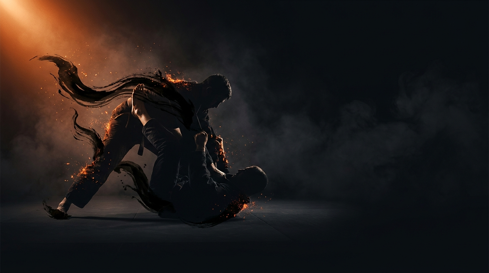

  
  
Ground · GrapplingGround Access

GroundGrapplingOffensiveIntermediateAccess

Pass the guard to a dominant position against an active bottom.

  
Start<b>Top inside the bottom's guard, inside a marked perimeter.</b>

  
→

  
The Goal<b>Top passes to a dominant position; bottom retains or sweeps.</b>

  
→

  
Finish<b>Establish dominant position → switch · Bottom sweeps or retains → reset · Leave the perimeter → loss.</b>

  
Get past the legs first,  finishing comes later.

  
The goal is the pass, not the submission. <b>Access comes before control.</b>

What to Read

<b>Attune to</b> the <i>felt weight distribution &amp; base through contact</i>, your posts loading and unloading, the guard grips going light or tight, your own balance over the legs, plus the bottom player's <b>hip and frame motion</b>. That inertial information specifies where the guard opens <i>before</i> the pass is available, not the opponent's limbs in isolation.

The Starting Position

  
PlayersTwo, one top, one bottom.

  
PositionTop inside the bottom's guard.

  
BoundaryA marked perimeter, both stay inside.

  
RolesOne top (attacker), one bottom (defender).

  
Start &amp; resetBegin from the guard; reset after each round.

The Matchup

  

    
🥋

    
Top (Attacker)

    
Trying to pass the guard and establish a dominant position, not submission.

    Break grips and controls, create a passing angle, complete the pass, and stabilize. Position must be established, not just touched.
  

  
VS

  

    
🤸

    
Bottom (Defender)

    
Trying to retain guard or sweep to top.

    Actively defend, never go passive. Maintain guard structure, create frames and distance, and threaten sweeps to discourage the pass.
  

The Rules

  🪨 Top must advance positionThe top player must <strong>advance</strong> position, just holding inside the guard doesn't count. This develops active passing, not stalling.
  🏃 Bottom actively defendsThe bottom player works guard retention and sweep threats continuously, no passive waiting. This develops passing against real resistance.
  🚫 Submissions are not the goalAt this stage the objective is position advancement, not finishing. Access comes before control and exploitation.
  📌 Position must be establishedThe pass only counts when the dominant position is stabilized, not just achieved momentarily. This ensures complete passes.
  ⬛ Stay inside the perimeterPlay happens inside a marked perimeter, any shape (square, circle, taped lines). If a player rolls fully out of it, that player loses instantly, training mat-edge awareness.

How to Win

  
Switch Top establishes a dominant position → switch roles.Side control, mount, or back, stabilized past the guard, top wins and earns the bottom's retention role.

  
Win Bottom sweeps or retains → bottom wins.Reverse to top, or keep the guard intact long enough that the pass is denied, the bottom defends successfully.

  
Reset Bottom sweeps or retains → reset, same roles.The round ends and resets from the guard, keeping the same roles for another rep.

  
Loss Roll fully out of the perimeter → that player loses.Crossing the marked perimeter loses the round instantly, regardless of position, training the mat-edge awareness a fighter needs.

The Levels

  
1<b>Closed Guard</b>Start in closed guard; top opens and passes.Begin in closed guard. Focus on breaking the closed guard open, the first barrier to access.

  
2<b>Open Guard</b>Start in open guard of the bottom's choice.Begin in open guard. More dynamic passing required, focus on passing open guard variations.

  
3<b>Half Guard</b>Start in half guard; top clears and advances.Begin in half guard. Top works to clear the trapped leg and advance, focus on half guard passing.

  
4<b>Full MMA Expression</b>Add ground strikes for both.Top can use ground strikes to open the guard; bottom can strike from guard. Guard passing under MMA pressure.

Recall Check

  
Test yourself before moving on. Answer out loud, then reveal what good looks like.

  

    
Q What information tells you the guard is about to open?

    
The <b>felt weight distribution and base through contact</b>: your posts loading and unloading, grips going light or tight, plus the bottom's <b>hip and frame motion</b>. Not the opponent's limbs in isolation.

  

  

    
Q The goal is the pass, not the submission. Why draw that line?

    
<b>Access comes before control.</b> Isolating the pass develops active, complete passing instead of rushing a finish before the position is even secured.

  

  

    
Q When does a pass actually count?

    
When the dominant position is <b>established and stabilized</b>, not just touched momentarily. You must re-load weight to hold it before the guard recovers.

  

  

    
Q What gets the top swept mid-pass, and how do you prevent it?

    
Losing the <b>connection to the bottom's hips</b>. Control the hips before passing so the pass completes rather than feeding a sweep.

  

Go Deeper

??? note "Task focus &amp; coaching cues"

    
Each role's job

    

      

🥋

Top (Attacker)

Break guard grips and controls; create passing opportunities; complete the pass to a dominant position; stabilize after passing.

      

🤸

Bottom (Defender)

Maintain guard structure; create frames and distance; threaten sweeps to discourage passing; recover guard if partially passed.

    

    
Coaching cues

    

      

🚧

Name the obstacle

Ask: "What was preventing your pass?" This develops recognition of guard obstacles rather than forcing a single passing technique.

      

⚓

Hips before pass

Ask: "Did you control their hips before passing?" Hip control perception is the key to a pass that actually completes.

    

??? abstract "Constraints-Led analysis"

    
Constraints → Affordances

    

      
Top must advance (not just hold)→Develops active passing, not stalling

      
Position must be established→Ensures complete passes

      
Progressive guard types→Scaffolded complexity (closed → open → half)

      
Bottom actively defends→Develops passing against resistance

      
Guard as obstacle→Creates the passing problem-space

    

    
Develops <b>passing affordance perception</b>, recognizing when and where the guard can be passed (Renshaw et al., 2019). <b>Degeneracy</b> emerges as athletes discover multiple passing solutions for the same guard type.

    
What the top reads

    

      

✋

Haptic

Guard grip strength &amp; hip control level → when to break grips and where the pass is available.

      

👁️

Visual

Guard structure &amp; the bottom's hand position → pass direction choice and grip prevention.

      

🧭

Proprioceptive

Own base &amp; posture → pass execution stability.

    

    
What we measure (order parameter)

    
Whether the top <b>stays connected to the bottom's hips through the pass</b>, track passes completed vs. swept, and whether the top re-loads weight to stabilize before the guard recovers. That control-connection relationship is the order parameter; when it stabilizes, the skill has formed.

    
Representativeness

    
<b>Models:</b> passing guard to a dominant ground position, the fundamental skill of ground offense in MMA.

    
Simplified: start in guardno submission focusprogressive guard complexity

    
Isolates passing from the takedown, passing-opportunity perception and hip control transfer directly into competition.

    
Readiness to progress

    <ul class="emma-checklist">
      <li>Passes current guard type consistently</li>
      <li>Recognizes passing opportunities</li>
      <li>Maintains control through pass completion</li>
      <li>Multiple passing solutions per guard</li>
    </ul>

    
Warning signs

    

      Gets swept during pass attempts
      Can't break grips
      Passes but can't stabilize
      Only one pass works
    

??? note "Safety &amp; related games"

    

      🤝 Controlled grappling, no slamming
      🛑 Stop on joint locks or neck cranks
      🔁 Reset if positions stall
    

    
Where it sits

    

      
Prerequisite→<a href="../positional-battle/">Positional Battle</a>

      
Follow-on→<a href="../ground-control/">Ground Control</a>

      
Related→<a href="../../concepts/decision-states/">Decision States</a>

    

