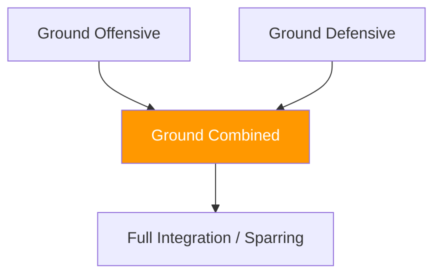

# Ground Games — Combined

!!! info "Coming Soon"
    This section will contain **combined ground games** — games where both athletes have offensive and defensive objectives simultaneously.

---

## Planned Development

Combined ground games will focus on:

- **Positional sparring** (start from specific position, both work their objectives)
- **Submission hunting vs escape** (both athletes have active goals)
- **Guard passing vs sweeping** (offensive and defensive guard work)
- **Top control vs stand-up** (cycles between control and escape)

---

## Combined Game Logic

Unlike asymmetric games, combined games create:

- **Simultaneous threats** — both athletes have something to achieve
- **Trade-offs** — aggressive offense may create defensive openings
- **Realistic dynamics** — mirrors actual fight conditions
- **Flow states** — positions cycle rather than reset

---

## System Position

---

!!! abstract "Development Notice"
    Games in this category are under development. Check back for updates.
