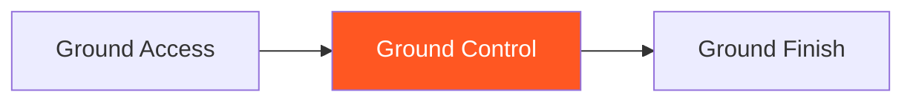

# Ground Control

!!! info "Game Identity"
    - **Problem:** Maintaining dominant position against escape attempts
    - **Environment:** Ground
    - **Stage:** Stabilize (Offensive Grappling)

This is an **offensive ground game** focused on holding dominant position. The top player learns to maintain control through active escape attempts without transitioning to finish yet.

---

## Goal

This is an **asymmetric game** with distinct roles.

| Role | Objective |
|------|-----------|
| **Top (Attacker)** | Maintain dominant position through escape attempts |
| **Bottom (Defender)** | Escape to guard OR stand up |

The objective is **position maintenance**, not submission.

---

## Entry Condition

- Start with top player in dominant position (side control, mount, or back)
- Top player works to maintain
- Bottom player works to escape
- Reset when bottom escapes OR top maintains for set duration

---

## Invariants

1. Top player must **actively control** — not just lying on top
2. Bottom player **actively escapes** — not passive
3. Submissions are not the goal at this stage
4. Brief position loss with immediate recovery still counts as control

---

## Task Focus

### Top (Attacker)
- Distribute weight effectively
- Anticipate and shut down escapes
- Transition between control positions as needed
- Maintain pressure without exhausting

### Bottom (Defender)
- Create frames and space
- Execute escape sequences
- Bridge and shrimp effectively
- Threaten reversals

!!! question "Key Internal Questions — Top"
    - "Am I controlling their hips or just their upper body?"
    - "Can I feel their escape attempt before it develops?"
    - "Am I using weight or strength to control?"

---

## Key Logic: Stabilize Before Exploit

!!! note "The Core Skill"
    Ground Control follows the decision state progression:

    | Stage | Goal |
    |-------|------|
    | Access | Get past guard (Ground Access) |
    | Stabilize | Hold position against resistance |
    | Exploit | Deal damage (Ground Finish) |

    This game focuses on the STABILIZE stage — holding what you've achieved.

    The skill: Control that allows you to stay AND creates opportunities to finish.

---

## Win Conditions

| Role | Win Condition |
|------|---------------|
| **Top** | Maintain dominant position for set duration (e.g., 30 seconds) |
| **Bottom** | Escape to guard, stand up, or reverse position |

**On top win:** Roles switch.
**On bottom win:** Reset from dominant position, same roles.

---

## Levels

=== "Level 1 — Side Control"
    - Start in side control
    - Top maintains, bottom escapes
    - Focus: Side control maintenance

=== "Level 2 — Mount"
    - Start in mount
    - Higher stakes for both players
    - Focus: Mount control and escape

=== "Level 3 — Back Control"
    - Start with back taken (hooks in)
    - Top maintains back, bottom escapes
    - Focus: Back control retention

=== "Level 4 — Full MMA Expression"
    - Top can threaten strikes to maintain control
    - Bottom can strike to create escape opportunities
    - Focus: Position control under MMA pressure
    - See: [Full MMA Expression](../concepts/full-mma-expression.md)

---

## Safety

- **Contact limits:** Controlled grappling
- **Stop conditions:** Submission attempts, excessive force
- **Coach intervention:** Reset if control becomes stalling

---

## System Position

- **Prerequisite games:** Ground Access
- **Follow-on games:** Ground Finish
- **Related concepts:** Decision States, TKO Pin

---

!!! abstract "System Evolution Notice"
    This game may be refined as ground control patterns emerge.
