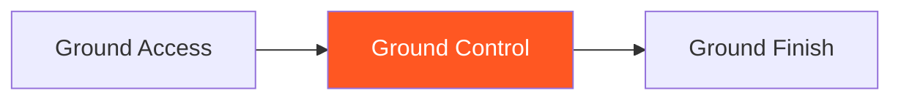

# Ground Control

!!! info "Game Identity"
    - **Problem:** Maintaining dominant position against escape attempts
    - **Environment:** Ground
    - **Stage:** Stabilize (Offensive Grappling)

This is an **offensive ground game** focused on holding dominant position. The top player learns to maintain control through active escape attempts without transitioning to finish yet.

---

## Goal

This is an **asymmetric game** with distinct roles.

| Role | Objective |
|------|-----------|
| **Top (Attacker)** | Maintain dominant position through escape attempts |
| **Bottom (Defender)** | Escape to guard OR stand up |

The objective is **position maintenance**, not submission.

---

## Entry Condition

- Start with top player in dominant position (side control, mount, or back)
- Top player works to maintain
- Bottom player works to escape
- Reset when bottom escapes OR top maintains for set duration

---

## Invariants

1. Top player must **actively control** — not just lying on top
2. Bottom player **actively escapes** — not passive
3. Submissions are not the goal at this stage
4. Brief position loss with immediate recovery still counts as control

---

## Task Focus

### Top (Attacker)
- Distribute weight effectively
- Anticipate and shut down escapes
- Transition between control positions as needed
- Maintain pressure without exhausting

### Bottom (Defender)
- Create frames and space
- Execute escape sequences
- Bridge and shrimp effectively
- Threaten reversals

!!! question "Key Internal Questions — Top"
    - "Am I controlling their hips or just their upper body?"
    - "Can I feel their escape attempt before it develops?"
    - "Am I using weight or strength to control?"

---

## Key Logic: Stabilize Before Exploit

!!! note "The Core Skill"
    Ground Control follows the decision state progression:

    | Stage | Goal |
    |-------|------|
    | Access | Get past guard (Ground Access) |
    | Stabilize | Hold position against resistance |
    | Exploit | Deal damage (Ground Finish) |

    This game focuses on the STABILIZE stage — holding what you've achieved.

    The skill: Control that allows you to stay AND creates opportunities to finish.

---

## Win Conditions

| Role | Win Condition |
|------|---------------|
| **Top** | Maintain dominant position for set duration (e.g., 30 seconds) |
| **Bottom** | Escape to guard, stand up, or reverse position |

**On top win:** Roles switch.
**On bottom win:** Reset from dominant position, same roles.

---

## Levels

=== "Level 1 — Side Control"
    - Start in side control
    - Top maintains, bottom escapes
    - Focus: Side control maintenance

=== "Level 2 — Mount"
    - Start in mount
    - Higher stakes for both players
    - Focus: Mount control and escape

=== "Level 3 — Back Control"
    - Start with back taken (hooks in)
    - Top maintains back, bottom escapes
    - Focus: Back control retention

=== "Level 4 — Full MMA Expression"
    - Top can threaten strikes to maintain control
    - Bottom can strike to create escape opportunities
    - Focus: Position control under MMA pressure
    - See: [Full MMA Expression](../concepts/full-mma-expression.md)

---

## Safety

- **Contact limits:** Controlled grappling
- **Stop conditions:** Submission attempts, excessive force
- **Coach intervention:** Reset if control becomes stalling

---

## Constraints Analysis

*How this game applies the [Constraints-Led Approach](../principles/cla/index.md)*

| Constraint Type | Constraint | Affordance Created |
|-----------------|------------|-------------------|
| **Task** | Top must actively control (not just lie on top) | Develops dynamic control, not dead weight |
| **Task** | Bottom actively escapes | Creates realistic control challenge |
| **Task** | Duration requirement (30 seconds) | Ensures sustained control skill |
| **Task** | Brief loss with recovery still counts | Realistic control recovery |
| **Individual** | Prerequisite: Ground Access | Can achieve positions before holding them |
| **Environmental** | Ground positions | Full position vocabulary development |

!!! info "Theoretical Foundation"
    This game develops **control maintenance perception**—anticipating escape attempts before they fully develop. The constraint requiring active control (not dead weight) develops efficient, adjustable control. Athletes learn **weight distribution perception**—where to place weight based on bottom's movements. This is classic perception-action coupling where control becomes reactive and adaptive (Renshaw et al., 2019).

---

## Information Structure

*What athletes must perceive to succeed (perception-action coupling)*

### Top (Controller) Perceives

| Information Source | What to Read | Action It Supports |
|--------------------|--------------|-------------------|
| **Haptic** | Bottom's hip movement | Escape prediction |
| **Haptic** | Frame creation attempts | Counter-adjustment |
| **Visual** | Bottom's bridge setup | Anticipate reversal |
| **Proprioceptive** | Own weight distribution | Control adjustment |
| **Proprioceptive** | Connection points | Maintain control |

### Bottom (Escaper) Perceives

| Information Source | What to Read | Action It Supports |
|--------------------|--------------|-------------------|
| **Haptic** | Top's weight distribution | Escape direction |
| **Haptic** | Control looseness | Escape timing |
| **Visual** | Space opportunities | Frame placement |
| **Proprioceptive** | Own hip mobility | Escape method selection |

!!! tip "Coaching Cue"
    Ask top players: "Are you using weight or strength to control?" Weight-based control is sustainable; strength-based control leads to fatigue. Ask: "Did you feel their escape before it happened?" This develops anticipation.

---

## Representativeness

*How this game models real MMA situations*

### Real MMA Situation

Holding dominant ground position through escape attempts—essential for ground-and-pound or submission setup.

### How This Game Represents It

| Element | Real MMA | This Game | Fidelity |
|---------|----------|-----------|----------|
| **Position maintenance** | Critical skill | Same | High |
| **Escape attempts** | Constant in competition | Active bottom | High |
| **Position transitions** | Moving between controls | Same | High |
| **Weight distribution** | Key to control | Same | High |
| **Strikes** | Ground-and-pound available | Progressive by level | Scaffolded |

### Simplifications & Justification

| Simplification | Why Acceptable |
|----------------|----------------|
| Start in dominant position | Isolates control from access |
| No submission focus | Develops control before exploitation |
| Set duration (30 seconds) | Clear success criteria |

!!! note "Transfer Expectation"
    Ground control developed here transfers directly to MMA. The perception of escape anticipation and weight distribution is identical in competition.

---

## Variability Guidelines

*Creating "repetition without repetition" (Bernstein, 1967)*

### Within-Level Variability

| Vary This | How | Maintains |
|-----------|-----|-----------|
| **Position** | Side control, mount, back | Full control vocabulary |
| **Bottom resistance** | Technical escapes, explosive escapes | Multiple control solutions |
| **Bottom size** | Larger, smaller, equal | Control adaptability |
| **Escape style** | Frames, bridges, shrimps | Develops recognition |
| **Duration** | 20 seconds, 45 seconds | Endurance calibration |

### What NOT to Vary

| Keep Constant | Why |
|---------------|-----|
| Active control required | Prevents stalling |
| Active escape attempts | Maintains realism |
| Position establishment | Ensures stable control |

### Progressing Through Levels

| Signal to Progress | Meaning |
|--------------------|---------|
| Controls side control consistently | Basic skill developing |
| Adjusts to escape attempts | Perception developing |
| Controls multiple positions | Ready for exploitation |

---

## Readiness Indicators

*When is the athlete ready to advance?*

### Ready for Next Level When

- [ ] Controls current position for full duration
- [ ] Anticipates escapes before they develop
- [ ] Uses weight efficiently (not gassing)
- [ ] Transitions between control positions
- [ ] Can articulate: "I felt them starting to bridge so I..."

### Ready to Exit Game When

- [ ] Level 2+ competence (controls mount effectively)
- [ ] Control adjustments are automatic
- [ ] Can control various body types
- [ ] Ground control appears in sparring

### Warning Signs (Not Ready to Progress)

| Sign | Meaning | Response |
|------|---------|----------|
| Gets reversed consistently | Weight distribution poor | Focus on pressure and base |
| Loses position immediately | Reaction too slow | Slow down, emphasize feel |
| Exhausts quickly | Using strength not weight | Work on efficient control |
| Only controls one position | Limited skill | Vary positions in training |

---

## System Position

- **Prerequisite games:** Ground Access
- **Follow-on games:** Ground Finish
- **Related concepts:** Decision States, TKO Pin

---

!!! abstract "System Evolution Notice"
    This game may be refined as ground control patterns emerge.
