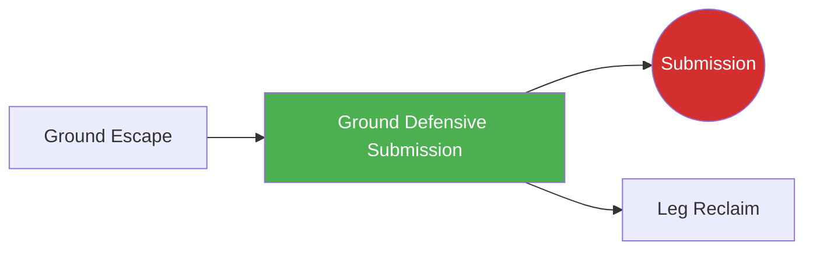

# Ground Defensive Submission

!!! info "Game Identity"
    - **Problem:** Using submissions from bottom position to stop top control
    - **Environment:** Ground
    - **Stage:** Counter (Defensive Grappling)

This is a **defensive ground game** where the bottom player uses submission threats to deter top control, create escapes, or finish the fight. In MMA, top position is generally advantageous, but submission threats from bottom create risk for the top player.

---

## Goal

This is an **asymmetric game** with distinct roles.

| Role | Objective |
|------|-----------|
| **Bottom (Defender)** | Threaten or complete submission from bottom position |
| **Top (Controller)** | Maintain control while avoiding submission danger |

The objective is **submission as defensive weapon** from bottom position.

---

## Entry Condition

- Bottom player is under top control (side control, mount, or back taken)
- Top player has established dominant position
- Bottom player works submission threats
- Reset when submission achieved, defended, OR position changes significantly

---

## Invariants

1. Bottom player must **threaten submissions** — not just escape
2. Top player **maintains intent to control** — not just defending
3. Submissions must be available from position
4. Position hierarchy: top is still generally advantageous

---

## Task Focus

### Bottom (Defender)
- Identify submission opportunities from position
- Create openings through movement and frames
- Use submission threat to improve position
- Finish if top player makes mistake

### Top (Controller)
- Maintain position while protecting limbs/neck
- Recognize submission setups
- Posture appropriately to deny attacks
- Continue offense while staying safe

!!! question "Key Internal Questions — Bottom"
    - "What submission is available from here?"
    - "Can I use this threat to improve position?"
    - "Is the submission high percentage or should I escape?"

---

## Key Logic: Risk vs. Reward from Bottom

!!! note "The Core Skill"
    Bottom submissions in MMA carry specific considerations:

    | Factor | Consideration |
    |--------|---------------|
    | **Position risk** | Failed submission may worsen position |
    | **Damage exposure** | Staying on bottom allows GnP |
    | **Energy cost** | Submissions from bottom are tiring |
    | **Finish rate** | Some submissions higher percentage than others |

    Available submissions by position:

    | Position | Submissions |
    |----------|-------------|
    | Guard | Triangle, armbar, guillotine, omoplata, kimura |
    | Half guard | Kimura, guillotine, kneebar |
    | Side control bottom | Limited — mostly setup to escape |
    | Mount bottom | Limited — armlock if they post, mostly escape |
    | Back taken | Very limited — fight the hands, escape |

    The skill is recognizing when submission is higher value than escape.

---

## Win Conditions

| Role | Win Condition |
|------|---------------|
| **Bottom** | Complete submission OR use threat to escape/reverse |
| **Top** | Maintain control while defending submissions for set duration |

**On bottom win:** Roles switch.
**On top win:** Reset, same roles.

---

## Levels

=== "Level 1 — From Guard Only"
    - Start in guard (bottom has most options)
    - Focus: Guard submissions (triangle, armbar, etc.)

=== "Level 2 — From Half Guard"
    - Start in half guard
    - Fewer options, more about timing
    - Focus: Half guard submissions and sweeps

=== "Level 3 — From Bad Positions"
    - Start under side control or mount
    - Very limited options, high risk
    - Focus: Recognizing rare opportunities

=== "Level 4 — Full MMA Expression"
    - Top player can use ground strikes
    - Bottom must time submissions around GnP
    - Focus: Bottom submissions under MMA pressure
    - See: [Full MMA Expression](../concepts/full-mma-expression.md)

---

## Safety

- **Contact limits:** Controlled submissions, tap immediately
- **Stop conditions:** Cranking submissions, stacking dangerously
- **Coach intervention:** Reset if bottom is taking too much damage without progressing

---

## System Position

- **Prerequisite games:** Ground Escape (understand escape first)
- **Follow-on games:** End state (Submission) if completed, Leg Reclaim if threat creates space
- **Related concepts:** Decision States

---

## Important Note on MMA Context

!!! warning "MMA Reality Check"
    In MMA, being on bottom is generally disadvantageous:

    - Top player can strike
    - Judges favor top position
    - Energy expenditure favors top
    - Failed submissions often worsen position

    **Prioritize escape over submission UNLESS:**

    - Submission is very high percentage
    - You are highly confident in the technique
    - Escape routes are exhausted
    - Position is about to get much worse anyway

    This game teaches when and how to attack from bottom — not that you should always attack from bottom.

---

!!! abstract "System Evolution Notice"
    This game may be refined as defensive submission patterns emerge.
