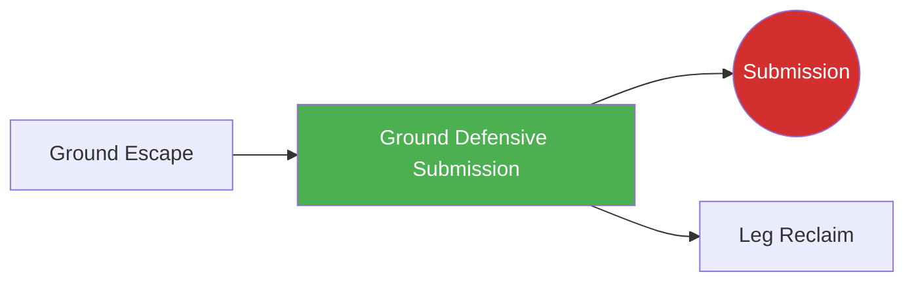

# Ground Defensive Submission

!!! info "Game Identity"
    - **Problem:** Using submissions from bottom position to stop top control
    - **Environment:** Ground
    - **Stage:** Counter (Defensive Grappling)

This is a **defensive ground game** where the bottom player uses submission threats to deter top control, create escapes, or finish the fight. In MMA, top position is generally advantageous, but submission threats from bottom create risk for the top player.

---

## Goal

This is an **asymmetric game** with distinct roles.

| Role | Objective |
|------|-----------|
| **Bottom (Defender)** | Threaten or complete submission from bottom position |
| **Top (Controller)** | Maintain control while avoiding submission danger |

The objective is **submission as defensive weapon** from bottom position.

---

## Entry Condition

- Bottom player is under top control (side control, mount, or back taken)
- Top player has established dominant position
- Bottom player works submission threats
- Reset when submission achieved, defended, OR position changes significantly

---

## Invariants

1. Bottom player must **threaten submissions** — not just escape
2. Top player **maintains intent to control** — not just defending
3. Submissions must be available from position
4. Position hierarchy: top is still generally advantageous

---

## Task Focus

### Bottom (Defender)
- Identify submission opportunities from position
- Create openings through movement and frames
- Use submission threat to improve position
- Finish if top player makes mistake

### Top (Controller)
- Maintain position while protecting limbs/neck
- Recognize submission setups
- Posture appropriately to deny attacks
- Continue offense while staying safe

!!! question "Key Internal Questions — Bottom"
    - "What submission is available from here?"
    - "Can I use this threat to improve position?"
    - "Is the submission high percentage or should I escape?"

---

## Key Logic: Risk vs. Reward from Bottom

!!! note "The Core Skill"
    Bottom submissions in MMA carry specific considerations:

    | Factor | Consideration |
    |--------|---------------|
    | **Position risk** | Failed submission may worsen position |
    | **Damage exposure** | Staying on bottom allows GnP |
    | **Energy cost** | Submissions from bottom are tiring |
    | **Finish rate** | Some submissions higher percentage than others |

    Available submissions by position:

    | Position | Submissions |
    |----------|-------------|
    | Guard | Triangle, armbar, guillotine, omoplata, kimura |
    | Half guard | Kimura, guillotine, kneebar |
    | Side control bottom | Limited — mostly setup to escape |
    | Mount bottom | Limited — armlock if they post, mostly escape |
    | Back taken | Very limited — fight the hands, escape |

    The skill is recognizing when submission is higher value than escape.

---

## Win Conditions

| Role | Win Condition |
|------|---------------|
| **Bottom** | Complete submission OR use threat to escape/reverse |
| **Top** | Maintain control while defending submissions for set duration |

**On bottom win:** Roles switch.
**On top win:** Reset, same roles.

---

## Levels

=== "Level 1 — From Guard Only"
    - Start in guard (bottom has most options)
    - Focus: Guard submissions (triangle, armbar, etc.)

=== "Level 2 — From Half Guard"
    - Start in half guard
    - Fewer options, more about timing
    - Focus: Half guard submissions and sweeps

=== "Level 3 — From Bad Positions"
    - Start under side control or mount
    - Very limited options, high risk
    - Focus: Recognizing rare opportunities

=== "Level 4 — Full MMA Expression"
    - Top player can use ground strikes
    - Bottom must time submissions around GnP
    - Focus: Bottom submissions under MMA pressure
    - See: [Full MMA Expression](../concepts/full-mma-expression.md)

---

## Safety

- **Contact limits:** Controlled submissions, tap immediately
- **Stop conditions:** Cranking submissions, stacking dangerously
- **Coach intervention:** Reset if bottom is taking too much damage without progressing

---

## Constraints Analysis

*How this game applies the [Constraints-Led Approach](../principles/cla/index.md)*

| Constraint Type | Constraint | Affordance Created |
|-----------------|------------|-------------------|
| **Task** | Bottom must threaten submissions (not just escape) | Develops offensive bottom game |
| **Task** | Top maintains control intent | Creates realistic control situation |
| **Task** | Submissions must be position-appropriate | Reality-based technique selection |
| **Task** | Progressive positions (guard → half → bad positions) | Scaffolded difficulty |
| **Individual** | Prerequisite: Ground Escape | Understands escape first |
| **Environmental** | Various ground positions | Full defensive submission vocabulary |

!!! info "Theoretical Foundation"
    This game develops **defensive submission perception**—recognizing when submission opportunities exist from bottom position. The constraint requiring threats (not just escape) develops **counter-offense from defense**. Athletes learn the **risk-reward calculation**—when submission is higher value than escape. This is advanced perception-action coupling where disadvantaged positions become offensive opportunities (Renshaw et al., 2019).

---

## Information Structure

*What athletes must perceive to succeed (perception-action coupling)*

### Bottom (Defender) Perceives

| Information Source | What to Read | Action It Supports |
|--------------------|--------------|-------------------|
| **Haptic** | Top's posture breaks | Submission opportunity |
| **Haptic** | Top's limb position | Target selection |
| **Visual** | Top's head position | Guillotine/choke availability |
| **Visual** | Top's arm extension | Armbar/kimura opportunity |
| **Proprioceptive** | Own hip position | Submission setup |
| **Proprioceptive** | Own grip quality | Attack commitment |

### Top (Controller) Perceives

| Information Source | What to Read | Action It Supports |
|--------------------|--------------|-------------------|
| **Haptic** | Bottom's grip changes | Submission setup recognition |
| **Haptic** | Hip movement | Guard threat awareness |
| **Visual** | Bottom's hand positioning | Attack prediction |
| **Proprioceptive** | Own posture quality | Vulnerability awareness |
| **Proprioceptive** | Limb position | Protection needs |

!!! tip "Coaching Cue"
    Ask bottom: "Was submission higher percentage than escape there?" This develops risk-reward perception. Ask: "Did you use the threat to improve position?" Submission threats often create escape opportunities even when not finished.

---

## Representativeness

*How this game models real MMA situations*

### Real MMA Situation

Using submission threats from bottom to deter top control, create escapes, or finish fights—a crucial MMA skill despite bottom being generally disadvantageous.

### How This Game Represents It

| Element | Real MMA | This Game | Fidelity |
|---------|----------|-----------|----------|
| **Defensive submissions** | High-risk, high-reward | Same | High |
| **Position-appropriate attacks** | Guards have more options than under mount | Same | High |
| **Threat as tool** | Creates control hesitation | Same | High |
| **Risk-reward calculation** | Critical decision | Same | High |
| **Strikes** | Make bottom dangerous | Progressive by level | Scaffolded |

### Simplifications & Justification

| Simplification | Why Acceptable |
|----------------|----------------|
| Progressive positions | Masters guard before bad positions |
| Clear threat requirement | Ensures offensive development |
| Controlled submissions | Safety during learning |

!!! note "Transfer Expectation"
    Defensive submission skill developed here transfers directly to MMA. The perception of when submission is available and worth pursuing is identical in competition.

---

## Variability Guidelines

*Creating "repetition without repetition" (Bernstein, 1967)*

### Within-Level Variability

| Vary This | How | Maintains |
|-----------|-----|-----------|
| **Starting position** | Guard, half guard, under side control | Multiple attack opportunities |
| **Top style** | Passive control, active control | Multiple threat timings |
| **Top size** | Larger, smaller, equal | Submission adjustment |
| **Submission emphasis** | Chokes, armlocks, leg attacks | Full submission vocabulary |
| **Intensity** | Drilling pace, live pace | Pressure calibration |

### What NOT to Vary

| Keep Constant | Why |
|---------------|-----|
| Submission threats required | Core constraint |
| Position-appropriate attacks | Maintains realism |
| Controlled submissions | Safety |

### Progressing Through Levels

| Signal to Progress | Meaning |
|--------------------|---------|
| Threatens effectively from guard | Basic skill developing |
| Uses threats to escape | Integration developing |
| Threatens from bad positions | Ready for full expression |

---

## Readiness Indicators

*When is the athlete ready to advance?*

### Ready for Next Level When

- [ ] Threatens submissions from current position
- [ ] Top feels genuine danger
- [ ] Finishes when openings appear
- [ ] Uses threats to improve position
- [ ] Can articulate: "Their arm was extended so I..."

### Ready to Exit Game When

- [ ] Level 2+ competence (threatens from half guard)
- [ ] Risk-reward assessment is instinctive
- [ ] Submission threats appear in sparring
- [ ] Top respects the threat (adjusts posture)

### Warning Signs (Not Ready to Progress)

| Sign | Meaning | Response |
|------|---------|----------|
| Only escapes (no submissions) | Not threatening | Constrain escape, require threat |
| Top doesn't feel danger | Technique ineffective | Work on setups and grips |
| Gives up position for failed attacks | Risk assessment poor | Emphasize position retention |
| Only one submission works | Limited recognition | Vary positions to force options |

---

## System Position

- **Prerequisite games:** Ground Escape (understand escape first)
- **Follow-on games:** End state (Submission) if completed, Leg Reclaim if threat creates space
- **Related concepts:** Decision States

---

## Important Note on MMA Context

!!! warning "MMA Reality Check"
    In MMA, being on bottom is generally disadvantageous:

    - Top player can strike
    - Judges favor top position
    - Energy expenditure favors top
    - Failed submissions often worsen position

    **Prioritize escape over submission UNLESS:**

    - Submission is very high percentage
    - You are highly confident in the technique
    - Escape routes are exhausted
    - Position is about to get much worse anyway

    This game teaches when and how to attack from bottom — not that you should always attack from bottom.

---

!!! abstract "System Evolution Notice"
    This game may be refined as defensive submission patterns emerge.
