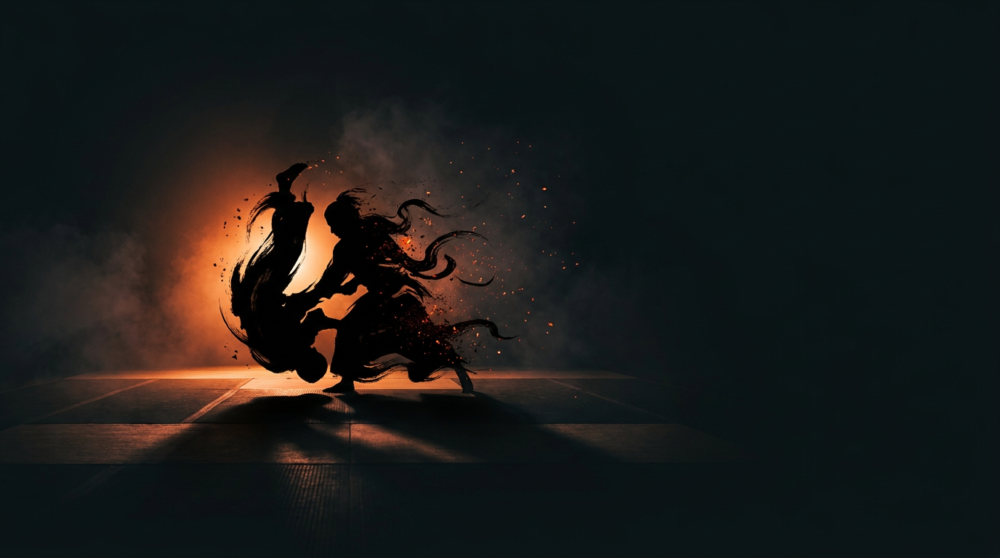

  
  
Ground · GrapplingGround Defensive Submission

GroundGrapplingDefensiveAdvancedCounter

Turn the bottom into a threat — submit, escape, or deter the top from a disadvantaged position.

  
Start<b>Bottom under established top control, inside a marked perimeter.</b>

  
→

  
The Goal<b>Bottom threatens or completes a submission; top controls while avoiding danger.</b>

  
→

  
Finish<b>Bottom finishes or threatens to escape/reverse → switch · Top controls &amp; defends the duration → reset · Leave the perimeter → loss.</b>

  
A bad position isn't a safe one — make the top pay to stay there.

  
Even from underneath, the threat is real. <b>The threat itself buys the escape.</b>

What to Read

<b>Attune to</b> the <i>felt weight distribution &amp; pressure through contact</i> — where the top's posture breaks, which limb extends or posts, where the connection goes light enough to attack — plus the top player's <b>head and hip motion</b>. That inertial information specifies when a submission opens <i>before</i> the top re-postures, not the opponent's limbs in isolation.

The Starting Position

  
PlayersTwo — one bottom, one top.

  
PositionBottom under established top control.

  
BoundaryA marked perimeter — both stay inside.

  
RolesOne bottom (defender), one top (controller).

  
Start &amp; resetBegin from top control; reset after each round.

The Matchup

  

    
🤸

    
Bottom (Defender)

    
Trying to threaten or complete a submission from bottom — not just escape.

    Identify position-appropriate submission opportunities, create openings through movement and frames, use the threat to improve position, and finish if the top makes a mistake.
  

  
VS

  

    
🪨

    
Top (Controller)

    
Trying to maintain control while avoiding submission danger.

    Maintain position while protecting limbs and neck, recognize submission setups, posture to deny attacks, and continue offense while staying safe.
  

The Rules

  🎯 Bottom must threaten submissionsThe bottom player must threaten submissions — not just escape. This develops an offensive bottom game.
  🪨 Top maintains control intentThe top player maintains the intent to control — not just defending. This creates a realistic control situation to attack against.
  📍 Submissions must fit the positionAttacks must be available from the position — guard has the most options; under mount has very few. This keeps technique selection reality-based.
  ⚖️ Top is still generally advantageousThe position hierarchy holds — top is still generally advantageous. The bottom is creating risk, not flipping the value of the position.
  ⬛ Stay inside the perimeterPlay happens inside a marked perimeter — any shape (square, circle, taped lines). If a player rolls fully out of it, that player loses instantly — training mat-edge awareness.

How to Win

  
Switch Bottom finishes or threatens to escape/reverse → switch roles.A finish, or a threat that buys the escape/reversal — bottom wins and earns the top's control role.

  
Win Top controls &amp; defends the duration → top wins.Hold position and stay safe from submissions for the duration — the top wins.

  
Reset Submission defended or position shifts significantly → reset, same roles.The round ends and resets from the top-control position, keeping the same roles for another rep.

  
Loss Roll fully out of the perimeter → that player loses.Crossing the marked perimeter loses the round instantly, regardless of position — training the mat-edge awareness a fighter needs.

The Levels

  
1<b>From Guard Only</b>Start in guard — bottom has the most options.Begin in guard, where the bottom has the most options. Focus on guard submissions — triangle, armbar, and more.

  
2<b>From Half Guard</b>Start in half guard — fewer options, more timing.Begin in half guard. Fewer options and more about timing — focus on half guard submissions and sweeps.

  
3<b>From Bad Positions</b>Start under side control or mount — high risk.Begin under side control or mount. Very limited options, high risk — focus on recognizing rare opportunities.

  
4<b>Full MMA Expression</b>Top can use ground strikes.Top can use ground strikes; bottom must time submissions around the ground-and-pound. Bottom submissions under MMA pressure.

Go Deeper

??? note "Task focus &amp; coaching cues"

    
Each role's job

    

      

🤸

Bottom (Defender)

Identify submission opportunities from the position; create openings through movement and frames; use the threat to improve position; finish if the top makes a mistake.

      

🪨

Top (Controller)

Maintain position while protecting limbs and neck; recognize submission setups; posture to deny attacks; continue offense while staying safe.

    

    
Coaching cues

    

      

⚖️

Submission or escape?

Ask: "Was submission higher percentage than escape there?" This develops the risk-reward perception at the heart of the bottom game.

      

🪤

Threat as tool

Ask: "Did you use the threat to improve position?" Submission threats often create escape openings even when not finished.

    

??? abstract "Constraints-Led analysis"

    
Constraints → Affordances

    

      
Bottom must threaten submissions→Develops an offensive bottom game

      
Top maintains control intent→Creates a realistic control situation

      
Position-appropriate submissions→Reality-based technique selection

      
Progressive positions→Scaffolded difficulty (guard → half → bad positions)

      
Various ground positions→Full defensive-submission vocabulary

    

    
Develops <b>defensive submission perception</b> — recognizing when submission opportunities exist from bottom (Renshaw et al., 2019). The requirement to threaten (not just escape) develops <b>counter-offense from defense</b>: athletes learn the risk-reward calculation of when submission beats escape.

    
What the bottom reads

    

      

✋

Haptic

Top's posture breaks &amp; limb position → submission opportunity and target selection.

      

👁️

Visual

Top's head position &amp; arm extension → guillotine/choke or armbar/kimura availability.

      

🧭

Proprioceptive

Own hip position &amp; grip quality → submission setup and attack commitment.

    

    
What we measure (order parameter)

    
Whether the bottom <b>stays connected to the top's extended limb or broken posture long enough to commit</b> — track threats that force a top reaction (finish, escape, or reversal) vs. attacks shut down, and whether the bottom keeps the threat live before the top re-postures. That threat-connection relationship is the order parameter; when it stabilizes, the skill has formed.

    
Representativeness

    
<b>Models:</b> using submission threats from bottom to deter top control, create escapes, or finish — crucial despite bottom being generally disadvantaged.

    
Simplified: progressive positionsclear threat requirementcontrolled submissions

    
Perception of when a submission is available and worth pursuing is identical to competition — threats that create space feed back into <a href="../leg-reclaim/">Leg Reclaim</a>.

    
Readiness to progress

    <ul class="emma-checklist">
      <li>Threatens submissions from the current position</li>
      <li>Top feels genuine danger</li>
      <li>Finishes when openings appear</li>
      <li>Uses threats to improve position</li>
    </ul>

    
Warning signs

    

      Only escapes (no submissions)
      Top doesn't feel danger
      Gives up position for failed attacks
      Only one submission works
    

??? note "Safety &amp; related games"

    

      🤝 Controlled submissions, tap immediately
      🛑 Stop on cranking submissions or dangerous stacking
      🔁 Reset if bottom is taking damage without progressing
    

    
MMA reality check

    
In MMA, bottom is generally disadvantaged — the top can strike, judges favor top, energy favors top, and a failed submission often worsens position. <b>Prioritize escape over submission UNLESS</b> the submission is very high percentage, you are highly confident, escape routes are exhausted, or the position is about to get much worse anyway. This game teaches <i>when and how</i> to attack from bottom — not that you should always attack from bottom.

    
Where it sits

    

      
Prerequisite→<a href="../ground-escape/">Ground Escape</a> (understand escape first)

      
Follow-on→End state (Submission) if completed · <a href="../leg-reclaim/">Leg Reclaim</a> if the threat creates space

      
Related→<a href="../../concepts/decision-states/">Decision States</a>

    

