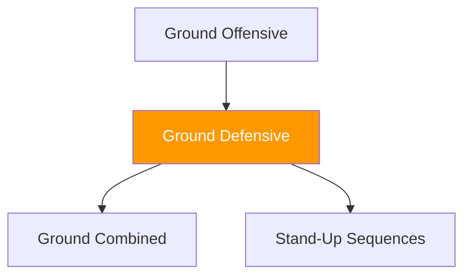

# Ground Games — Defensive

!!! info "Coming Soon"
    This section will contain **defensive ground games** — games focused on escaping bad positions, recovering guard, and returning to standing.

---

## Planned Development

Defensive ground games will focus on:

- **Escape sequences** (from mount, side control, back control)
- **Guard recovery** (creating space and re-establishing guard)
- **Stand-up sequences** (technical stand-up, wall-assisted stand-up)
- **Survival under TKO pressure** (defending strikes while creating escape opportunities)

---

## Defensive Ground Principles

The defender's task progression:

1. **Survive** (protect from damage, don't give up worse position)
2. **Create space** (frames, hip escapes, shrimping)
3. **Recover position** (guard, half-guard, or standing)
4. **Escape or reverse** (return to neutral or achieve dominant position)

---

## System Position

---

!!! abstract "Development Notice"
    Games in this category are under development. Check back for updates.
