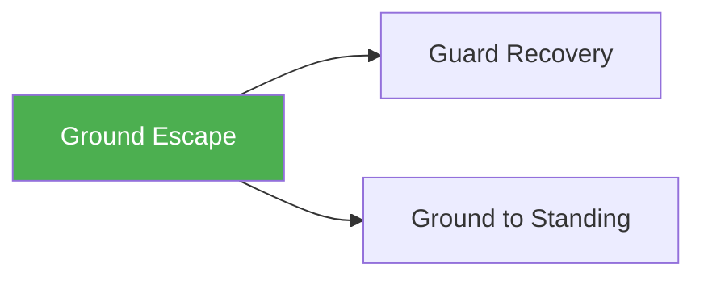

# Ground Escape

!!! info "Game Identity"
    - **Problem:** Escaping from under dominant position
    - **Environment:** Ground
    - **Stage:** Counter (Defensive Grappling)

This is a **defensive ground game** focused on escaping bad positions. The bottom player learns to create space, execute escapes, and recover to safer positions.

---

## Goal

This is an **asymmetric game** with distinct roles.

| Role | Objective |
|------|-----------|
| **Bottom (Defender)** | Escape to guard, neutral, or standing |
| **Top (Attacker)** | Maintain position and prevent escape |

The objective is **escape from bottom**, not submission from bottom.

---

## Entry Condition

- Start with top player in dominant position (side control, mount, or back)
- Bottom player works to escape
- Top player works to maintain
- Reset when bottom escapes OR top maintains for set duration

---

## Invariants

1. Bottom player must **actively escape** — not just surviving
2. Top player **maintains control** — not attacking
3. Escape = guard recovery, reversal, or standing up
4. Submissions from bottom are not the focus

---

## Task Focus

### Bottom (Defender)
- Create frames and space
- Execute escape techniques (bridges, shrimps, turns)
- Chain escape attempts
- Recover to guard or standing

### Top (Attacker)
- Maintain weight distribution
- Anticipate and counter escapes
- Stay heavy without exhausting
- Transition to maintain control

!!! question "Key Internal Questions — Bottom"
    - "Where is their weight?"
    - "Can I create space to move?"
    - "What escape does this position allow?"

---

## Key Logic: Escape Hierarchy

!!! note "The Core Skill"
    Escapes have a hierarchy of outcomes:

    | Escape Result | Value |
    |---------------|-------|
    | Stand up | Best — returns to neutral |
    | Reversal to top | Great — position reversed |
    | Guard recovery | Good — defensive position |
    | Worse position | Failed — mount from side, etc. |

    The skill: Recognizing which escape is available and executing it.

---

## Win Conditions

| Role | Win Condition |
|------|---------------|
| **Bottom** | Escape to guard, reversal, or standing |
| **Top** | Maintain dominant position for set duration |

**On bottom win:** Roles switch.
**On top win:** Reset from dominant position, same roles.

---

## Levels

=== "Level 1 — Side Control Escapes"
    - Start under side control
    - Focus: Frames, shrimp to guard, sit-up escape
    - Most fundamental escape position

=== "Level 2 — Mount Escapes"
    - Start under mount
    - Higher urgency, fewer options
    - Focus: Bridge and roll, elbow-knee escape

=== "Level 3 — Back Escapes"
    - Start with opponent on back (hooks in)
    - Highest danger position
    - Focus: Hand fighting, escape to guard

=== "Level 4 — Full MMA Expression"
    - Top player can threaten strikes
    - Bottom must escape while defending strikes
    - Focus: Escape under MMA pressure
    - See: [Full MMA Expression](../concepts/full-mma-expression.md)

---

## Safety

- **Contact limits:** Controlled grappling
- **Stop conditions:** Submission attempts, neck cranks
- **Coach intervention:** Reset if positions stall completely

---

## System Position

- **Prerequisite games:** None (fundamental defensive game)
- **Follow-on games:** Guard Recovery, Ground to Standing
- **Related concepts:** Decision States

---

!!! abstract "System Evolution Notice"
    This game may be refined as ground escape patterns emerge.
