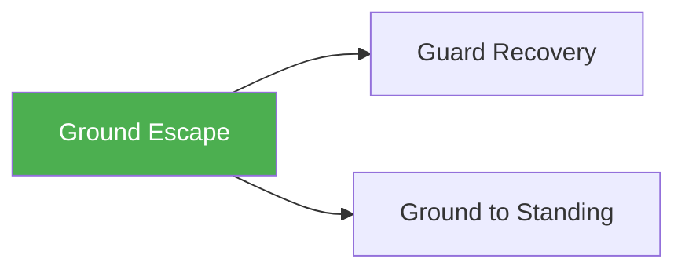

# Ground Escape

!!! info "Game Identity"
    - **Problem:** Escaping from under dominant position
    - **Environment:** Ground
    - **Stage:** Counter (Defensive Grappling)

This is a **defensive ground game** focused on escaping bad positions. The bottom player learns to create space, execute escapes, and recover to safer positions.

---

## Goal

This is an **asymmetric game** with distinct roles.

| Role | Objective |
|------|-----------|
| **Bottom (Defender)** | Escape to guard, neutral, or standing |
| **Top (Attacker)** | Maintain position and prevent escape |

The objective is **escape from bottom**, not submission from bottom.

---

## Entry Condition

- Start with top player in dominant position (side control, mount, or back)
- Bottom player works to escape
- Top player works to maintain
- Reset when bottom escapes OR top maintains for set duration

---

## Invariants

1. Bottom player must **actively escape** — not just surviving
2. Top player **maintains control** — not attacking
3. Escape = guard recovery, reversal, or standing up
4. Submissions from bottom are not the focus

---

## Task Focus

### Bottom (Defender)
- Create frames and space
- Execute escape techniques (bridges, shrimps, turns)
- Chain escape attempts
- Recover to guard or standing

### Top (Attacker)
- Maintain weight distribution
- Anticipate and counter escapes
- Stay heavy without exhausting
- Transition to maintain control

!!! question "Key Internal Questions — Bottom"
    - "Where is their weight?"
    - "Can I create space to move?"
    - "What escape does this position allow?"

---

## Key Logic: Escape Hierarchy

!!! note "The Core Skill"
    Escapes have a hierarchy of outcomes:

    | Escape Result | Value |
    |---------------|-------|
    | Stand up | Best — returns to neutral |
    | Reversal to top | Great — position reversed |
    | Guard recovery | Good — defensive position |
    | Worse position | Failed — mount from side, etc. |

    The skill: Recognizing which escape is available and executing it.

---

## Win Conditions

| Role | Win Condition |
|------|---------------|
| **Bottom** | Escape to guard, reversal, or standing |
| **Top** | Maintain dominant position for set duration |

**On bottom win:** Roles switch.
**On top win:** Reset from dominant position, same roles.

---

## Levels

=== "Level 1 — Side Control Escapes"
    - Start under side control
    - Focus: Frames, shrimp to guard, sit-up escape
    - Most fundamental escape position

=== "Level 2 — Mount Escapes"
    - Start under mount
    - Higher urgency, fewer options
    - Focus: Bridge and roll, elbow-knee escape

=== "Level 3 — Back Escapes"
    - Start with opponent on back (hooks in)
    - Highest danger position
    - Focus: Hand fighting, escape to guard

=== "Level 4 — Full MMA Expression"
    - Top player can threaten strikes
    - Bottom must escape while defending strikes
    - Focus: Escape under MMA pressure
    - See: [Full MMA Expression](../concepts/full-mma-expression.md)

---

## Constraints Analysis

*How this game applies the [Constraints-Led Approach](../principles/cla/index.md)*

| Constraint Type | Constraint | Affordance Created |
|-----------------|------------|-------------------|
| **Task** | Bottom must actively escape (not just survive) | Forces exploration of escape solutions |
| **Task** | Top maintains position (no submissions) | Bottom focuses on escape, not submission defense |
| **Task** | Specific starting positions (side control, mount, back) | Isolates escape patterns for each position |
| **Task** | Win by escape OR duration | Creates urgency for bottom, patience for top |
| **Individual** | Size/strength matching | Technique-based solutions, not attribute-based |
| **Environmental** | Ground surface, limited mobility | Ground-specific movement patterns |

!!! info "Theoretical Foundation"
    This game implements **Task Simplification** (Renshaw et al., 2019). Rather than full positional grappling, we isolate the escape task while keeping the essential perception-action loop intact. The bottom player still reads weight distribution and timing from a real, resisting opponent.

---

## Information Structure

*What athletes must perceive to succeed (perception-action coupling)*

### Bottom (Defender) Perceives

| Information Source | What to Read | Action It Supports |
|--------------------|--------------|-------------------|
| **Haptic** | Pressure distribution (where weight is) | Which direction to escape |
| **Haptic** | Grip tension and location | Which limbs are controlled |
| **Proprioceptive** | Own hip position and mobility | Available escape directions |
| **Proprioceptive** | Frame strength/collapse | When space exists |
| **Visual** | Top player's posture changes | Timing windows for escape |
| **Visual** | Space between bodies | Where to insert frames/knees |

### Top (Attacker) Perceives

| Information Source | What to Read | Action It Supports |
|--------------------|--------------|-------------------|
| **Haptic** | Bottom's hip movement initiation | Anticipate escape direction |
| **Haptic** | Frame pressure against body | When to adjust weight |
| **Proprioceptive** | Own weight distribution | Maintaining control |
| **Visual** | Bottom's arm/leg positioning | Which escape they're setting up |

!!! tip "Coaching Cue"
    For bottom players: "Where is their weight? Where is the space?" These questions direct attention to the information that matters, rather than prescribing a technique.

---

## Representativeness

*How this game models real MMA situations*

### Real MMA Situation

Being taken down and controlled in side control, mount, or back control—needing to escape before damage accumulates or submission occurs.

### How This Game Represents It

| Element | Real MMA | This Game | Fidelity |
|---------|----------|-----------|----------|
| **Positional threat** | Strikes and submissions available | Position control only (Levels 1-3) | Reduced |
| **Escape urgency** | High—damage and finish threat | Moderate—time limit pressure | Simplified |
| **Movement options** | All escapes available | All escapes available | High |
| **Weight and pressure** | Real opponent resistance | Real opponent resistance | High |
| **Consequences** | Finish or damage | Role switch | Reduced |

### Simplifications & Justification

| Simplification | Why Acceptable |
|----------------|----------------|
| No strikes (Levels 1-3) | Allows focus on escape mechanics; strikes added at Level 4 |
| No submissions by top | Keeps focus on escape task, not submission defense |
| Reset on time limit | Provides clear structure; real fights have no reset |

!!! note "Transfer Expectation"
    Escape patterns developed here transfer directly to live grappling and MMA. The haptic perception (reading weight and pressure) is identical to real competition. Level 4 adds striking for full MMA transfer.

---

## Variability Guidelines

*Creating "repetition without repetition" (Bernstein, 1967)*

### Within-Level Variability

| Vary This | How | Maintains |
|-----------|-----|-----------|
| **Starting position details** | Different side control variations, mount heights | Multiple solutions for same position |
| **Partner size/style** | Heavier partners, pressure-based vs. mobile top players | Adaptability to different problems |
| **Time pressure** | 30-second escapes, 2-minute escapes | Urgency calibration |
| **Top player activity** | Passive maintenance vs. active transitions | Different escape windows |
| **Success threshold** | Any escape vs. specific escape (guard vs. standing) | Targeted development |

### What NOT to Vary

| Keep Constant | Why |
|---------------|-----|
| Starting from bottom | Core learning position for this game |
| Top player maintains (no subs) | Maintains escape focus |
| Live resistance | Keeps perception-action coupling intact |

### Progressing Through Levels

| Signal to Progress | Meaning |
|--------------------|---------|
| Consistent escapes from current position | Ready for higher-threat position |
| Multiple escape pathways | Not locked into one pattern |
| Escapes against varied partners | Solutions are generalizable |

---

## Readiness Indicators

*When is the athlete ready to advance?*

### Ready for Next Level When

- [ ] Escapes successfully 60%+ against resisting partners
- [ ] Uses multiple escape techniques (not just one)
- [ ] Chain escapes when first attempt fails
- [ ] Can verbalize: "I felt their weight shift so I went the other way"
- [ ] Remains calm under pressure (not panicking)

### Ready for Level 4 (MMA Expression) When

- [ ] Level 3 competence (escapes from back control)
- [ ] Escape timing is instinctive
- [ ] Ready to manage striking threat while escaping
- [ ] Demonstrates defensive hand positioning automatically

### Ready to Exit Game When

- [ ] Competent escapes from all three major positions
- [ ] Escapes integrate with [Guard Recovery](leg-reclaim.md) and [Ground to Standing](ground-to-standing.md)
- [ ] Escape skills appear in open grappling rounds

### Warning Signs (Not Ready to Progress)

| Sign | Meaning | Response |
|------|---------|----------|
| Only one escape works | Limited solution set | Deliberately practice neglected escapes |
| Escapes only vs. lighter partners | Relying on attributes | Train with varied partner sizes |
| Panic/flailing when escape fails | Coordination stage incomplete | More time at current level, reduce intensity |
| Can't feel weight distribution | Perception underdeveloped | Slower positional sparring with feedback |

---

## Safety

- **Contact limits:** Controlled grappling
- **Stop conditions:** Submission attempts, neck cranks
- **Coach intervention:** Reset if positions stall completely

---

## System Position

- **Prerequisite games:** None (fundamental defensive game)
- **Follow-on games:** Guard Recovery, Ground to Standing
- **Related concepts:** Decision States

---

!!! abstract "System Evolution Notice"
    This game may be refined as ground escape patterns emerge.
