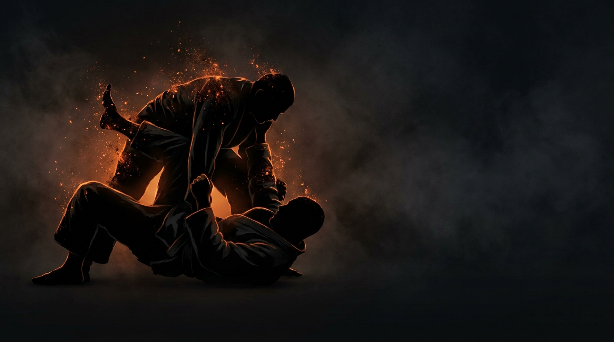

  
  
Ground · GrapplingGround Escape

GroundGrapplingDefensiveIntermediateCounter

Escape from under a dominant position before damage accumulates.

  
Start<b>Bottom under a dominant position, inside a marked perimeter.</b>

  
→

  
The Goal<b>Bottom escapes to guard, neutral, or standing; top holds and prevents it.</b>

  
→

  
Finish<b>Bottom escapes → switch · Top holds the duration → reset · Leave the perimeter → loss.</b>

  
Escapes start in the space,  go where the weight isn't.

  
Read the pressure, then move. <b>Frames and knees go where the connection is light.</b>

What to Read

<b>Attune to</b> the <i>felt weight distribution &amp; pressure through contact</i>, where the top's base loads and unloads, which limbs are pinned, where the connection goes light, plus the top player's <b>posture and frame motion</b>. That inertial information specifies which way the space opens <i>before</i> the escape window closes, not the opponent's limbs in isolation.

The Starting Position

  
PlayersTwo, one bottom, one top.

  
PositionA dominant top position.

  
BoundaryA marked perimeter, both stay inside.

  
RolesOne bottom (defender), one top (attacker).

  
Start &amp; resetBegin from the dominant position; reset after each round.

The Matchup

  

    
🤸

    
Bottom (Defender)

    
Trying to escape to guard, neutral, or standing, not submission.

    Create frames and space, execute bridges, shrimps, and turns, and chain attempts. Escape means guard recovery, reversal, or standing up.
  

  
VS

  

    
🥋

    
Top (Attacker)

    
Trying to maintain the dominant position and prevent the escape, not submission.

    Maintain weight distribution, anticipate and counter escapes, and stay heavy without exhausting. Control only, no finishing.
  

The Rules

  🏃 Bottom must actively escapeThe bottom player works escape sequences continuously, not just surviving or waiting. This forces exploration of escape solutions.
  🪨 Top maintains, does not attackThe top player maintains control without submissions, so the bottom can focus on escape rather than submission defense.
  🎯 Escape = guard, reversal, or standingA successful escape is guard recovery, a reversal to top, or standing up. This defines clear, hierarchical success.
  🚫 No submissions from bottomSubmissions from bottom are not the focus here, the task is escape mechanics. Submission threats live in a separate game.
  ⬛ Stay inside the perimeterPlay happens inside a marked perimeter, any shape (square, circle, taped lines). If a player rolls fully out of it, that player loses instantly, training mat-edge awareness.

How to Win

  
Switch Bottom escapes, reverses, or stands → switch roles.The bottom breaks free to a safer position, bottom wins and earns the top's maintenance role.

  
Win Top holds the position for the set duration → top wins.Hold the dominant position for the set duration, the top denies the escape.

  
Reset Top holds for the set duration → reset, same roles.The round ends and resets from the dominant position, keeping the same roles for another rep.

  
Loss Roll fully out of the perimeter → that player loses.Crossing the marked perimeter loses the round instantly, regardless of position, training the mat-edge awareness a fighter needs.

The Levels

  
1<b>Side Control Escapes</b>Start under side control.Begin under side control, the most fundamental escape position. Focus on frames, shrimp to guard, and the sit-up escape.

  
2<b>Mount Escapes</b>Start under mount, higher urgency.Begin under mount. Higher urgency and fewer options, focus on bridge and roll and the elbow-knee escape.

  
3<b>Back Escapes</b>Start with the opponent on the back, hooks in.Begin with the back taken (hooks in), the highest-danger position. Focus on hand fighting and escaping to guard.

  
4<b>Full MMA Expression</b>Top can threaten strikes.Top can threaten strikes; bottom must escape while defending them. Escape under MMA pressure.

Recall Check

  
Test yourself before moving on. Answer out loud, then reveal what good looks like.

  

    
Q Escapes start in the space. What are you reading to find it?

    
The <b>felt weight distribution and pressure through contact</b>: where the top's base loads and unloads, which limbs are pinned, where the <b>connection goes light</b>. Frames and knees go where the weight isn't.

  

  

    
Q Why does the top maintain only, with no submissions, at Levels 1 to 3?

    
So the bottom can <b>focus on escape mechanics</b>, not submission defense. It isolates the escape task while keeping the live weight-reading loop intact.

  

  

    
Q What three outcomes count as a successful escape?

    
<b>Guard recovery, a reversal to top, or standing up.</b> A clear, hierarchical definition of success, not just surviving in place.

  

  

    
Q What is being measured to know the escape skill has formed?

    
Whether you <b>recover space and frames faster than the top can re-load weight</b>, and whether frames stay live as the top adjusts. When that space-recovery relationship stabilizes, the skill has formed.

  

Go Deeper

??? note "Task focus &amp; coaching cues"

    
Each role's job

    

      

🤸

Bottom (Defender)

Create frames and space; execute bridges, shrimps, and turns; chain escape attempts; recover to guard or standing.

      

🥋

Top (Attacker)

Maintain weight distribution; anticipate and counter escapes; stay heavy without exhausting; transition to maintain control.

    

    
Coaching cues

    

      

⚓

Where is the weight?

Ask: "Where is their weight?" This directs attention to the haptic information that matters, rather than prescribing a technique.

      

🕳️

Find the space

Ask: "Where is the space?" Escapes start from felt space, frames and knees go where the connection is light.

    

??? abstract "Constraints-Led analysis"

    
Constraints → Affordances

    

      
Bottom must actively escape→Forces exploration of escape solutions

      
Top maintains (no submissions)→Bottom focuses on escape, not submission defense

      
Specific starting positions→Isolates escape patterns per position

      
Win by escape OR duration→Urgency for bottom, patience for top

      
Live, resisting opponent→Keeps weight-reading perception intact

    

    
Implements <b>Task Simplification</b> (Renshaw et al., 2019), isolates the escape task while keeping the essential perception-action loop intact. The bottom still reads weight distribution and timing from a real, resisting opponent.

    
What the bottom reads

    

      

✋

Haptic

Pressure distribution &amp; grip location → which direction to escape and which limbs are controlled.

      

🧭

Proprioceptive

Own hip position &amp; frame strength → available escape directions and when space exists.

      

👁️

Visual

Top's posture changes &amp; space between bodies → timing windows and where to insert frames or knees.

    

    
What we measure (order parameter)

    
Whether the bottom <b>recovers space and frames faster than the top can re-load weight</b>, track escapes completed vs. position held, and whether frames stay live as the top adjusts. That space-recovery relationship is the order parameter; when it stabilizes, the skill has formed.

    
Representativeness

    
<b>Models:</b> being controlled in side control, mount, or back and escaping before damage accumulates or a submission occurs.

    
Simplified: no strikes (L1–3)no submissions by topreset on time limit

    
Haptic perception of weight and pressure is identical to competition, transfers into <a href="../leg-reclaim/">Leg Reclaim</a> and <a href="../ground-to-standing/">Ground to Standing</a>.

    
Readiness to progress

    <ul class="emma-checklist">
      <li>Escapes ~60%+ against resisting partners</li>
      <li>Uses multiple escape techniques</li>
      <li>Chains escapes when the first fails</li>
      <li>Stays calm under pressure</li>
    </ul>

    
Warning signs

    

      Only one escape works
      Escapes only vs lighter partners
      Panic / flailing when escape fails
      Can't feel weight distribution
    

??? note "Safety &amp; related games"

    

      🤝 Controlled grappling
      🛑 Stop on submission attempts or neck cranks
      🔁 Reset if positions stall completely
    

    
Where it sits

    

      
Prerequisite→None, this is a fundamental defensive game

      
Follow-on→<a href="../leg-reclaim/">Leg Reclaim</a> · <a href="../ground-to-standing/">Ground to Standing</a>

      
Related→<a href="../../concepts/decision-states/">Decision States</a> · <a href="../../concepts/guard-recovery/">Guard Recovery</a>

    

