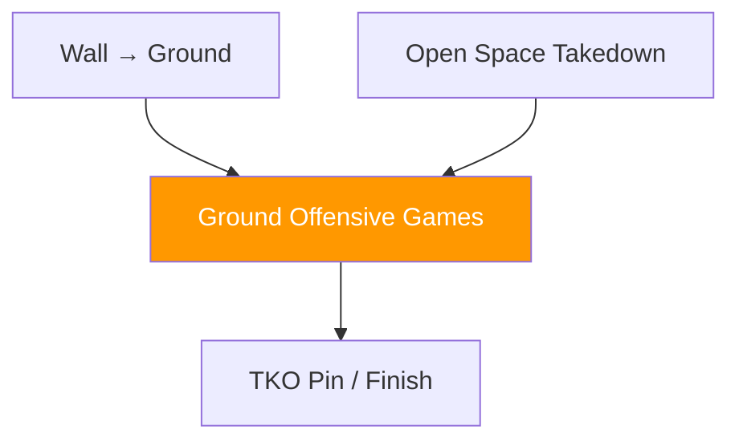

# Ground Games — Offensive

!!! info "Coming Soon"
    This section will contain **offensive ground games** — games focused on establishing control, advancing position, and creating finishing opportunities.

---

## Planned Development

Offensive ground games will focus on:

- **Position establishment** (mount, side control, back control)
- **Position advancement** (guard pass sequences, mount transitions)
- **TKO Pin development** (creating striking opportunities from control)
- **Submission setups** (positional threats that create submission entries)

---

## Ground Control Principles

Offensive ground work follows the same pattern as wall control:

1. **Establish control** (hips and shoulders)
2. **Deny escape** (anticipate and shut down defensive movements)
3. **Advance position** (improve toward dominant position)
4. **Exploit** (create damage or submission opportunities)

---

## System Position

---

!!! abstract "Development Notice"
    Games in this category are under development. Check back for updates.
