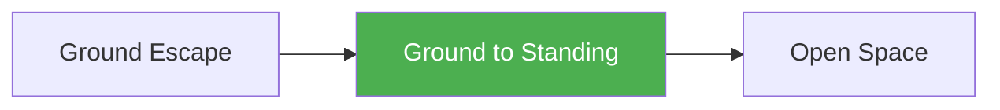

# Ground to Standing

!!! info "Game Identity"
    - **Problem:** Getting back to feet from ground position
    - **Environment:** Ground → Open Space
    - **Stage:** Counter (Defensive Grappling)

This is a **defensive ground game** focused on standing up from bottom positions. The bottom player learns to create separation and get to their feet — the ultimate ground escape in MMA.

---

## Goal

This is an **asymmetric game** with distinct roles.

| Role | Objective |
|------|-----------|
| **Bottom (Defender)** | Stand up and disengage completely |
| **Top (Attacker)** | Keep opponent on the ground |

The objective is **returning to standing**, not sweeping to top.

---

## Entry Condition

- Start with bottom player on ground (guard, under side control, or turtle)
- Bottom player works to stand
- Top player works to keep them down
- Reset when bottom stands OR top establishes dominant control

---

## Invariants

1. Bottom player's goal is **standing**, not top position
2. Top player **keeps them grounded** — follows if they rise
3. Standing = both feet, clear of opponent's control
4. Sweep to top is progress but not the win condition

---

## Task Focus

### Bottom (Defender)
- Create space from opponent
- Build base and posture
- Manage opponent's grips while rising
- Complete standup cleanly

### Top (Attacker)
- Maintain connection and weight
- Collapse standup attempts
- Drag back down when they rise
- Transition to takedown if needed

!!! question "Key Internal Questions — Bottom"
    - "Do I have space to build my base?"
    - "What's keeping me connected to them?"
    - "Can I clear their grip and stand?"

---

## Key Logic: Standup Hierarchy

!!! note "The Core Skill"
    Standing up from ground follows stages:

    | Stage | Goal |
    |-------|------|
    | Create space | Get distance from opponent |
    | Build base | Hands/feet on ground, hips up |
    | Clear grips | Break their control |
    | Complete standup | Both feet, disengage |

    The skill: Creating enough separation to stand before they can drag you back.

    This is often called "wrestling up" — it requires different skills than sweeping.

---

## Win Conditions

| Role | Win Condition |
|------|---------------|
| **Bottom** | Stand up and disengage (both feet, no opponent control) |
| **Top** | Prevent standup for set duration OR establish dominant control |

**On bottom win:** Roles switch.
**On top win:** Reset, same roles.

---

## Levels

=== "Level 1 — From Guard"
    - Start in open guard
    - Bottom works technical standup
    - Focus: Creating space to stand

=== "Level 2 — From Turtle"
    - Start in turtle position
    - Bottom works to base and stand
    - Focus: Standup from defensive position

=== "Level 3 — From Under"
    - Start under side control or mount
    - Must escape THEN stand
    - Focus: Chaining escape to standup

=== "Level 4 — Full MMA Expression"
    - Top can use strikes to keep bottom down
    - Bottom can strike to create separation
    - Focus: Standup under MMA pressure
    - See: [Full MMA Expression](../concepts/full-mma-expression.md)

---

## Safety

- **Contact limits:** Controlled grappling
- **Stop conditions:** Slamming during standup attempts
- **Coach intervention:** Reset if positions stall

---

## Constraints Analysis

*How this game applies the [Constraints-Led Approach](../principles/cla/index.md)*

| Constraint Type | Constraint | Affordance Created |
|-----------------|------------|-------------------|
| **Task** | Goal is standing, not top position | Develops standup-specific skill |
| **Task** | Standing = both feet, clear of control | Clear success definition |
| **Task** | Top follows and attempts to keep down | Realistic resistance |
| **Task** | Progressive starting positions (guard → turtle → under) | Scaffolded difficulty |
| **Individual** | Prerequisite: Ground Escape | Understands escape before standup |
| **Environmental** | Ground → Standing transition | Environment change practice |

!!! info "Theoretical Foundation"
    This game develops **standup affordance perception**—recognizing when separation is sufficient to stand. The constraint distinguishing standup from sweeping develops specific "wrestling up" skill separate from guard work. Athletes learn to perceive **grip control**—what's keeping them connected and how to clear it. This is a critical MMA skill where standing is often preferable to sweeping (Renshaw et al., 2019).

---

## Information Structure

*What athletes must perceive to succeed (perception-action coupling)*

### Bottom (Standup) Perceives

| Information Source | What to Read | Action It Supports |
|--------------------|--------------|-------------------|
| **Haptic** | Connection points | What to clear |
| **Haptic** | Top's weight distribution | Standup timing |
| **Visual** | Space available | Base building opportunity |
| **Proprioceptive** | Own base position | Standup method |
| **Proprioceptive** | Posture quality | Readiness to rise |

### Top (Keep Down) Perceives

| Information Source | What to Read | Action It Supports |
|--------------------|--------------|-------------------|
| **Haptic** | Base building attempts | Collapse timing |
| **Haptic** | Connection strength | When to re-engage |
| **Visual** | Bottom's hip position | Drag-down opportunity |
| **Proprioceptive** | Own control points | Maintain connection |

!!! tip "Coaching Cue"
    Ask bottom: "What was keeping you connected?" This develops grip awareness. Ask: "Did you clear their control before standing?" Clearing before standing is essential—standing while connected gets dragged back down.

---

## Representativeness

*How this game models real MMA situations*

### Real MMA Situation

"Wrestling up"—getting back to feet from bottom position. In MMA, standing is often preferable to staying on bottom.

### How This Game Represents It

| Element | Real MMA | This Game | Fidelity |
|---------|----------|-----------|----------|
| **Standup goal** | Return to striking range | Same | High |
| **Grip clearing** | Essential for standup | Same | High |
| **Top follows** | Opponent tries to keep down | Same | High |
| **Progressive positions** | Various starting points | Scaffolded by level | Scaffolded |
| **Strikes** | Available | Progressive by level | Scaffolded |

### Simplifications & Justification

| Simplification | Why Acceptable |
|----------------|----------------|
| Focus on standing (not sweeping) | Develops specific standup skill |
| Start from various positions | Isolates standup from escape |
| Clear success criteria | Ensures complete standup |

!!! note "Transfer Expectation"
    Standup skill developed here transfers directly to MMA. The perception of grip clearing and base building is identical in competition. "Wrestling up" is a distinct skill set.

---

## Variability Guidelines

*Creating "repetition without repetition" (Bernstein, 1967)*

### Within-Level Variability

| Vary This | How | Maintains |
|-----------|-----|-----------|
| **Starting position** | Guard, turtle, under side | Multiple standup problems |
| **Top aggression** | Passive, following, aggressive | Adaptability |
| **Top size** | Larger, smaller, equal | Standup calibration |
| **Connection type** | Grips, hooks, body lock | Multiple clearing solutions |
| **Intensity** | Drilling pace, live pace | Pressure calibration |

### What NOT to Vary

| Keep Constant | Why |
|---------------|-----|
| Standing as goal (not sweep) | Maintains game focus |
| Must clear control | Prevents sloppy standup |
| Complete standup required | No partial credit |

### Progressing Through Levels

| Signal to Progress | Meaning |
|--------------------|---------|
| Stands from guard consistently | Basic skill developing |
| Clears grips effectively | Perception developing |
| Stands from turtle | Ready for harder positions |

---

## Readiness Indicators

*When is the athlete ready to advance?*

### Ready for Next Level When

- [ ] Stands from current level consistently
- [ ] Clears grips before standing
- [ ] Completes standup without being dragged back
- [ ] Timing is appropriate (not forced)
- [ ] Can articulate: "I cleared their grip when..."

### Ready to Exit Game When

- [ ] Level 2+ competence (stands from turtle)
- [ ] Grip clearing is automatic
- [ ] Chains escape to standup (Level 3)
- [ ] Wrestling up appears in sparring

### Warning Signs (Not Ready to Progress)

| Sign | Meaning | Response |
|------|---------|----------|
| Gets dragged back immediately | Didn't clear control | Focus on grip clearing |
| Can't build base | Mechanics lacking | Work on technical standup |
| Only sweeps (doesn't stand) | Wrong goal | Constrain to standup only |
| Stands into takedown | Timing/awareness poor | Work on posture during standup |

---

## System Position

- **Prerequisite games:** Ground Escape
- **Follow-on games:** Returns to Open Space games
- **Related concepts:** Decision States

---

!!! abstract "System Evolution Notice"
    This game may be refined as ground-to-standing patterns emerge.
