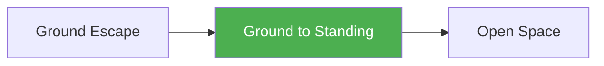

# Ground to Standing

!!! info "Game Identity"
    - **Problem:** Getting back to feet from ground position
    - **Environment:** Ground → Open Space
    - **Stage:** Counter (Defensive Grappling)

This is a **defensive ground game** focused on standing up from bottom positions. The bottom player learns to create separation and get to their feet — the ultimate ground escape in MMA.

---

## Goal

This is an **asymmetric game** with distinct roles.

| Role | Objective |
|------|-----------|
| **Bottom (Defender)** | Stand up and disengage completely |
| **Top (Attacker)** | Keep opponent on the ground |

The objective is **returning to standing**, not sweeping to top.

---

## Entry Condition

- Start with bottom player on ground (guard, under side control, or turtle)
- Bottom player works to stand
- Top player works to keep them down
- Reset when bottom stands OR top establishes dominant control

---

## Invariants

1. Bottom player's goal is **standing**, not top position
2. Top player **keeps them grounded** — follows if they rise
3. Standing = both feet, clear of opponent's control
4. Sweep to top is progress but not the win condition

---

## Task Focus

### Bottom (Defender)
- Create space from opponent
- Build base and posture
- Manage opponent's grips while rising
- Complete standup cleanly

### Top (Attacker)
- Maintain connection and weight
- Collapse standup attempts
- Drag back down when they rise
- Transition to takedown if needed

!!! question "Key Internal Questions — Bottom"
    - "Do I have space to build my base?"
    - "What's keeping me connected to them?"
    - "Can I clear their grip and stand?"

---

## Key Logic: Standup Hierarchy

!!! note "The Core Skill"
    Standing up from ground follows stages:

    | Stage | Goal |
    |-------|------|
    | Create space | Get distance from opponent |
    | Build base | Hands/feet on ground, hips up |
    | Clear grips | Break their control |
    | Complete standup | Both feet, disengage |

    The skill: Creating enough separation to stand before they can drag you back.

    This is often called "wrestling up" — it requires different skills than sweeping.

---

## Win Conditions

| Role | Win Condition |
|------|---------------|
| **Bottom** | Stand up and disengage (both feet, no opponent control) |
| **Top** | Prevent standup for set duration OR establish dominant control |

**On bottom win:** Roles switch.
**On top win:** Reset, same roles.

---

## Levels

=== "Level 1 — From Guard"
    - Start in open guard
    - Bottom works technical standup
    - Focus: Creating space to stand

=== "Level 2 — From Turtle"
    - Start in turtle position
    - Bottom works to base and stand
    - Focus: Standup from defensive position

=== "Level 3 — From Under"
    - Start under side control or mount
    - Must escape THEN stand
    - Focus: Chaining escape to standup

=== "Level 4 — Full MMA Expression"
    - Top can use strikes to keep bottom down
    - Bottom can strike to create separation
    - Focus: Standup under MMA pressure
    - See: [Full MMA Expression](../concepts/full-mma-expression.md)

---

## Safety

- **Contact limits:** Controlled grappling
- **Stop conditions:** Slamming during standup attempts
- **Coach intervention:** Reset if positions stall

---

## System Position

- **Prerequisite games:** Ground Escape
- **Follow-on games:** Returns to Open Space games
- **Related concepts:** Decision States

---

!!! abstract "System Evolution Notice"
    This game may be refined as ground-to-standing patterns emerge.
