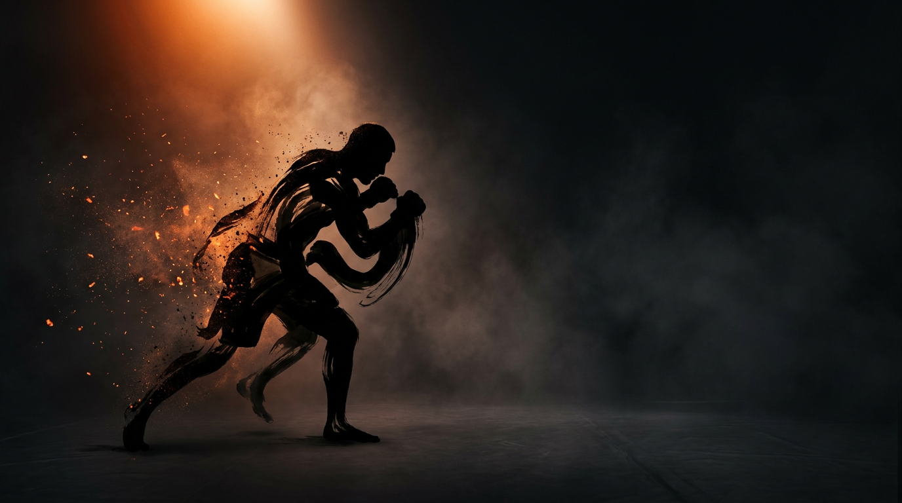

  
  
Ground → Open Space · GrapplingGround to Standing

Ground → Open SpaceGrapplingDefensiveIntermediateCounter

Get back to your feet from the bottom before they drag you down.

  
Start<b>One on bottom, one on top, inside a marked perimeter.</b>

  
→

  
The Goal<b>Bottom stands and disengages; top keeps them down.</b>

  
→

  
Finish<b>Bottom stands &amp; disengages → switch · Top keeps them down → reset · Leave the perimeter → loss.</b>

  
Standing while connected gets dragged down,  clear the grips first.

  
Separation, not a sweep, is the win. <b>Both feet up and clear of control.</b>

What to Read

<b>Attune to</b> the <i>felt weight distribution &amp; connection through contact</i>, which grips, hooks, or body-locks are keeping you tied to them, where the top's base loads and goes light, plus the top player's <b>posture and hip motion</b>. That inertial information specifies when separation is sufficient to stand <i>before</i> they re-engage, not the opponent's limbs in isolation.

The Starting Position

  
PlayersTwo, on the mat, one on bottom, one on top.

  
PositionBottom in guard, under side control, or turtle, set by the level.

  
BoundaryA marked perimeter, both stay inside.

  
RolesOne bottom (defender), one top (attacker).

  
Start &amp; resetBegin from the ground; reset there each round.

The Matchup

  

    
🤸

    
Bottom (Defender)

    
Trying to stand up and disengage completely, both feet, clear of control.

    Create space, build base and posture, manage the grips while rising, and complete the standup cleanly. Sweeping to top is progress but not the win.
  

  
VS

  

    
🥋

    
Top (Attacker)

    
Trying to keep the opponent on the ground, following if they rise.

    Maintain connection and weight, collapse standup attempts, drag them back down when they rise, and transition to a takedown if needed.
  

The Rules

  🧍 The goal is standing, not topThe bottom player's goal is standing, not the top position. A sweep is progress but doesn't end the round, this develops the distinct "wrestling up" skill.
  🪨 Top keeps them groundedThe top player keeps the opponent down and follows if they rise, realistic resistance, not a passive partner.
  🎯 Standing = both feet, clear of controlA complete standup is both feet up and clear of the opponent's control. Standing while still connected gets dragged back down.
  🔗 Clear control before standingGrips, hooks, and body-locks must be cleared before rising, standing while connected invites the drag-down. This forces grip clearing.
  ⬛ Stay inside the perimeterPlay happens inside a marked perimeter, any shape (square, circle, taped lines). If a player rolls fully out of it, that player loses instantly, training mat-edge awareness.

How to Win

  
Switch Bottom stands &amp; disengages → switch roles.A clean standup, both feet, no opponent control, bottom wins and earns the top's keep-down role.

  
Win Top denies the standup for the duration → top wins.Keep the opponent grounded for the set duration, or advance to a dominant control, the top denies the standup.

  
Reset Top wins → reset, same roles.When the top prevents the standup or advances control, the round resets from the ground position, keeping the same roles for another rep.

  
Loss Roll fully out of the perimeter → loss.Crossing the marked perimeter loses the round instantly, regardless of position, training the mat-edge awareness a fighter needs.

The Levels

  
1<b>From Guard</b>Start in open guard; bottom works the technical standup.Begin in open guard. Bottom works the technical standup, focus on creating space to stand.

  
2<b>From Turtle</b>Start in turtle; bottom bases and stands.Begin in turtle. Bottom works to base and stand, focus on standing up from a defensive position.

  
3<b>From Under</b>Start under side control or mount; escape THEN stand.Begin under side control or mount. Bottom must escape first, then stand, focus on chaining escape to standup.

  
4<b>Full MMA Expression</b>Add strikes for both.Top can strike to keep the bottom down; bottom can strike to create separation. Standup under MMA pressure.

Recall Check

  
Test yourself before moving on. Answer out loud, then reveal what good looks like.

  

    
Q Standing while connected gets you dragged down. What must happen first?

    
<b>Clear the grips, hooks, and body-locks before rising.</b> Name what is tying you to them, then break it, then stand.

  

  

    
Q What exactly counts as a win here?

    
<b>Both feet up and clear of control.</b> Separation, not a sweep. Sweeping to top is progress but does not end the round.

  

  

    
Q What are you reading to know separation is enough to stand?

    
The <b>felt connection through contact</b>: which grips keep you tied, where the top's base loads and goes light, plus the top's <b>posture and hip motion</b>. It specifies the window before they re-engage.

  

  

    
Q Why is this trained as its own skill instead of as a sweep?

    
Because "<b>wrestling up</b>" is distinct from guard work: getting back to the feet is often preferable to staying down, so the standup affordance gets its own development.

  

Go Deeper

??? note "Task focus &amp; coaching cues"

    
Each role's job

    

      

🤸

Bottom (Defender)

Create space from the opponent; build base and posture; manage grips while rising; complete the standup cleanly.

      

🥋

Top (Attacker)

Maintain connection and weight; collapse standup attempts; drag back down when they rise; transition to a takedown if needed.

    

    
Coaching cues

    

      

🔗

What's connecting you?

Ask: "What was keeping you connected?" This develops grip awareness, naming the tie before trying to break it.

      

🧹

Clear, then rise

Ask: "Did you clear their control before standing?" Clearing before standing is essential, standing while connected gets dragged back down.

    

??? abstract "Constraints-Led analysis"

    
Constraints → Affordances

    

      
Goal is standing, not top position→Develops standup-specific "wrestling up" skill

      
Standing = both feet, clear of control→Clear success definition

      
Top follows and attempts to keep down→Realistic resistance

      
Progressive starting positions→Scaffolded difficulty (guard → turtle → under)

      
Ground → standing transition→Environment-change practice

    

    
Develops <b>standup affordance perception</b>, recognizing when separation is sufficient to stand (Renshaw et al., 2019). The constraint distinguishing standup from sweeping develops the specific "wrestling up" skill, separate from guard work.

    
What the bottom reads

    

      

✋

Haptic

Connection points &amp; top's weight distribution → what to clear and when to time the standup.

      

👁️

Visual

Space available → base-building opportunity.

      

🧭

Proprioceptive

Own base position &amp; posture quality → standup method and readiness to rise.

    

    
What we measure (order parameter)

    
Whether the bottom <b>recovers base and clears connection faster than the top can re-load weight</b>, track standups completed vs. drag-downs, and whether the grip is cleared before rising. That separation-recovery relationship is the order parameter; when it stabilizes, the skill has formed.

    
Representativeness

    
<b>Models:</b> "wrestling up", getting back to feet from bottom, where standing is often preferable to staying down.

    
Simplified: focus on standing, not sweepingstart from various positionsclear success criteria

    
Grip-clearing and base-building perception is identical to competition, returns to the Open Space games.

    
Readiness to progress

    <ul class="emma-checklist">
      <li>Stands from current level consistently</li>
      <li>Clears grips before standing</li>
      <li>Completes standup without being dragged back</li>
      <li>Timing is appropriate (not forced)</li>
    </ul>

    
Warning signs

    

      Gets dragged back immediately
      Can't build base
      Only sweeps (doesn't stand)
      Stands into a takedown
    

??? note "Safety &amp; related games"

    

      🤝 Controlled grappling
      🛑 Stop on slamming during standup attempts
      🔁 Reset if positions stall
    

    
Where it sits

    

      
Prerequisite→<a href="../ground-escape/">Ground Escape</a>

      
Follow-on→Returns to the Open Space games

      
Related→<a href="../../concepts/decision-states/">Decision States</a>

    

