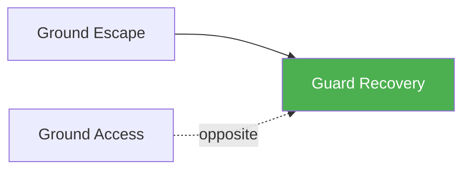

# Guard Recovery

!!! info "Game Identity"
    - **Problem:** Recovering guard when it's being passed
    - **Environment:** Ground
    - **Stage:** Counter (Defensive Grappling)

This is a **defensive ground game** focused on preventing guard passes and recovering guard when partially passed. The bottom player learns to maintain guard integrity against passing pressure.

---

## Goal

This is an **asymmetric game** with distinct roles.

| Role | Objective |
|------|-----------|
| **Bottom (Defender)** | Maintain or recover guard position |
| **Top (Attacker)** | Pass guard to dominant position |

The objective is **guard retention**, not sweep or submission.

---

## Entry Condition

- Start with bottom player in guard (open, half, or being passed)
- Top player works to pass
- Bottom player works to retain or recover
- Reset when guard is fully passed OR bottom maintains guard for set duration

---

## Invariants

1. Bottom player **defends guard** — not attacking
2. Top player **passes actively** — not just pressuring
3. Half guard counts as guard retained
4. Side control = guard passed (game over)

---

## Task Focus

### Bottom (Defender)
- Maintain frames and hip movement
- Recover guard when partially passed
- Use legs actively for defense
- Transition between guard types as needed

### Top (Attacker)
- Work systematic passing
- Control hips and legs
- Chain passing attempts
- Consolidate when guard is cleared

!!! question "Key Internal Questions — Bottom"
    - "Are my hips facing them?"
    - "Can I get my knee/shin back in?"
    - "What guard can I recover to from here?"

---

## Key Logic: Levels of Guard Retention

!!! note "The Core Skill"
    Guard retention happens in layers:

    | Position | Status |
    |----------|--------|
    | Full guard (closed/open) | Ideal — full guard tools available |
    | Half guard | Acceptable — still in guard |
    | Quarter guard (ankle only) | Danger — almost passed |
    | Side control | Failed — guard passed |

    The skill: Recognizing when guard is compromised and recovering before fully passed.

---

## Win Conditions

| Role | Win Condition |
|------|---------------|
| **Bottom** | Maintain or recover guard for set duration |
| **Top** | Pass guard and establish side control |

**On bottom win:** Roles switch.
**On top win:** Reset to guard, same roles.

---

## Levels

=== "Level 1 — Open Guard Retention"
    - Start in open guard
    - Bottom retains, top passes
    - Focus: Hip movement and frames

=== "Level 2 — Half Guard Recovery"
    - Start in half guard or top already mid-pass
    - Higher urgency for bottom
    - Focus: Recovery from compromised positions

=== "Level 3 — Dynamic Guard"
    - Bottom can switch between guard types
    - More fluid and realistic
    - Focus: Guard transitions as defense

=== "Level 4 — Full MMA Expression"
    - Top can use strikes to open guard
    - Bottom must retain while managing strikes
    - Focus: Guard retention under MMA pressure
    - See: [Full MMA Expression](../concepts/full-mma-expression.md)

---

## Safety

- **Contact limits:** Controlled grappling
- **Stop conditions:** Knee attacks, excessive stacking
- **Coach intervention:** Reset if passing/retention stalls

---

## System Position

- **Prerequisite games:** Ground Escape
- **Follow-on games:** Positional Battle (combined perspective)
- **Related concepts:** Decision States

---

!!! abstract "System Evolution Notice"
    This game may be refined as guard recovery patterns emerge.
