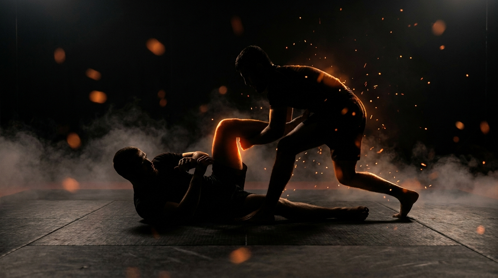

  
  
Ground · GrapplingHalf-Guard Bottom

!!! warning "Provisional (WIP): built from the ground-wave spec, pending coach review"

    Sourced from the Slime Mold Grappling Club catalog (Greg Souders / Standard Jiu-Jitsu, Modern Defensive Guard material), re-expressed with our threshold rules. Passed the build rubric on paper; awaits validation against a live grappling class. Details may change.

GroundGrapplingCombinedIntermediateShield &amp; Sweep

Hold the shield, break their base, take something better.

  
Start<b>Bottom on the side with a knee shield framed in; top working to clear it, inside a marked perimeter.</b>

  
→

  
The Goal<b>Bottom causes posts, punishes them, and elevates; top clears the shield to chest-to-chest.</b>

  
→

  
Finish<b>Sweep, full guard, the back, or top elevated fully off the mat → bottom · Shield cleared to chest-to-chest, held 3s → top · Out of bounds → loss.</b>

  
The shield isn't a wall,  it's a lever.

  
It holds them off only long enough to tilt them. <b>A shield that only blocks eventually gets crushed.</b>

What to Read

<b>Attune to</b> the <i>pressure coming through the knee shield</i>. Light pressure means the top is basing back, safe but passive, attack their posture. Crushing pressure means their weight has committed past their knees, that's the elevation window. The shield is a pressure gauge: read it, don't just brace it.

The Starting Position

  
PlayersTwo, one bottom (half guard, knee shield), one top (passer).

  
PositionBottom on the side, knee shield across the top's chest or hip, one leg hooked; top driving to clear it.

  
BoundaryA marked perimeter, both stay inside.

  
RolesBottom maintains the shield and converts pressure into offense; top removes the shield and flattens.

  
Start &amp; resetBegin with the shield set; reset on a sweep, a recovery, a clear, or the round cap.

The Matchup

  

    
🤸

    
Bottom (Knee Shield)

    
Trying to keep the shield framed, force and punish posts, and convert: sweep, full guard, the back, or elevate the top clean off the mat.

    Stay on your side, shield angled, not flat. Use it as a lever: when their pressure commits, lift and turn. When they base back, sit up into them. Four wins, the shield is the start of all of them.
  

  
VS

  

    
🥋

    
Top (Passer)

    
Trying to clear the knee shield and reach chest-to-chest, held 3 seconds.

    Don't wrestle the shield head-on, change the angle until it points at nothing. Control the bottom knee, drop your hip below the shield line, and keep your weight behind your own knees while you do it.
  

The Rules

  🛡️ The shield is the resourceThe round revolves around the knee shield: the bottom converts it into offense, the top works to remove it. Losing the shield isn't losing the round, but it's losing the lever.
  ⬆️ Elevation countsLifting the top fully off the mat (both feet and hands clear) is a bottom win, the proof that the shield-lever and underhooks beat the base, even without finishing the sweep.
  🎯 Clear proven by the holdThe top wins by removing the shield and reaching chest-to-chest, held 3 seconds. Brushing the knee aside into a scramble proves nothing yet.
  ⏱️ Round cap, no stallingRun a set round cap (start at 60 seconds). If neither side wins by the cap, reset and switch roles. A clock, never "as long as possible".
  🚫 No striking until the top levelLevels 1 to 4 are grappling only, so the bottom can read pressure through the shield without defending strikes. Strikes enter at the full-expression level.
  🎚️ GnP dial-up, by permissionOnce strikes are on, the coach explicitly grants a meaner dial on ground-and-pound: mid-grapple, strength is already compromised, so firmer strikes stay safe. The shield must now manage punches as well as pressure, exactly the MMA half guard. Ground games train smashing on the ground, not grappling for its own sake.
  ⬛ Stay inside the perimeterPlay happens inside a marked perimeter, any shape. If a player rolls fully out of it, that player loses the round, training mat-edge awareness.

How to Win

  
Win Bottom sweeps, recovers full guard, or takes the back → bottom wins.Three conversions, each observable: a reversal to top, both legs back around (full guard), or chest-to-back. The shield did its job as a lever.

  
Win Bottom elevates the top fully off the mat → bottom wins.Feet and hands clear of the floor at once. The base is beaten even if the sweep isn't finished, an honest, observable proxy that scales safely.

  
Switch Top clears the shield to chest-to-chest, held 3s → top wins.The shield removed and the chest connection held. From here the position is the half-guard-pass game's flatten-and-free problem.

  
Loss Roll fully out of the perimeter → that player loses.Crossing the marked perimeter loses the round instantly, regardless of position, training the mat-edge awareness a fighter needs.

The Levels

  
1<b>Hold the shield</b>Maintain the frame only.The round is only maintenance: bottom keeps the shield framed and the side position, top works to clear it. Whoever owns the shield at the bell owns the round. Learn the angles that survive pressure.

  
2<b>Cause posts</b>Tilt them onto a hand.Bottom adds push-pull through the shield and grips: the round ends when the top posts a hand or knee wide. The shield becomes a steering tool, not a wall.

  
3<b>Punish posts</b>Hips to the captured side.The post is the start: bottom captures the posted arm (2-on-1) and moves the hips toward it, the doorway to the back and the sweep. The window after the post is the whole game.

  
4<b>Elevate</b>Lift the base away.Bottom adds the elevation win: underhook plus shield-lever lifts the top fully off the mat, or converts to the sweep, the recovery, or the back. The complete bottom game, grappling only.

  
5<b>Full expression</b>Continuous, strikes on.Light strikes on. The shield manages punches and pressure together, and a lazy shield gets hit through, not just passed. The MMA half guard, complete.

Recall Check

  
Test yourself before moving on. Answer out loud, then reveal what good looks like.

  

    
Q What does pressure through the shield tell you?

    
<b>Light = they're based back, attack the posture. Crushing = weight committed past their knees, elevate.</b> The shield is a pressure gauge, not just a barrier.

  

  

    
Q Why does a blocking-only shield eventually fail?

    
Because the top gets unlimited attempts against a static frame. <b>The shield earns its keep as a lever</b>, every clear attempt is weight you can redirect.

  

  

    
Q What does full elevation prove, and why is it a win?

    
Feet and hands clear of the mat means <b>the base is completely beaten</b>. It's the sweep's proof without the slam risk, observable and safe at every size difference.

  

  

    
Q How does the top beat the shield without wrestling it?

    
<b>Change the angle until the shield points at nothing.</b> Control the bottom knee, drop the hip below the shield line, keep weight behind the knees while doing it.

  

Go Deeper

??? note "Task focus &amp; coaching cues"

    
Each role's job

    

      

🤸

Bottom (Knee Shield)

Stay on the side, angle the shield, read the pressure, cause and punish posts, elevate or convert when the weight commits.

      

🥋

Top (Passer)

Change angles on the shield, control the bottom knee, keep weight behind the knees, clear to chest-to-chest and hold it.

    

    
Coaching cues

    

      

🛡️

Gauge or wall?

Ask the bottom: "What was the pressure telling you before the clear?" Builds the read that turns the shield from a brace into a sensor.

      

⬆️

Where did the weight go?

Ask both after an elevation: "When did the top's weight pass the knees?" Marks the commit moment both sides need to feel.

    

??? abstract "Constraints-Led analysis"

    
Constraints → Affordances

    

      
Maintenance-only opening level→Builds shield angles before offense exists

      
Cause-then-punish post ladder→Same off-balancing grammar as Seated Guard Retention, new position

      
Elevation as a win→Rewards beating the base without slam risk

      
Clear proven by a 3s hold→The top must control, not just brush past

      
Live, resisting passer→Keeps the pressure-gauge read intact

    

    
Implements <b>Task Simplification</b> (Renshaw et al., 2019): the maintain → cause → punish → elevate ladder grows the bottom's role from survival to offense one perceptual layer at a time, against a top whose passing pressure is the very signal being learned.

    
What the bottom reads

    

      

✋

Haptic

Pressure through the shield → based-back passive, or committed past the knees: the elevation window.

      

🧭

Proprioceptive

Own torso angle and shield angle → on the side and levered, or flattening toward the back.

      

👁️

Visual

The top's hands and knee width → posts landing, angles changing on the shield.

    

    
What we measure (order parameter)

    
Whether the bottom <b>converts pressure into offense faster than the top changes angles</b>. Track sweeps, recoveries, back-takes, and elevations vs. shield-clears conceded, and whether the bottom's attacks launch at the commit moment or after it has passed. When the elevation arrives on the commit, the read has formed.

    
Representativeness

    
<b>Models:</b> the half-guard bottom every MMA fighter actually ends up in after a half-stuffed takedown, where staying flat means eating punches and the shield is the only structure that buys offense back.

    
Simplified: shield ladderno strikes L1-4round cap

    
Deepens the recovery side of <a href="../leg-reclaim/">Leg Reclaim</a>; mirrors <a href="../half-guard-pass/">Half-Guard Pass</a>.

    
Readiness to progress

    <ul class="emma-checklist">
      <li>Keeps the side position and shield angle under pressure</li>
      <li>Causes posts through the shield, not despite it</li>
      <li>Launches the elevation at the commit moment</li>
      <li>Converts elevations into sweeps, guard, or the back</li>
    </ul>

    
Warning signs

    

      Goes flat and braces the shield straight on
      Blocks every clear but never attacks
      Elevates without an underhook, gives the pass
      Top wrestles the shield head-on, feeds the lever
    

??? note "Safety &amp; related games"

    

      🤝 Controlled grappling
      🛑 Elevations lower with control, no dumping the elevated player
      🔁 Reset if the position stalls completely
    

    
Where it sits

    

      
Prerequisite→<a href="../leg-reclaim/">Leg Reclaim</a>

      
Follow-on→<a href="../closed-guard-bottom/">Closed Guard Bottom</a>

      
Mirror→<a href="../half-guard-pass/">Half-Guard Pass</a>

      
Related→<a href="../../concepts/guard-recovery/">Guard Recovery</a> · <a href="../../concepts/decision-states/">Decision States</a>

    

