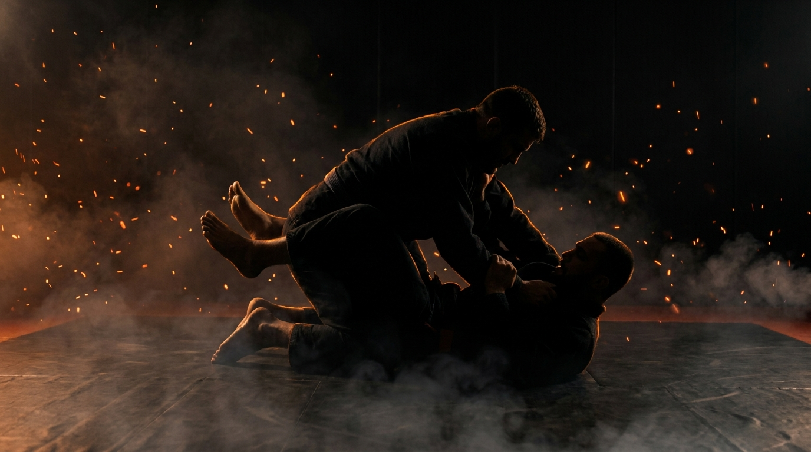

  
  
Ground · GrapplingHalf-Guard Pass

!!! warning "Provisional (WIP): built from the ground-wave spec, pending coach review"

    Sourced from the Slime Mold Grappling Club catalog (Greg Souders / Standard Jiu-Jitsu), re-expressed with our threshold rules. Passed the build rubric on paper; awaits validation against a live grappling class. Details may change.

GroundGrapplingOffensiveIntermediatePassing

Win the underhook, flatten them, free the trapped leg.

  
Start<b>Top in half guard, one leg trapped, underhook and cross-face contested, inside a marked perimeter.</b>

  
→

  
The Goal<b>Top wins the chest battle and frees the leg; bottom builds the shield or hook and recovers.</b>

  
→

  
Finish<b>Leg freed to a chest-to-chest pin (side or mount), held 3s → top · Knee shield in, inside hook in, sweep, or full guard → bottom · Out of bounds → loss.</b>

  
Half guard is one battle,  who owns the chest.

  
Underhook and cross-face decide it. <b>The trapped leg frees itself once the bottom is flat.</b>

What to Read

<b>Attune to</b> the <i>angle of the bottom's torso against your chest</i>. On their side, they're alive: the underhook, the shield, and the sweep all live there. Flat on the back, they're done. Every inch of shoulder you press to the mat shortens their options, the leg comes free when the hips can't follow the knee.

The Starting Position

  
PlayersTwo, one top (passer), one bottom (half guard).

  
PositionTop's leg trapped between the bottom's; underhook and cross-face contested, nobody owns the chest yet.

  
BoundaryA marked perimeter, both stay inside.

  
RolesTop flattens and frees the leg; bottom fights for the underhook, the shield, and the recovery.

  
Start &amp; resetBegin from contested half guard; reset on a pass, a recovery, a sweep, or the round cap.

The Matchup

  

    
🥋

    
Top (Passer)

    
Trying to win the underhook and cross-face, flatten the bottom, and free the trapped leg into a held pin.

    Chest before leg, always. Yanking the knee while the bottom is on their side feeds the sweep. Flatten the shoulders, kill the inside frames, and the leg slides out almost on its own.
  

  
VS

  

    
🤸

    
Bottom (Half Guard)

    
Trying to stay on the side, win the underhook or build the knee shield, and recover full guard, sweep, or stand.

    The side position is everything, the moment your back touches flat, start framing back to it. Underhook beats shield when you can get it; the shield buys time when you can't.
  

The Rules

  🫁 The chest battle decidesUnderhook and cross-face are the contested resources. Whoever owns them owns the round's direction, the leg is a consequence, not the fight.
  🎯 Pass proven by the holdThe pass counts when the trapped leg is free AND the top holds a chest-to-chest pin (side control or mount) for 3 seconds. Freeing the leg into a scramble proves nothing yet.
  🛡️ Recovery is gradedKnee shield in, inside hook in, full guard recovered, a sweep, or standing all win for the bottom, each a cleaner answer than the last. Name which one you got.
  ⏱️ Round cap, no stallingRun a set round cap (start at 60 seconds). If neither side wins by the cap, reset and switch roles. A clock, never "as long as possible".
  🚫 No striking until the top levelLevels 1 to 4 are grappling only, so both sides can read the chest battle without defending strikes. Strikes enter at the full-expression level.
  🎚️ GnP dial-up, by permissionOnce strikes are on, the coach explicitly grants a meaner dial on ground-and-pound: mid-grapple, strength is already compromised, so firmer strikes stay safe. The cross-face hand becomes a striking hand, exactly as it does in MMA. Ground games train smashing on the ground, not grappling for its own sake.
  ⬛ Stay inside the perimeterPlay happens inside a marked perimeter, any shape. If a player rolls fully out of it, that player loses the round, training mat-edge awareness.

How to Win

  
Win Top frees the leg to a chest-to-chest pin (side or mount), held 3s → top wins.The trapped leg cleared and the pin held. Freeing the leg but losing the chest in the scramble doesn't count, the hold is the proof.

  
Switch Bottom recovers full guard, sweeps, or stands → bottom wins.Graded ladder: knee shield and inside hook are progress markers; full guard, a sweep to top, or standing fully wins the round.

  
Reset Round cap expires in contested half guard → reset, switch roles.Neither the pass nor the recovery landed before the clock. Switch roles so both sides get both problems.

  
Loss Roll fully out of the perimeter → that player loses.Crossing the marked perimeter loses the round instantly, regardless of position, training the mat-edge awareness a fighter needs.

The Levels

  
1<b>Win the hip access</b>Flatten them, nothing else.The round is only about torso angle: top works to press the bottom's shoulders flat, bottom works to stay on the side. Whoever owns the angle at the bell owns the round. The fight underneath every half-guard exchange, isolated.

  
2<b>Single underhook</b>Chest-to-chest, one wing in.Top adds the underhook on one side plus the cross-face, and must keep both while flattening. Bottom hand-fights for the underhook back. The chest battle becomes explicit.

  
3<b>Double unders</b>Both wings, total chest control.Top works to double underhooks before any leg work. Heavier control, but the bottom's hips get freer, feel the tradeoff between arm control and hip control.

  
4<b>Free the leg</b>The full pass, held.The complete task, grappling only: win the chest, flatten, free the trapped leg to side or mount held 3 seconds, against a bottom playing the full recovery ladder.

  
5<b>Full expression</b>Continuous, strikes on.Light strikes on. The cross-face hand now strikes, the bottom's shield now manages punches too. Half guard the way MMA actually plays it.

Recall Check

  
Test yourself before moving on. Answer out loud, then reveal what good looks like.

  

    
Q What's the one battle half guard reduces to?

    
<b>Who owns the chest</b>, the underhook and cross-face. The trapped leg is a consequence of that battle, not the battle itself.

  

  

    
Q Why is yanking the knee out early a mistake?

    
Because while the bottom is <b>on their side</b>, their underhook and sweep are live. Pulling the leg from there trades your base for their best moment. Flatten first.

  

  

    
Q What does the bottom's torso angle tell the top?

    
<b>On the side = alive, flat = finished.</b> Every inch of shoulder pressed to the mat removes options. The leg slides free when the hips can't follow the knee.

  

  

    
Q When should the bottom take the shield over the underhook?

    
When the underhook is lost or being smashed. <b>The underhook wins position; the shield buys time</b> to angle back and re-fight for it.

  

Go Deeper

??? note "Task focus &amp; coaching cues"

    
Each role's job

    

      

🥋

Top (Passer)

Win underhook and cross-face, press the shoulders flat, kill the inside frames, then free the leg into a held pin.

      

🤸

Bottom (Half Guard)

Fight to the side, hand-fight the underhook, build the shield when losing, climb the recovery ladder: hook, full guard, sweep, stand.

    

    
Coaching cues

    

      

🫁

Who had the chest?

Ask both: "When the pass came, who owned the underhook?" Ties the outcome back to the battle that decided it.

      

📐

Side or flat?

Ask the bottom: "How long were you flat before the leg came out?" Builds the alarm bell that flat = the clock is running.

    

??? abstract "Constraints-Led analysis"

    
Constraints → Affordances

    

      
Angle-only opening level→Isolates the flatten-vs-side war before any grips exist

      
Underhook levels (single → double)→Makes the chest battle explicit and felt

      
Pass proven by leg-free + 3s pin→Rewards control sequence over knee-yanking

      
Graded recovery ladder→The bottom always has a next rung, no dead rounds

      
Live, resisting opponent→Keeps the torso-angle read intact

    

    
Implements <b>Task Simplification</b> (Renshaw et al., 2019): the level ladder peels the half-guard problem into its perceptual layers (angle → chest → leg) while the opponent stays live, so the read that matters, torso angle under pressure, never leaves the game.

    
What the top reads

    

      

✋

Haptic

The bottom's torso angle against the chest → flat enough to start freeing the leg, or still alive on the side.

      

🧭

Proprioceptive

Own underhook depth and cross-face pressure → whether the chest is actually won.

      

👁️

Visual

The bottom's free knee → shield coming, hook hunting, or recovery starting.

    

    
What we measure (order parameter)

    
Whether the top <b>wins the chest before working the leg</b>. Track passes held vs. sweeps conceded, and what the bottom's torso angle was at each pass. When passes consistently come from a flattened bottom rather than a knee-yank race, the skill has formed.

    
Representativeness

    
<b>Models:</b> the most common contested ground position in MMA, half guard after an imperfect takedown or a partial recovery, where GnP and passing share the same chest battle.

    
Simplified: chest-battle ladderno strikes L1-4round cap

    
Deepens the passing side of <a href="../ground-access/">Ground Access</a>; mirrors <a href="../half-guard-bottom/">Half-Guard Bottom</a>; the recovery ladder connects to <a href="../../concepts/guard-recovery/">Guard Recovery</a>.

    
Readiness to progress

    <ul class="emma-checklist">
      <li>Wins the underhook before touching the trapped leg</li>
      <li>Flattens the shoulders and keeps them flat</li>
      <li>Frees the leg into a held pin, not a scramble</li>
      <li>As bottom: fights back to the side the moment the back touches</li>
    </ul>

    
Warning signs

    

      Yanks the knee while the bottom is on their side
      Trades the cross-face away to hunt the leg
      Bottom accepts flat and waits
      Recovery skips rungs and gives the back
    

??? note "Safety &amp; related games"

    

      🤝 Controlled grappling
      🛑 No neck cranks from the cross-face
      🔁 Reset if the position stalls completely
    

    
Where it sits

    

      
Prerequisite→<a href="../ground-access/">Ground Access</a>

      
Follow-on→<a href="../ground-control/">Ground Control</a>

      
Mirror→<a href="../half-guard-bottom/">Half-Guard Bottom</a>

      
Related→<a href="../../concepts/guard-recovery/">Guard Recovery</a> · <a href="../../concepts/decision-states/">Decision States</a>

    

